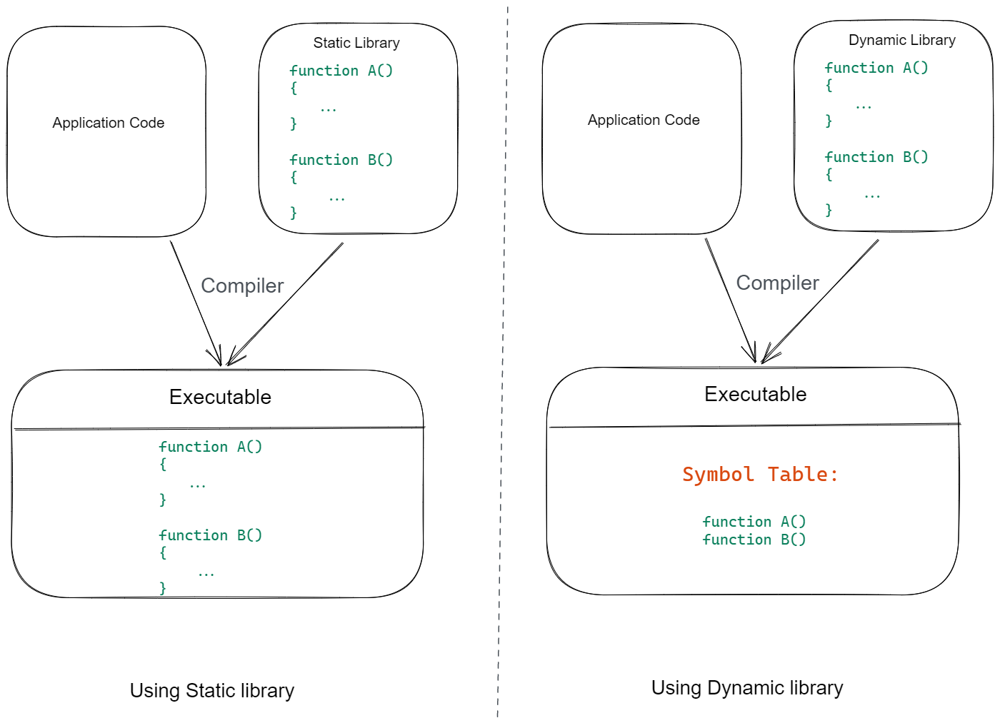
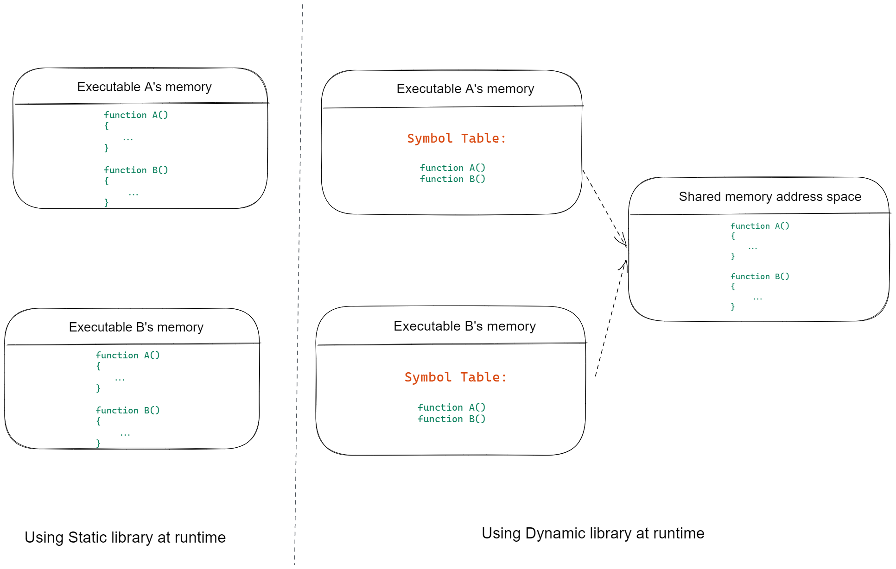
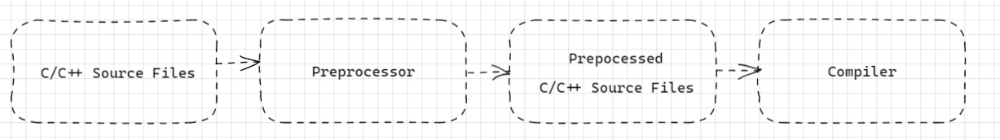
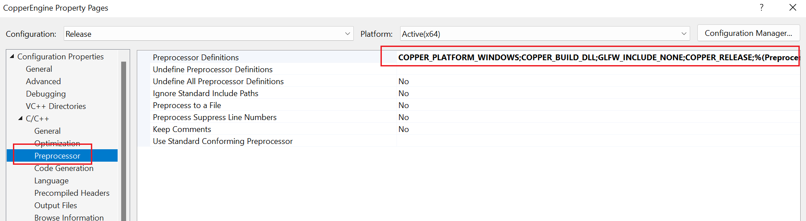

> CopperEngine 开发日志。记录一些零碎的知识点以及遇到的问题。

# Static library vs. Dynamic library



* Static library 静态库在编译阶段会被直接编译至目标Executable文件，也就是每个Executable文件都包含了完整的静态库代码拷贝。
* Dynamic library 动态库在编译阶段生成Symbol Table至目标Executable文件，在Executable文件运行时，在已经加载的库文件中通过Symbol Table来查找函数并执行。



使用Static Library有两个明显的缺点：

1. 应用程序的包体会变大，如果你的应用中又包含多个可执行程序，最坏的情况是同一个库在不同的可执行程序中被包含了多次。
2. 修改或升级库需要重新构建应用程序，这会增加编译以及部署成本。

# __declspec(dllexport & dllimport)

* __declspec: MS VC++中用于指定类信息的扩展属性语法: [declspec doc](https://docs.microsoft.com/en-us/cpp/cpp/declspec?view=msvc-170)

* __declspec(dllexport) 从动态库（dll）中导出函数或类。

* __declspec(dllimport) 从动态库（dll）中导入函数或类。

相对应的不同编译平台下，函数或类的导出与导入会有不同的语法，例如在Unreal Engine中对于Mac平台（GCC）中导入导出的宏就被定义为：

```c++
// DLL export and import definitions
#define DLLEXPORT			__attribute__((visibility("default")))
#define DLLIMPORT			__attribute__((visibility("default")))
```

用法：

库中声明函数：

```c
/* math_util.c */
int __declspec(dllexport) add(int a, int b)
{
    return (a + b);
}
```

使用库：

```c
int __declspec(dllimport) add(int a, int b)
```

### Preprocessor Difinitions in Visual Studio

在C/C++代码中，经常会看到：#include、#define等指令，这些以#开头的指令被称为预处理指令，预处理指令由预处理器（Preprocessor）操作。预处理指令会在源文件被编译之前先通过预处理器的处理：



预处理指令分类：

1. 文件包含：#include 该指令有两种写法：
   - `#include<math.h>`尖括号形式，预处理器会直接到系统目录对应的文件中搜索math.h文件，搜索不到则报错。系统文件提供的文件头一般使用该方式，而自定义的头文件不能采用这种方式。
   - `#include"anther_math.h"`双引号形式，预处理器会先在当前工作目录下查找该文件，如果搜索不到再去系统目录下查找。所以一般自定义头文件一般使用这种形式，当然也可以使用尖括号形式，但浪费了不必要的搜索时间。
2. 宏定义：包括定义宏#define和宏删除#undef
3. 条件编译：#if，#elif，#else，#endif，#ifdef，#ifndef
4. 特殊控制：ANSI C还定义了特殊作用的预处理指令如 ：`#error`，`#pragma`
   - `#error`:使预处理器输出指定错误，通常用于调试程序
   - `#pragma`:功能丰富的指令，有很多参数可选择，从而完成相应的特定操作。
      - `#pragma once`:可以避免同一个头文件被包含多次
      - `#prama pack(n)`:使用预处理器来设置内存按多少字节对齐，n为对齐系数：1、2、4、 8...
5. 预定义的宏：
   - `__LINE__`:编译后，包含了当前程序行在程序内的行号
   - `__FILE__`:编译后，包含了当前程序的程序名

在Visual Studio中预定义宏：



### Scoped Enumeration vs. Unscoped Enumeration

C++11新标准引入了**限定作用域的枚举类型（scoped enumeration）**。定义限定作用域的枚举类型的一般形式：

```c++
enum class InputType {Key, Mouse, Controller} // enum class 形式
enum struct InputType {Key, Mouse, Controller} // enum struct 形式
```

而定义**不限定作用域的枚举类型（unscoped enumeration）**的一般形式

```c++
enum InputType {Key, Mouse, Controller} // 已命名的不限定作用域的枚举类型
enum {Key, Mouse, Controller} // 未命名的不限定作用域的枚举类型
```

两者的区别：

1. 作用域不同，限定作用域的枚举类型中枚举成员在枚举类型的作用域外是不可访问的，而不限定作用域的枚举类型的枚举成员是和枚举类型本身的作用域相同的：

   ```C++
   enum Color { Red, Green, Blue };                    // unscoped enumeration Color
   enum Card_Error { Red, RedCard, GreenCard, YellowCard };    // 错误！重复定义了red，当前作用域下已在Color中定义了Red
   enum Card_Correct { RedCard, GreenCard, YellowCard }; 		// 正确
   
   enum class Animal { Dog, Deer, Cat, Bird, Human };    // scoped enumeration class
   enum class Mammal { Kangaroo, Deer, Human };       // Deer定义正确，枚举成员作于域不同
   
   int main(int argc, char** argv)
   {
       Color a = Red; // 正确：不限定作用域枚举类型的枚举成员Red位于有效作用域下
       Animal b = Dog; // 错误：限定作用域枚举类型的枚举成员Dog不在当前作用域下
       Animal c = Animal::Dog; //正确： 使用Animal的Dog枚举成员，类型也匹配
   }
   ```

2. 限定作用域枚举类型不可以隐式的转换为其他类型或int

   ```c++
   int i = Color::Red; //正确： i = 0
   int j = Animal::Dog; //错误：限定作用域的枚举类型不会进行隐式转换
   ```

更推荐使用限定作用域枚举类型，多数编译器默认都会检查Enum的声明，会给出warning提示你使用scoped enum:


限定作用域枚举类型解决了以下常见问题：

1. 不限定作用域枚举类型更容易导致命名冲突问题，而限定作用域枚举类型可有效避免。
2. 不限定作用域枚举类型无法指定成员类型，这会带来安全问题，而限定作用域枚举类型则可以显式的指定类型，当不指定时，默认为int类型。
3. 不限定作用域枚举类型的前置声明需要指定成员类型：`enum intValues : unsigned long long;`，而限定作用域枚举类型则不需要：`enum class Animal;`
