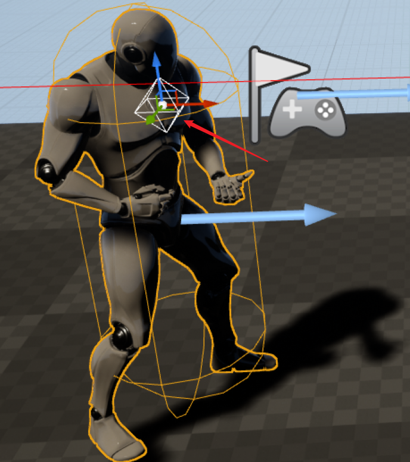

# Component Visualizers

起因是想在BlueprintEditor下对某个组件的一个Vector属性进行可视化并且支持编辑。引擎在UPROPERTY的meta中提供了MakeEditWidget的功能。如果将一个属性（支持Vector、Transform类型）设置为MakeEditWidget=true，那么引擎会自动给这个属性生成一个编辑用的小组件：

```c++
UPROPERTY(EditAnywhere, BlueprintReadWrite, meta = (MakeEditWidget = true))
FTransform RespawnLocation;
```



但通过MakeEditWidge生成的编辑组件只在LevelEditor下有效，在Blueprint Edtior下无法使用。流程上我们不可能先把BP拖放到LevelEditor然后可视化到编辑Vector，然后再把数值复制粘贴到蓝图。

**Component Visualizers**是一个将数据在Blueprint Editor下可视化的很好方式，并且支持鼠标响应，右键菜单绑定等操作。

## Setting Up

**Component Visualizers**的使用需要在Editor Module环境下，所以首先需要在项目能新建一个Editor模块。关于模块的创建以及配置可以参考官方Wiki：[Creating an Editor Module](https://unrealcommunity.wiki/creating-an-editor-module-x64nt5g3)

## Aiming Point

假设我们有一个巨型怪，怪可以被玩家使用枪械瞄准射击，并且有多个部位可瞄准（瞄准时需要有自动吸附）。也就是怪身体上存在多个可用于瞄准且吸附的Point，我们暂且定义为**Aiming Point** 。一般情况下我们可能会使用指定的骨骼来作为Aiming Point，但使用骨骼可能会导致瞄准时由于骨骼本身的运动导致吸附枪线抖动。所以我们选择在DamageComponent（ActorComponent）上配置多个Vector作为Aiming Point。

**DamageComponent**

```c++
UCLASS(ClassGroup=(Custom), meta=(BlueprintSpawnableComponent))
class UDamageComponent : public UActorComponent
{
	GENERATED_BODY()

public:
	UDamageComponent();

	UPROPERTY(EditAnywhere, BlueprintReadWrite)
	TArray<FVector> AimingPoints;

protected:
	virtual void BeginPlay() override;

public:
	virtual void TickComponent(float DeltaTime, ELevelTick TickType,
	                           FActorComponentTickFunction* ThisTickFunction) override;
};
```

## Creating DamageComponent Visualization Class

接下来在EditorModule中创建DamageComponentVisualizer:

```c++
#pragma once

#include "CoreMinimal.h"
#include "ComponentVisualizer.h"

class DamageComponentVisualizer : public FComponentVisualizer
{
public:
	DamageComponentVisualizer();
	virtual ~DamageComponentVisualizer();

	virtual void OnRegister() override;
	virtual void DrawVisualization(const UActorComponent* Component, const FSceneView* View, FPrimitiveDrawInterface* PDI) override;
	virtual bool GetWidgetLocation(const FEditorViewportClient* ViewportClient, FVector& OutLocation) const override;
	virtual bool VisProxyHandleClick(FEditorViewportClient* InViewportClient, HComponentVisProxy* VisProxy, const FViewportClick& Click) override;
	virtual bool IsVisualizingArchetype() const override;
	virtual bool HandleInputDelta(FEditorViewportClient* ViewportClient, FViewport* Viewport, FVector& DeltaTranslate, FRotator& DeltalRotate, FVector& DeltaScale) override;
};
```

可以在子类中Override我们需要的可视化行为，如组件的绘制，组件的Input行为等。要使用ComponentVisualizer，首先需要将自定义的Visualizer在编辑模块启动时注册到引擎中：

```C++
void FMasteryEditorModule::StartupModule()
{
	if(GUnrealEd)
	{
		TSharedPtr<FDamageComponentVisualizer> Visualizer = MakeShareable(new FDamageComponentVisualizer);
		GUnrealEd->RegisterComponentVisualizer(UDamageComponent::StaticClass()->GetFName(),
			Visualizer);

		if(Visualizer.IsValid())
		{
			Visualizer->OnRegister();
		}
	}
}
```

完成这一步后，当我们在BlueprintEditor下选中**DamageComponent**时，引擎会使用我们注册的**FComponentVisualizer**。

由于我们需要编辑多个**FVector**类型的AimingPoint，所以我们需要在**DamgeComponentVisualizer**中分别定义要可视化的属性和当前正在编辑的AimingPoint:

```C++
private:
	FProperty* AimingPointProperty;
	int32 SelectedPointIndex;
```

初始化：

```C++
FDamageComponentVisualizer::FDamageComponentVisualizer():AimingPointProperty(nullptr),
															SelectedPointIndex(0)
{
	AimingPointProperty = FindFProperty<FProperty>(UDamageComponent::StaticClass(),
	                                               "AimingPoint");
}
```

## Hit Proxies

