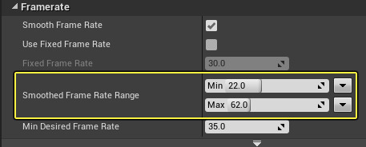
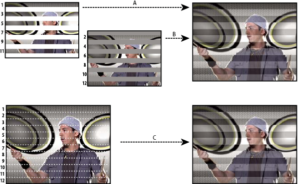
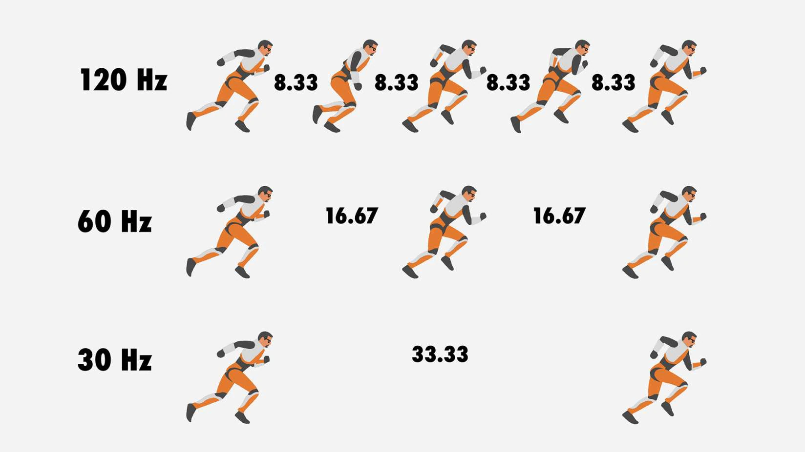
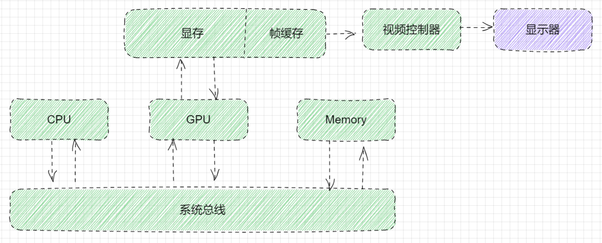
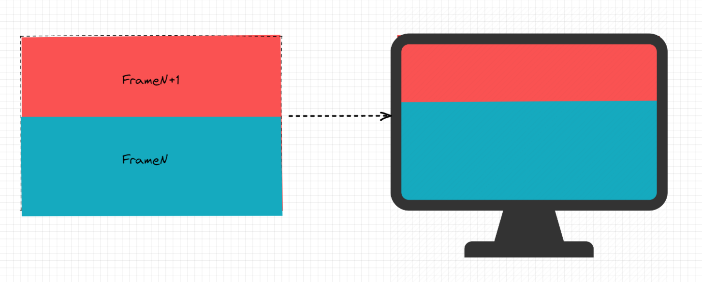
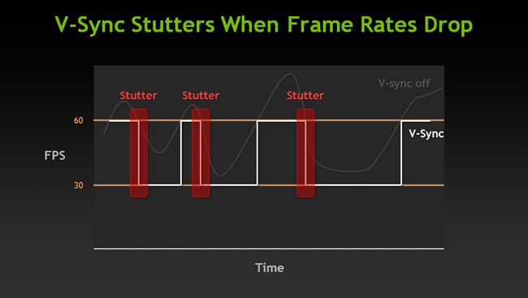
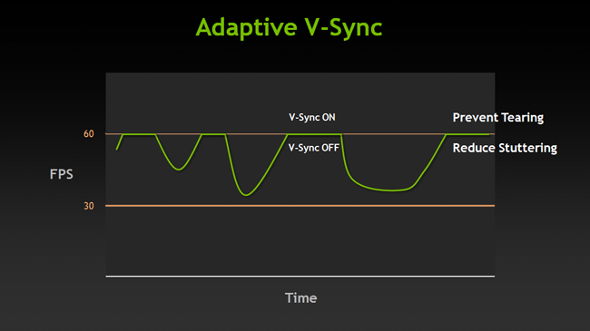
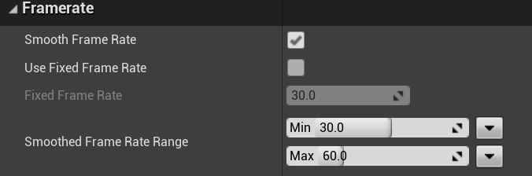
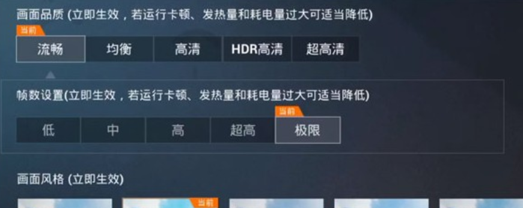
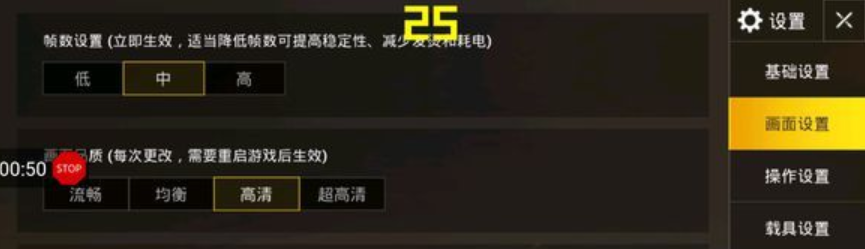

#  What exactly does "Smooth Frame Rate" do?



帧率是游戏是否合格的一个黄金标准，大量的性能优化工作也是围绕着帧率进行。UE提供了一个**Smooth Frame Rate**的选项，你会在官方文档中看到这样的最佳实践：如果你要进行性能分析工作，需要关闭**Smooth Frame Rate**选项，打开**Use Fixed Frame Rate**选项。

**Fixed Frame Rate**这个很好理解，例如**Fixed Frame Rate**设置为30.0，那么引擎就按照帧时间为1/30(s)来执行逻辑。那**Smooth Frame Rate**又是用来干什么的？Range应该怎么设置？多少是合理的？是用来解决什么问题的？文档上提到了V-Sync，这两者又有什么关系？是不是打开了**Smooth Frame Rate**就不会在游戏中出现屏幕撕裂（Screen Tearing）问题了？

带着这些问题来深入了解下相关知识。看似一个小的引擎功能，但这背后可能是需要大量的知识和经验才能完成的工作。先不着急从源码看起，梳理一些背景知识。

## Progressive Scanning vs. Interlaced Scanning

显示器在呈现画面时，一般通过两种方式来实现：Progressive Scanning（逐行扫描）和Interlaced Scanning（隔行扫描）。两者都是按照在显示器上从左到右，从上到小的顺序显示像素，逐行扫描是每行都处理，而隔行扫描则是奇数行和偶数行交替进行，这样的好处是节省了数据量，多用在电视设备（SDTVs）上，由于人眼的视觉暂留原因，隔行扫描的形式人眼看到的也会事完整的画面。现代显示设备基本都是逐行扫描的方式。



## VBlank

当显示器扫描线完成一次完整扫描后，会从显示器的右下角返回至左上角，这个过程我们称为：VBlank，也叫VBI（Vertical Blanking Interval）。

## 刷新率

我们在购买显示器的时候，特别是游戏玩家会比较关注的一个重要指标就是屏幕刷新率。例如：144Hz，60Hz。**Hz:表示每一秒周期性事件发送的次数。**那么我们说一台显示器的刷新率为60Hz就代表该显示器在每一秒钟可以完成60次全画幅的逐行扫描。

如下图所示越高的刷新率的屏幕对画面的更新频率越高，单位时间内能观察到的画面就越多。对于快节奏竞技类游戏，这点尤其的重要。



## 帧、帧率（FPS）

在游戏开发中我们所说的帧通常分为逻辑帧和渲染帧，这里我们只从渲染的角度来理解帧和帧率。渲染层面上帧对应的是显卡绘制完成并即将输出到显示器的一副完整画面。那么对应的帧率即Frames Per Second，每秒钟显卡绘制的帧数。

帧率和刷新率是两个不同的概念，一定要区分开，不然我们就没办法很好的理解屏幕撕裂产生的原因等问题。

## 帧缓存（Frame Buffer)

帧缓存是显存（如果显示芯片是集成在主板上的话，那么帧缓存就在主存上 ）中一段专用的存储空间，保存着用于发送到显示器的图像数据。



## 屏幕撕裂（Screen Tearing）

理解了上面的各种概念以后，可以讨论下关键问题了。玩各种游戏的时候我们可能会看到像下图这样画面，画面上半部分与下半部分完全错开了，这种现象被称作屏幕撕裂：


## Single Buffering

在Single Buffering的模式下，当刷新率与帧率不一致时，就会出现画面的撕裂的情况。这个很好理解，假如当前帧率为30fps，而屏幕的刷新率为60Hz,那么就会出现当一帧画面绘制到一半的时候，屏幕就会将Frame Buffer的数据同步到屏幕：



## Double Buffering + V-Sync

Double Buffering即双缓冲模式，也就是当前存在两个Frame Buffer分别是Frontbuffer，Backbuffer。这种模式下，显卡会一直在Backbuffer上绘制帧，当一帧绘制完成了以后就会触发帧传递（Buffer Swap）,将绘制好的下一帧画面传递至Frontbuffer。显示器控制器则会将Frontbuffer的帧画面同步至显示器。

但双缓冲模式并没有解决Single Buffering下的画面撕裂问题，只是提高了帧绘制的效率，当帧率高于屏幕刷新率时，仍然会产生画面撕裂。例如：当前帧率为90fps，屏幕刷新率为60Hz，屏幕在Progressive Scanning到一半的时候，此时显卡已经绘制完成了Backbuffer，直接发生了Buffer Swap，Frontbuffer被刷新为下一帧，那么结果仍然和上图一样产生屏幕撕裂。

这时候就需要V-Sync来协调整个过程，V-Sync是将Buffer Swap强制发生在VBlank阶段。这就保证了显示器在Progressive Scanning阶段，Frontbuffer是不会被刷新的，从而避免了画面撕裂问题的出现。也就是V-Sync会强制将最大帧率限制为显示器的最大刷新率，以避免出现屏幕撕裂问题。

如果显卡可以一直将帧率稳定60fps的话，那么是没问题的。但如果显卡性能不足以维持60fps的话，V-Sync机制则会带来卡顿问题。例如：显卡能达到的最大帧率为30fps，屏幕刷新率为60Hz，开启V-Sync后当Backbuffer没有绘制完成时，屏幕则会重新绘制Frontbuffer的内容，那么此时刷新率则为30Hz，Backbuffer并不能在第一时间swap到Frontbuffer，从而导致卡顿的出现。

在UE-SmoothFrameRate文档页面引用了 Nvidia对V-Sync产生卡顿的说明图例：



## Adaptive V-Sync

UE-SmoothFrameRate中提到了Adapitve V-Sync，也叫自适应V-Sync。该功能允许帧率高于刷新率时自动开启V-Sync来避免屏幕撕裂，帧率低于刷新率时自动关闭V-Sync来避免卡顿的产生。



到这里我们基本上了解了V-Sync的相关前置知识。但这些和SmoothFrameRate有什么关系？不得不说UE的文档迷惑性非常强，如果你第一次看这页文档，你会自然的认为SmoothFrameRate是和V-Sync相关的一个功能。但令人意外的是，两者并没有什么关系，唯一的关系只是在这里拿Adaptive V-sync举了个例子。

## Smooth Frame Rate

Smooth Frame Rate直译就是”平滑帧率“，原理不复杂，Smooth Frame Rate就是游戏在运行时的帧率不再是固定的30fps，60fps而是会根据SmoothedFrameRateRange定义的帧率范围来动态调整帧率。这个策略可以让游戏在不同设备上都能以最大（高性能设备）或最优（低性能设备）帧率运行游戏。例如下图将最小最大帧率分别设置为30fps,60fps：



当游戏运行在高性能机器上时，帧率为60fps，玩家的体验更流畅；当游戏运行在低端机器上，性能不足以将帧率稳定在60fps，那么SmoothFrameRate策略则会通过一段时间的平均帧率，将帧率设定在低于60fps，高于或等于30fps范围内的值，从而保证帧率是平滑的，优化体验。

```cpp
float UEngine::GetMaxTickRate(float DeltaTime, bool bAllowFrameRateSmoothing) const
{
	float MaxTickRate = 0;

	if (bAllowFrameRateSmoothing && IsAllowedFramerateSmoothing())
	{
		// Work in FPS domain as that is what the function will return.
		MaxTickRate = 1.f / RunningAverageDeltaTime;

		// Clamp FPS into ini defined min/ max range.
		if (SmoothedFrameRateRange.HasLowerBound())
		{
			MaxTickRate = FMath::Max( MaxTickRate, SmoothedFrameRateRange.GetLowerBoundValue() );
		}
		if (SmoothedFrameRateRange.HasUpperBound())
		{
			MaxTickRate = FMath::Min( MaxTickRate, SmoothedFrameRateRange.GetUpperBoundValue() );
		}
	}
	......
	if (CVarMaxFPS.GetValueOnAnyThread() > 0)
	{
		MaxTickRate = CVarMaxFPS.GetValueOnAnyThread();
	}

	return MaxTickRate;
}
```

代码也比较清晰，在函数的最后会去读取CVarMaxFPS这个CVar的值，如果对该值进行过设置，那么最大帧率则为该CVar的值。

## 一点思考



一般我们都会在FPS游戏的设置里看到帧率相关的设置选项，上图是和平精英的设置选项，如果你的手机是高刷新率（120Hz）的话，甚至能看到极限这个选项，点选后最大帧率会设置到120fps，但有些低端机器的设置则如下图：



帧率其实只有高中低三个选项。这些选项其实对应就是帧率上限，UE提供了一套硬件适配系统：Scalability 。通过获取硬件数据来适配不同的性能配置，如View Distance, Anti-Aliasing等渲染相关的适配，很明显和平精英也对帧率做了一些适配，但貌似他们只是直接使用FixedFrameRate模式，也就是说帧数设置选中，那么帧率就是固定的25fps，比较好的方式我认为还是开启SmoothFrameRate并提供不同的Range，例如帧数设置选中，那么SmoothFrameRateRange对应[20,25]。这也不难实现，稍微修改一下将Range从 UPROPERTY修改为CVar的形式即可。