# Unity MapGen

 基于多边形的随机地图生成。

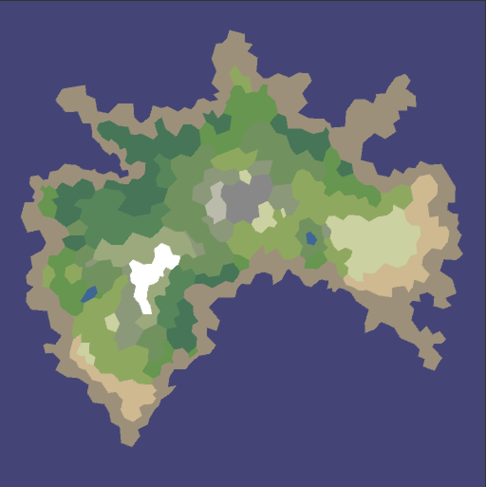

## Part1 Polygon

随机地图的生成首先需要一张高度图(Elevation)，可以理解为海拔数据代表了每个坐标的海拔值。再用一张降雨图(Moisture)来影响植被和河流。高度图一般的做法是使用噪音来得到，而降雨图是根据高度图计算得来的(海岸和季风的影响)。简单的户外环境使用噪音即可以得到比较自然的地形，但实际游戏需求往往是复杂的。可能需要选择在不同的位置生成不同的植物，动物群落。再或者游戏的资源的投放是需要关联不同地貌的，例如在沙漠地带投放水资源相关掉落。在平原地区生成城市，在热带雨林生成部落等。

我们使用多边形来填充地图，相比传统的基于Tile的地图生成在很大程度上降低了空间上的复杂度。100000个Tile的地图可能只需要1000个多边形就可以完成地图数据的填充。

### Voronoi Diagram (沃罗诺伊图)

首先我们使用**Voronoi Diagram**来分割地图。沃罗诺伊图(Voronoi Diagram)又叫泰森多边形，该算法实现使用一组特定的点将平面分割成不同区域，而每一区域又仅包含唯一的特定点，并且该区域内任意位置到该特定点的距离最小。分割后得到的Voronoi节点可有多种适用场景，如在地图的平原地区生成一个面积最大的城镇等。为了使用Voronoi来分割地图，要先生成一些随机点，随机点的生成可以是柏林噪音，或其他任何随机，为了能够利用种子(seed)来还原地图，这里最好使用伪随机来生成点。

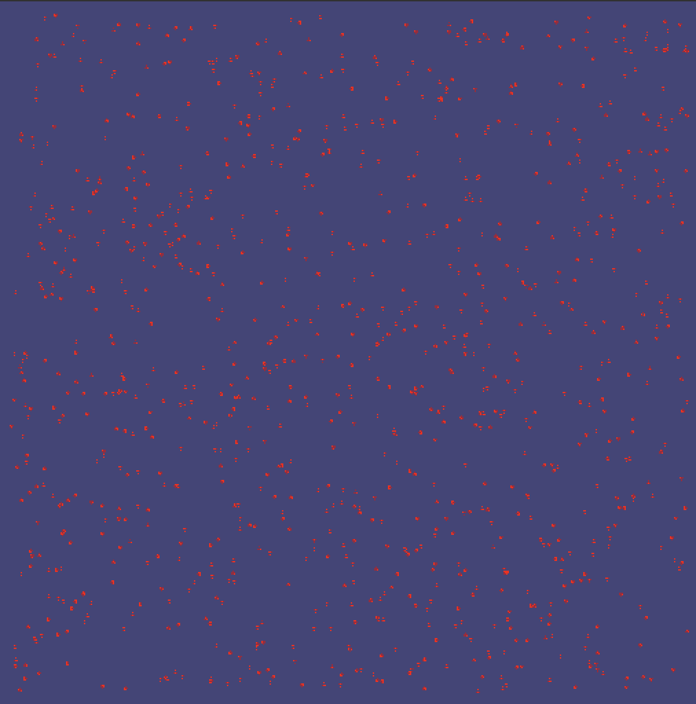

随机生成了1000个点，然后我们使用**Delaunay三角剖分**来得到三角形。这里使用基于**Fortune's algorithm**的三角剖分。

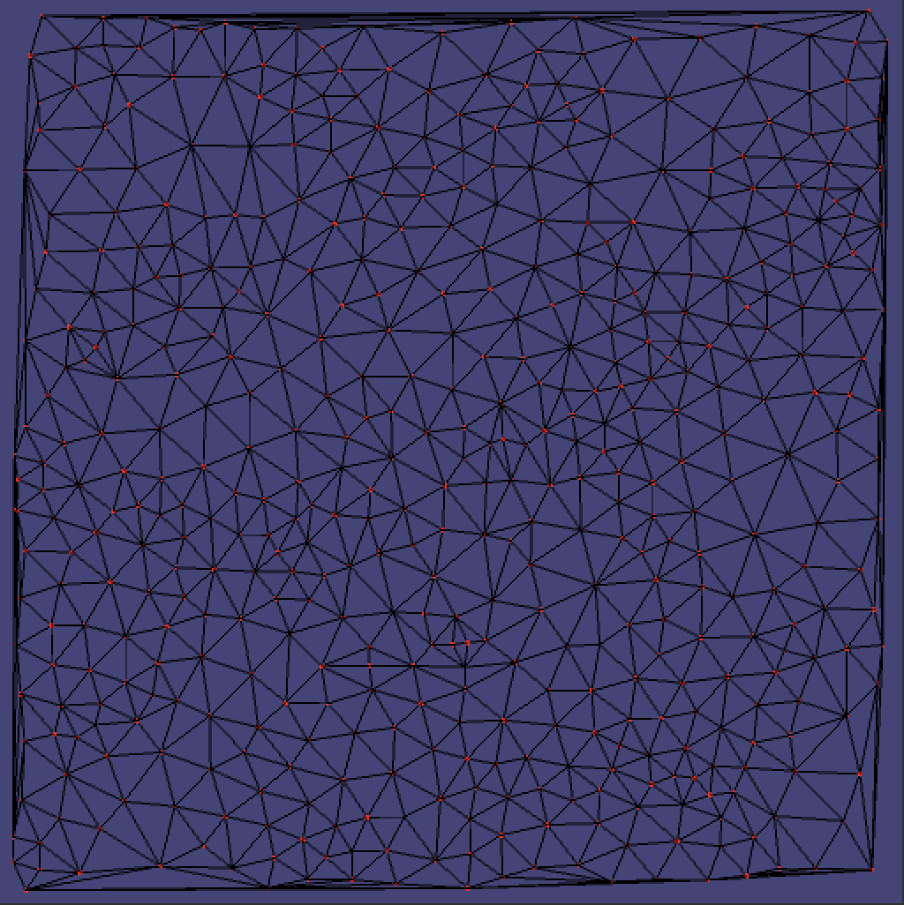

为了方便观察，我把随机的点数调整为500个。接下来用已有的三角形得到Voronoi多边形。

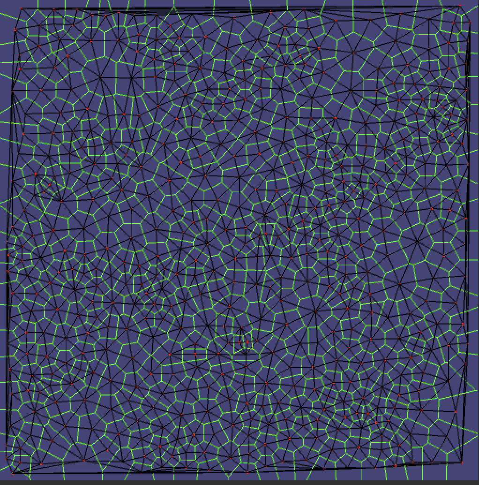

绿色的多边形，即为Voronoi多边形。我们仔细观察一下单个多边形：

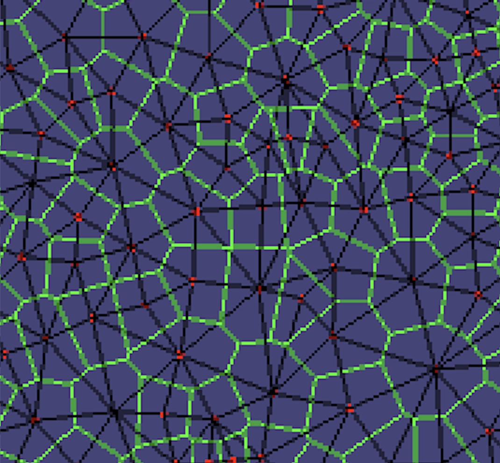

可以看到一个三角形对应一个多边形的顶角，每个多边形又对应三角形的一个顶角。这种双重性将会用在不同的地方，比如三角形可以用来寻路，而多边形则可以用来渲染。后面会有具体的应用场景。现在我们把暂时用不到的三角形的渲染关掉，再来观察这些多边形：

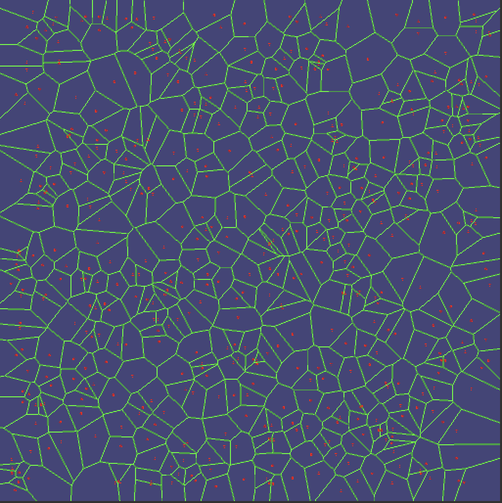

 可以看到多边形的大小都非常不规则，接下来我们使用**Lloyd relaxation**调整网格大小使整体更规整:

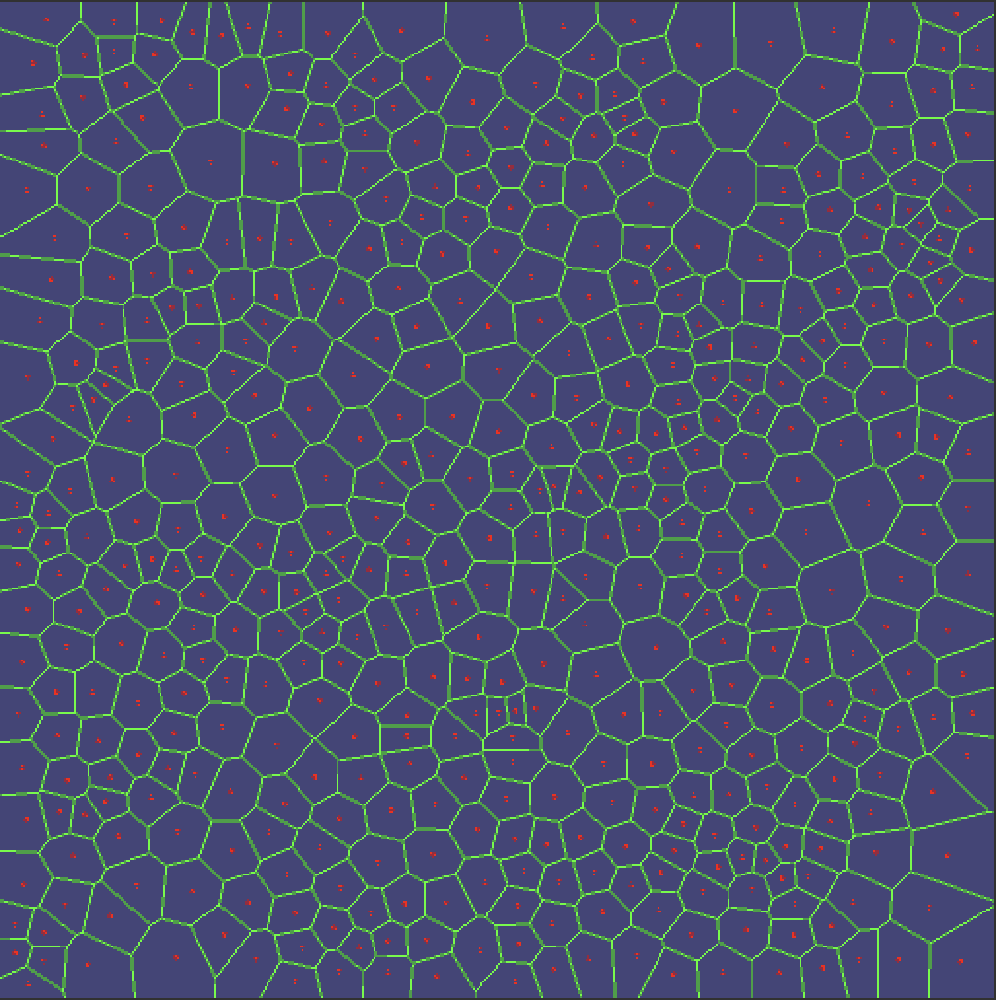


> Voronoi Diagram: <https://en.wikipedia.org/wiki/Voronoi_diagram>
>
> Fortune's algorithm：<https://en.wikipedia.org/wiki/Fortune's_algorithm>
>
> Lloyd relaxation: <https://en.wikipedia.org/wiki/Lloyd%27s_algorithm>

### 区分水和陆地

现在要生成一个被大海包围的岛屿，这里我们使用**Radial**正弦波算法来生成圆形岛屿。当然岛屿可以是任何条件约束下生成的形状，代码里提供了另外两种：Perlin和Square算法来生成岛屿。

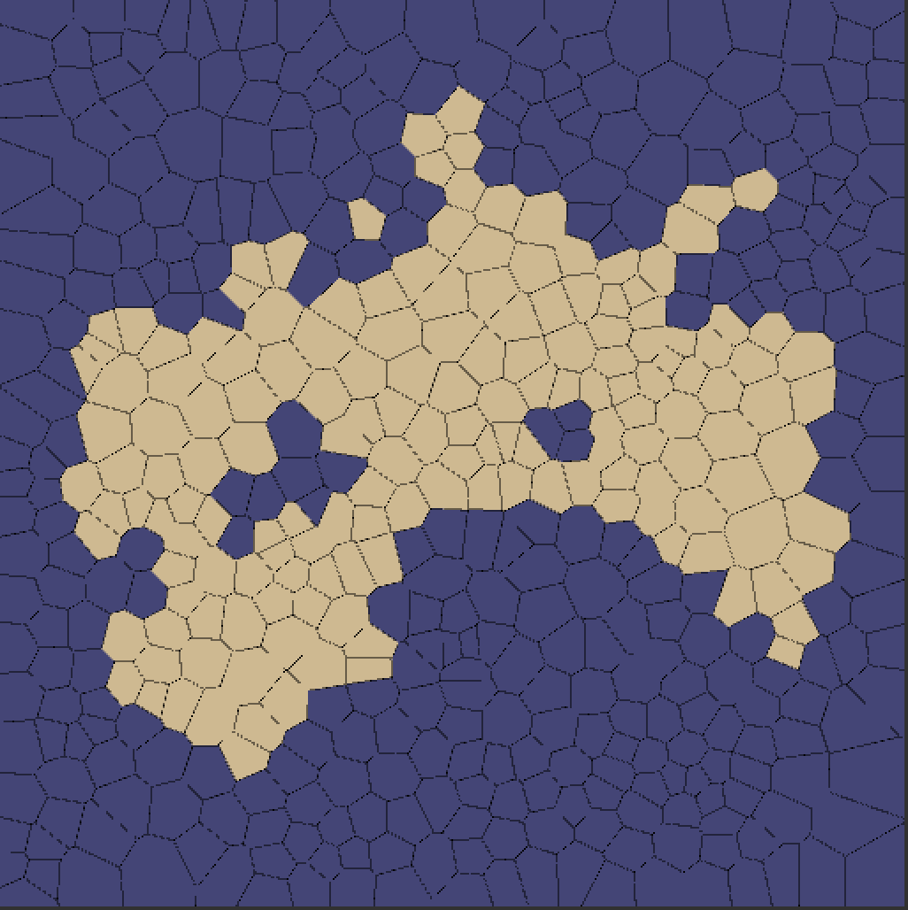

### 区分海洋,海岸线和内陆湖

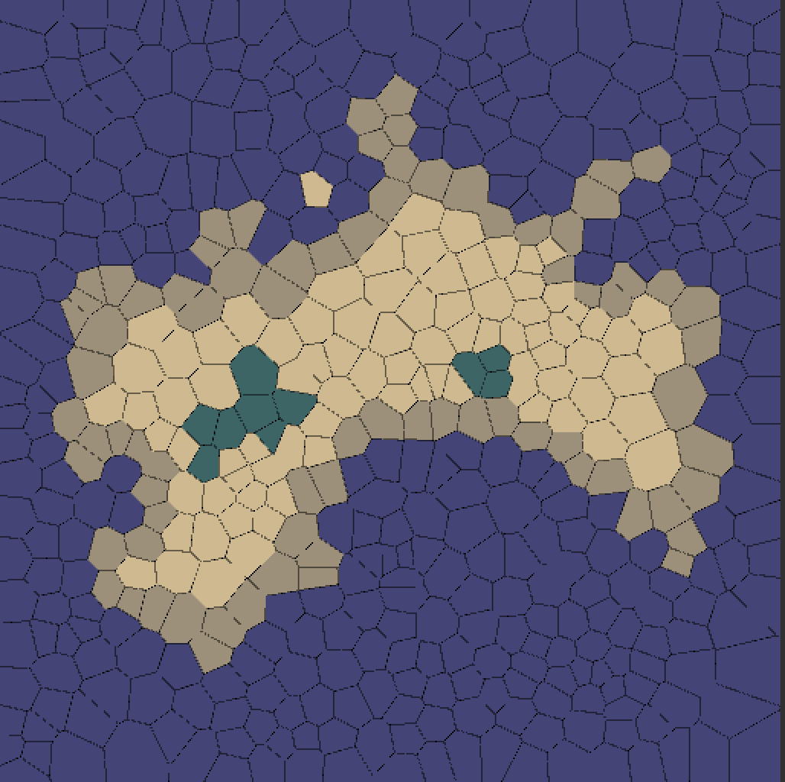

1. 首先规定地图边缘均为海洋 。
2. 所有与海洋接触的水均为海洋。
3. 所有与海洋接触的陆地为海岸线即渲染为沙滩。
4. 其余的水均为湖泊。 

## Part2 海拔，河流，湿度，生物类群

### 海拔(Elevation)
接下来给每个网格生成海拔值。海拔值会是很重要的数据，它将会用来影响生物类群的分布，河流的流向等。首先通过Voronoi多边形的角距离海岸线的距离来确定其海拔值，最后将Voronoi多边形所有角海拔的平均值存储到Voronoi多边形对应的**Center**中。
1. `AssignCornerElevations`方法为每个角计算海拔值
   从边缘的角开始计算海拔值，并通过当前角的相邻角依次往里收缩计算角的海拔值。

   ```c#
   // queue存储了边缘角
       while(queue.Count > 0)
        {
            Corner q = queue.Pop();
   
            foreach(Corner s in q.Adjacent) // 从边缘角通过相邻角向里收缩 
            {
                double newElevation = 0.01f + q.Elevation;
                if(!q.Water && !s.Water)
                {
                    newElevation += 1;
                    if(NeedsMoreRandomness)
                    {
                        // 如果是Square或Hexagon类型地图，海拔加入随机以确保后面河流的生成有足够的随机性
                        newElevation += ParkMillerRng.NextDouble();
                    }
                }
   
                if (newElevation < s.Elevation)
                {
                    s.Elevation = newElevation;
                    queue.Push(s);
                }
            }
        }
   ```

2. `AssignPolygonElevations`方法计算海拔平均值
   ```c#
   // 计算平均值
   public void AssignPolygonElevations()
    {
        double sumElevation;
        foreach(Center p in Centers)
        {
            sumElevation = 0.0;
            foreach(Corner q in p.Corners)
            {
                sumElevation += q.Elevation;
            }
   
            p.Elevation = sumElevation / (double)p.Corners.Count;
        }
    }
   ```

为了方便观察海拔的分布，将海拔值转换为灰度值来绘制。颜色取值0-255，越接近白色代表海拔越高。


海拔对河流的影响: 河流会从高海拔流入低海拔地区，并最终汇入大海。
海拔对生物群落的影响: 高海拔地区会分布岩石，雪，冻土地带。中海拔地区会分布灌木，沙漠，森林和草原。低海拔地区会分布雨林，草原，海滩。

### 河流(Rivers)

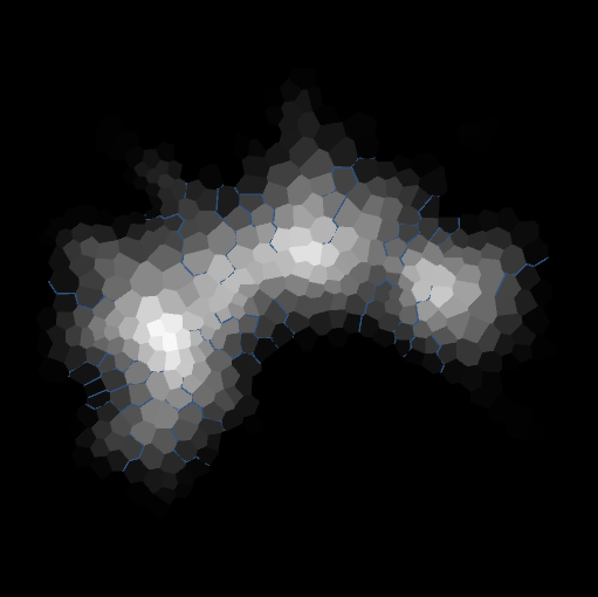

```c#
public void CreateRivers()
{
  Corner q;
  Edge edge;
  for(int i = 0; i < MapSize/2; i++)
  {
    q = Corners[(int)ParkMillerRng.NextIntRange(0, Corners.Count - 1)];
    if (q.Ocean || q.Elevation < 0.3 || q.Elevation > 0.9) continue;
    while (!q.Coast)
    {
      if (q == q.Downslope) break;

      edge = LookupEdgeFromCorner(q, q.Downslope);
      edge.River = edge.River + 1;
      q.River = q.River + 1;
      q.Downslope.River = q.Downslope.River + 1;
      q = q.Downslope;
    }
  }
}
```

随机获取已有的多边形且该多边形是水但不是海洋，并且海拔的取值范围限定在0.3~0.9。然后通过前面建立的Downslope节点，将水流一直延续到海洋。上图中蓝色的线条即为生成的水流。

### 湿度(Moisture)

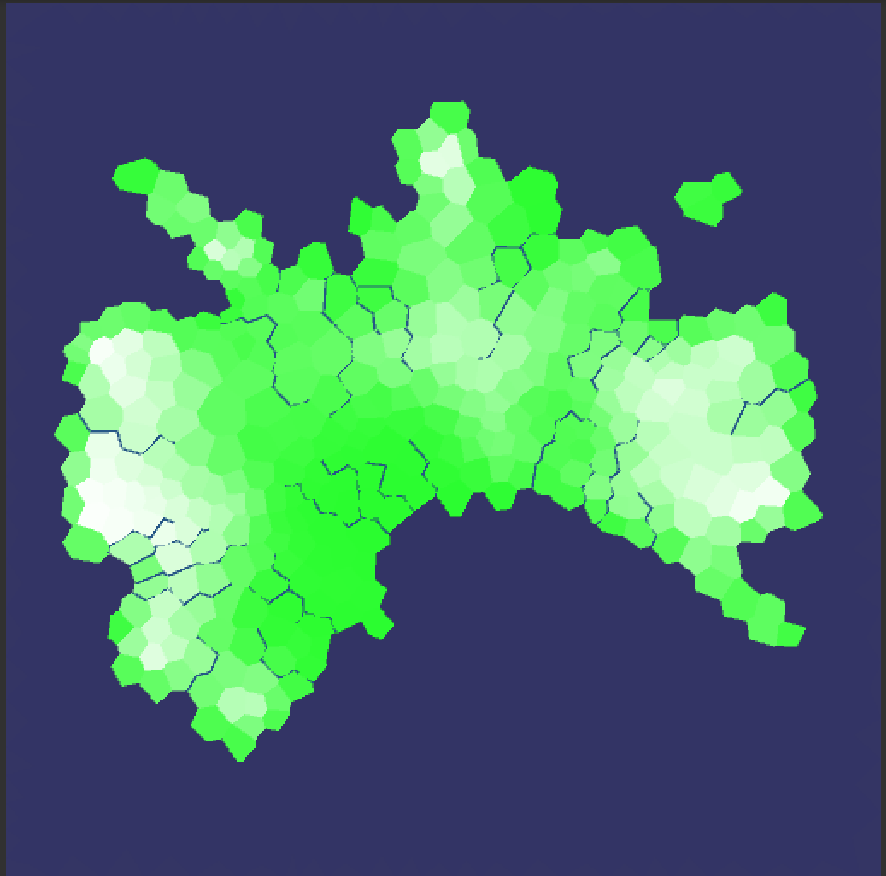

根据河流的分布来计算湿度分布，越是靠近海洋，河流，湖的地方湿度越大。如图绿色越深则湿度越大。结合河流分布来看会更加清晰。

```c#
public void AssignCornerMoisture()
    {
        Stack<Corner> queue = new Stack<Corner>();
        double newMoisture;
        foreach(Corner q in Corners)
        {
            if((q.Water || q.River > 0) && !q.Ocean)
            {
                q.Moisture = q.River > 0 ? Mathf.Min(3.0f, (0.2f * q.River)) : 1.0f;
                queue.Push(q);
            }else
            {
                q.Moisture = 0.0;
            }
        }
        
        while(queue.Count > 0)
        {
            Corner q = queue.Pop();
            foreach(Corner r in q.Adjacent)
            {
                newMoisture = q.Moisture * 0.9;
                if(newMoisture > r.Moisture)
                {
                    r.Moisture = newMoisture;
                    queue.Push(r);
                }
            }
        }
        
        foreach(Corner q in Corners)
        {
            if(q.Ocean || q.Coast)
            {
                q.Moisture = 1.0;
            }
        }
    }
```

### 生物类群(Biomes)

接下来将海拔和湿度数据结合起来，这样就可以得到不同区域所对应的生态环境，以及生物类群的分布。


```c#
public static string GetBiome(Center p)
    {
        if (p.Ocean)
        {
            return "OCEAN";
        }
        else if (p.Water)
        {
            if (p.Elevation < 0.1) return "MARSH";
            if (p.Elevation > 0.8) return "ICE";
            return "LAKE";
        }
        else if (p.Coast)
        {
            return "BEACH";
        }
        else if (p.Elevation > 0.8)
        {
            if (p.Moisture > 0.50) return "SNOW";
            else if (p.Moisture > 0.33) return "TUNDRA";
            else if (p.Moisture > 0.16) return "BARE";
            else return "SCORCHED";
        }
        else if (p.Elevation > 0.6)
        {
            if (p.Moisture > 0.66) return "TAIGA";
            else if (p.Moisture > 0.33) return "SHRUBLAND";
            else return "TEMPERATE_DESERT";
        }
        else if (p.Elevation > 0.3)
        {
            if (p.Moisture > 0.83) return "TEMPERATE_RAIN_FOREST";
            else if (p.Moisture > 0.50) return "TEMPERATE_DECIDUOUS_FOREST";
            else if (p.Moisture > 0.16) return "GRASSLAND";
            else return "TEMPERATE_DESERT";
        }
        else
        {
            if (p.Moisture > 0.66) return "TROPICAL_RAIN_FOREST";
            else if (p.Moisture > 0.33) return "TROPICAL_SEASONAL_FOREST";
            else if (p.Moisture > 0.16) return "GRASSLAND";
            else return "SUBTROPICAL_DESERT";
        }
    }
```

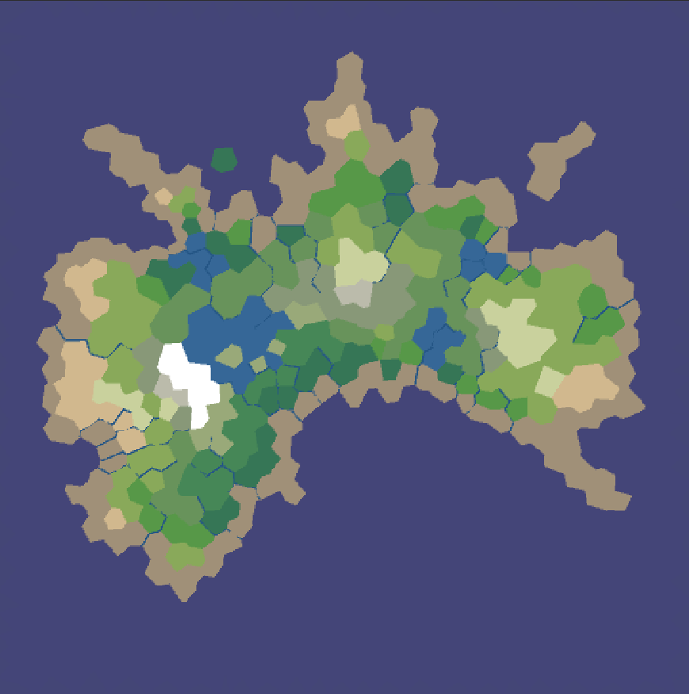

至此，我们已经有了一张相对完整的地图。接下来，这些地图数据将会在游戏中使用。

> Polygonal Map Generation for Games : http://www-cs-students.stanford.edu/~amitp/game-programming/polygon-map-generation/
>
> Generating fantasy maps : http://mewo2.com/notes/terrain/
>
> GitHub: https://github.com/vanCopper/Unity-MapGen