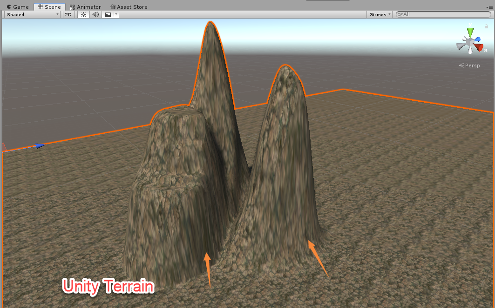

# TriplanarMapping

在基于高度图生成的地形中都会出现立面的纹理拉伸问题，Unity自带的地形系统同样会出现该问题。导致这个问题的原因也很简单：立面中所使用的UV只能跨越较小的纹理尺寸，进而导致了纹理的拉伸问题。



**GPU Gems 3** 在章节[Generating Complex Procedural Terrains Using the GPU](https://developer.nvidia.com/gpugems/GPUGems3/gpugems3_ch01.html)中提到使用Triplanar Mapping技术来处理立面中纹理拉伸问题。先来理解一下解决思路。


如上图，我们用ab，bc代表悬崖的两个侧面。Pa，Pb，Pc表示三个点在Y轴上的投影位置，Pa'，Pb'，Pc'，表示三个点在X轴上的投影位置。可以看到ab在Y轴上的投影距离大于X轴上的投影距离，bc则是X轴上的投影距离大于Y轴上的投影距离。所以为了让纹理坐标跨越较大范围，ab的UV应该使用其在Y轴上的投影，bc的UV应该使用其在X轴上的投影。

接下来验证一下，利用高度图拉起的地形中，UV坐标一般是使用顶点的世界坐标的xz，上图中**Unity Terrain**就是使用顶点坐标的xz来做UV的效果。我们首先将UV换成zy平面坐标来看下效果：


可以明显看到部分立面的拉伸已经得到很大的改善。再将UV换成xy平面坐标：


可以看到，由于观察角度不同就需要使用不同平面坐标来进行采样。比如沿x轴观察使用yz平面更容易获得好的采样结果。**Triplanar Mapping**技术会对三个平面分别进行采样，然后根据法线(WorldSpace)计算出权重来做最终混合，从而得到比较不错的效果。

```c#
half4 frag(v2f i) : COLOR 
{  
	float2 uv_x = TRANSFORM_TEX(i.worldPos.zy, _Basemap); // x 平面
	float2 uv_y = TRANSFORM_TEX(i.worldPos.xz, _Basemap); // y 平面
	float2 uv_z = TRANSFORM_TEX(i.worldPos.xy, _Basemap); // z 平面

	half4 col_x = tex2D(_Basemap, uv_x);
	half4 col_y = tex2D(_Basemap, uv_y);
	half4 col_z = tex2D(_Basemap, uv_z);

	half3 blend_weights = abs(i.worldNormal);
	 // 法线的分量相加会超过3，我们需要控制三个分量相加等于 1
	blend_weights  = blend_weights  /  (blend_weights.x + blend_weights.y + blend_weights.z);

	col_x *= blend_weights.x;
	col_y *= blend_weights.y;
	col_z *= blend_weights.z;

	Light mainLight = GetMainLight();
	half3 lightDir = mainLight.direction;
	half3 NdotL = max(0, dot(i.worldNormal, lightDir));
	half4 light = half4(NdotL * mainLight.color.xyz + SampleSH(i.worldNormal).xyz, 1);

	half4 diffuse = col_x + col_y + col_z;
	half4 color = diffuse * light;

	return color;
}
```


**GPU Gems 3**的Triplanar Mapping实现效果基本上就是上图的样子，但感觉混合效果并不是很好。三次采样直接混合在一起导致画面稍微有些杂乱，这里可以使用`pow`处理混合权重，这样原本低的权重值会更低，而又不会改变最高值，进而减少权重低的混合。

```c#
half3 blend_weights = abs(i.worldNormal);
blend_weights = pow(weights, 64);
blend_weights  = blend_weights  / (blend_weights.x + blend_weights.y + blend_weights.z);
```


> <https://developer.nvidia.com/gpugems/GPUGems3/gpugems3_ch01.html>
>
> <https://www.ronja-tutorials.com/2018/05/11/triplanar-mapping.html>

