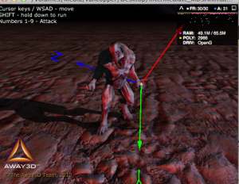

<strong>原创博文，转载请声明</strong>

骨骼的绑定归根结底就是将目标骨骼的位置以及旋转数据，同步给要绑定的显示对象。

先来看BindingTag.as

package away3d.entities
{
    import away3d.arcane;
    import away3d.animators.SkeletonAnimator;
    import away3d.animators.data.JointPose;
    import away3d.containers.ObjectContainer3D;

    use namespace arcane
    /**
     * 骨骼绑定点 
     * @author vancopper
     * 
     */ 
    public class BindingTag extends ObjectContainer3D
    {
        private var _skeletonAnimator:SkeletonAnimator;
        private var _skeletonIndex:int;

        /**
         * 
         * @param skeletonAnimator
         * @param skeletonIndex 要绑定的骨骼索引
         * 
         */     
        public function BindingTag(skeletonAnimator:SkeletonAnimator, skeletonIndex:int)
        {
            super();
            _skeletonAnimator = skeletonAnimator;
            _skeletonIndex = skeletonIndex;
        }

        public function notifyBindingTransformChange():void
        {
            invalidateTransform();
        }

        override protected function updateSceneTransform():void
        {
            if (_parent) 
            {
                var jointPoses:Vector.<JointPose> = _skeletonAnimator.globalPose.jointPoses;
                if(jointPoses && jointPoses.length)
                {
                                        //取到骨骼数据并同步给当前对象
                    _sceneTransform.copyFrom( jointPoses[_skeletonIndex].toMatrix3D() );
                    _sceneTransform.append( _parent.sceneTransform );
                    _sceneTransform.prepend(transform);
                }
            }
            _sceneTransformDirty = false;
        }

        override public function dispose():void
        {
            //TODO:
        }
    }
}


`BindingTag`即是绑定在指定骨骼上的容器，假如你想绑定武器或特效，只要将他们addChild到该BindingTag就可以了。  
下面看怎样将BindingTag集成到Away3D里面。 
为AnimatorBase添加Exit_Frame事件，至于为什么要加这个Exit_Frame事件，后面再来解释。
分别在start()以及stop()方法里添加、移除Exit_Frame事件

<pre class="brush:as3">if(!_broadcaster.hasEventListener(Event.EXIT_FRAME))
    _broadcaster.addEventListener(Event.ENTER_FRAME, onExitFrame);

if(_broadcaster.hasEventListener(Event.EXIT_FRAME))
    _broadcaster.removeEventListener(Event.EXIT_FRAME, onExitFrame);

protected function onExitFrame(event:Event):void
{
    //Override
}</pre>

为SkeletonAnimator添加addBindingTagByName，addBindingTagByIndex方法
以及复写onExitFrame

		 /**
         * 绑定至通过名字指定的骨骼上 
         * @param boneName
         * @return 
         * 
         */     
        public function addBindingTagByName(boneName:String):BindingTag
        {
            var boneIndex : int = globalPose.jointPoseIndexFromName(boneName);
            if(boneIndex<0)//骨骼不存在
                return null;
            return addBindingTagByIndex(boneIndex);
        }

        /**
         * 绑定至通过骨骼索引指定的骨骼上 
         * @param boneIndex
         * @return 
         * 
         */     
        public function addBindingTagByIndex(boneIndex:int):BindingTag
        {
            var bindingTag:BindingTag = new BindingTag(this, boneIndex);

            for(var i:int = 0; i < _owners.length; i++)
            {
                _owners[i].addChild(bindingTag);//将bindingTag添加至骨骼对应的Mesh
            }

            if(!_bindingTags)_bindingTags = new Vector.<BindingTag>();
            _bindingTags.push(bindingTag);          
            return bindingTag;
        }

        override protected function onExitFrame(event:Event):void
        {
            if(_bindingTags && _bindingTags.length)
            {
                for (var i:int = 0; i < _bindingTags.length; i++)
                {
                    _bindingTags[i].notifyBindingTransformChange();
                }
            }
        }
        

到这里就已经代码已经都修改添加完成了，下面来说下为什么要在Exit_Frame事件中通知
BindingTag更新.骨骼的更新是在skeletonAnimatior的updateGlobalProperties方法中
进行的，他的更新是在引擎执行完traverse后执行的，所以为了保证每次执行traverse时都能让
BindingTag根据骨骼更新，需在Exit_Frame时通知，否则BindingTag的更新总会延迟一帧，
从而导致跟随出现错位问题。
下面利用官方例子Intermediate_MD5Animation测试了一下
在481行添加以下代码:

<pre class="brush:as3">var bindingTag:BindingTag = animator.addBindingTagByIndex(11);
bindingTag.addChild(new Trident(100));

点击图片链接至demo，需加载3M左右资源

