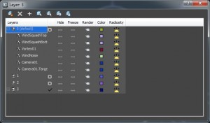
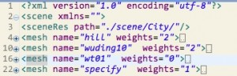

**原创博文，转载请声明**

3D页游场景资源量相对2D场景要大许多。如何保证玩家快速进入场景是场景优化的第一步。
首先，场景不可能用户进去就能一览无余。所以考虑将场景分批加载，分批加载需要解决
场景穿帮问题以及如何组织资源以便分批加载。

1.利用3dmax导出场景资源配置：3dmax里面利用layer工具就可以对场景进行组织以决定加载
的先后顺序。
  

2.场景配置导出的时候将物件所在的层索引一并导出

3.导出的配置文件就是场景配置，在配置里还可以导出更多信息，比如场景物件位置，旋转以及是否支持透贴，是否接受或响应阴影等信息。

4.最后通过场景配置来分批加载还原场景，通过分层可将进入场景的时间控制在很短的时间内。