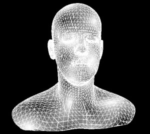

<strong>原创博文，转载请声明</strong>

本是想以线框的方式查看一下地形模型，不想Away3D中的线框材质非常不友好，不支持透明也就算了，还有各种报错。

其实直接换模型材质也不好，最好的还是用根据模型生成线框实体来的方便。花时间弄了一个，效果如图:

WireframeTriangle.as   

package copper3d.primitives
{
    import flash.geom.Vector3D;

    import away3d.primitives.WireframePrimitiveBase;

    /**
     * 线框三角 
     * @author vancopper
     * 
     */ 
    public class WireframeTriangle extends WireframePrimitiveBase
    {
        /**
         * 三角形顶点索引 
         */     
        private var _vertexIndices:Vector.&lt;uint&gt;;
        /**
         * 顶点 
         */     
        private var _vertices:Vector.&lt;Number&gt;;

        /**
         *  
         * @param vertexIndices 三角形顶点索引
         * @param vertices 顶点
         * @param color
         * @param thickness
         * 
         */     
        public function WireframeTriangle(vertexIndices:Vector.&lt;uint&gt;, vertices:Vector.&lt;Number&gt;, color:uint=0xffffff, thickness:Number=1)
        {
            _vertexIndices = vertexIndices;
            _vertices = vertices;
            super(color, thickness);
        }

        override protected function buildGeometry():void
        {
            var numTriangle:uint = _vertexIndices.length/3;
            var indexA:uint;
            var indexB:uint;
            var indexC:uint;

            var posA:Vector3D;
            var posB:Vector3D;
            var posC:Vector3D;
            var segmentIndex:uint = 0;
            for(var i:int=0; i&lt;numTriangle; i++)
            {
                indexA = _vertexIndices[i*3];
                indexB = _vertexIndices[i*3 + 1];
                indexC = _vertexIndices[i*3 + 2];

                posA = new Vector3D(_vertices[indexA*3], _vertices[indexA*3 + 1], _vertices[indexA*3 + 2]);
                posB = new Vector3D(_vertices[indexB*3], _vertices[indexB*3 + 1], _vertices[indexB*3 + 2]);
                posC = new Vector3D(_vertices[indexC*3], _vertices[indexC*3 + 1], _vertices[indexC*3 + 2]);
                //线段AB
                updateOrAddSegment(++segmentIndex, posA, posB);
                //线段BC
                updateOrAddSegment(++segmentIndex, posB, posC);
                //线段CA
                updateOrAddSegment(++segmentIndex, posC, posA);
            }
        }
    }
}  


用法：

//将需要以线框查看的模型顶点索引以及顶点数据传入即可
_wireframeTriangle =  new WireframeTriangle(mesh.geometry.subGeometries[0].indexData, mesh.geometry.subGeometries[0].vertexPositionData, 0xffffff);
_view.scene.addChild(_wireframeTriangle);
