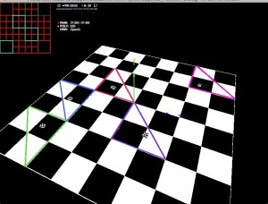

<strong>原创博文，转载请声明</strong>

away3d官方例子中有一个关于地形追踪的例子，用的是通过高度图<a href="http://udn.epicgameschina.com/Three/TerrainHeightmapsCH.html" target="_blank">(关于高度图)</a>获取地形指定点(x,z)上的高度(y)值。使用高度图的方法有一些弊端：

>1.需要额外加载一张美术根据地形导出的高度图  
>2.每次修改地形都需要美术重新生成高度图

另外一种常用思路是先获取指定点(x,z)所在的三角形，然后通过插值计算得出正确的高度(y)值。这里的思路是利用地形模型来完成高度的追踪，然后将高度写入程序动态生成的位图上。将已经计算过的高度写入位图是为了优化性能，避免一个点多次计算。

那么完成地形追踪需要两个步骤：

一.根据地形模型组织用于追踪的三角形数据,并获取到指定点(x,z)所在的三角形

二.根据指定点(x,z)计算出高度，并写入高度图

先看第一步:

如何在地形模型中找到指定点(x,z)所在的三角形？遍历地形模型中所有的三角形来确定目标三角形？那对性能的牺牲太大了，一个不是很大的而且相对简单场景地形也得有上千个三角形。这里可以利用四叉树<a href="http://zh.wikipedia.org/wiki/四叉树" target="_blank">(关于四叉树)</a>来组织和管理这些三角形(因为管理的xz这个二维平面所以采用了四叉树)。

<a href="http://blog.as3er.com/demo/TerrainPickTest.html" target="_blank">打开Demo</a>

Demo.as:


package
{
    import flash.display.Sprite;
    import flash.display.StageAlign;
    import flash.display.StageScaleMode;
    import flash.events.Event;
    import flash.events.KeyboardEvent;
    import flash.events.MouseEvent;
    import flash.geom.Rectangle;
    import flash.geom.Vector3D;
    import flash.ui.Keyboard;
    
    import away3d.containers.View3D;
    import away3d.controllers.HoverController;
    import away3d.debug.AwayStats;
    import away3d.debug.Trident;
    import away3d.entities.Mesh;
    import away3d.events.AssetEvent;
    import away3d.events.MouseEvent3D;
    import away3d.library.assets.AssetType;
    import away3d.loaders.Loader3D;
    import away3d.loaders.parsers.Parsers;
    import away3d.primitives.CubeGeometry;
    
    import copper3d.primitives.WireframeTriangle;
    import copper3d.terrain.TerrainBoundingBox;
    import copper3d.terrain.TerrainQuadTree;
    import copper3d.terrain.TerrainTriangle;
    
    [SWF(backgroundColor="#FF0000", frameRate="30", width="800", height="600")]
    
    public class TerrainPickTest extends Sprite
    {
        [Embed(source="./assets/terrain_03.3ds",mimeType="application/octet-stream")]
        public static var Terrain:Class;
        
        private var _view:View3D;
        private var _cameraController:HoverController;
        
        private var _move:Boolean = false;
        private var _lastPanAngle:Number;
        private var _lastTiltAngle:Number;
        private var _lastMouseX:Number;
        private var _lastMouseY:Number;

        private var _wireframeTriangle:WireframeTriangle;
        private var _terrainQuadTree:TerrainQuadTree;
        private var _sp:Sprite = new Sprite();
        
        private var _triNum:int = 0;//三角数量
        
        public function TerrainPickTest()
        {
            super();
            init();
        }
        
        private function init():void
        {
            stage.scaleMode = StageScaleMode.NO_SCALE;
            stage.align = StageAlign.TOP_LEFT;
            
            initEng();
            initObject();
        }
        
        private function initEng():void
        {
            _view = new View3D();
            addChild(_view);
            
            _view.camera.lens.far = 10000;
            
            _cameraController = new HoverController(_view.camera, null, 45, 20, 1000);
            
            addChild(new AwayStats(_view));
            
            addEventListener(Event.ENTER_FRAME, onEnterFrame);
            stage.addEventListener(MouseEvent.MOUSE_DOWN, onMouseDown);
            stage.addEventListener(MouseEvent.MOUSE_UP, onMouseUp);
            stage.addEventListener(MouseEvent.MOUSE_WHEEL, onMouseWheel);
            stage.addEventListener(Event.RESIZE, onResize);
        }
        
        private function initObject():void
        {
            Parsers.enableAllBundled();
            var loader:Loader3D = new Loader3D();
            loader.addEventListener(AssetEvent.ASSET_COMPLETE, onAssetComplete);
            loader.loadData(new Terrain());
            _view.scene.addChild(loader);
            _view.scene.addChild(new Trident());
        }
        
        private function onAssetComplete(event:AssetEvent):void
        {
            if(event.asset.assetType == AssetType.MESH)
            {
                var mesh:Mesh = event.asset as Mesh;
                _wireframeTriangle =  new WireframeTriangle(mesh.geometry.subGeometries[0].indexData, mesh.geometry.subGeometries[0].vertexPositionData);
                _view.scene.addChild(_wireframeTriangle);
                _terrainQuadTree = new TerrainQuadTree();
                _terrainQuadTree.setTerrainGeo(mesh.geometry.subGeometries[0]);
                _terrainQuadTree.buildQuadTree(10, 100);
                
                _sp.graphics.lineStyle(2, 0xFF0000);
                
                _terrainQuadTree.drawTree(_sp.graphics);
                
                var rect:Rectangle = _sp.getRect(_sp);
                _sp.x = Math.abs(rect.topLeft.x);
                _sp.y = Math.abs(rect.topLeft.y);
                addChild(_sp);
                
                _triNum = mesh.geometry.subGeometries[0].numTriangles;
                
                mesh.mouseEnabled = true;
                mesh.addEventListener(MouseEvent3D.MOUSE_DOWN, on3DMouseDown);
            }
        }
        
        private function on3DMouseDown(e:MouseEvent3D):void
        {
            var cube:Mesh = new Mesh(new CubeGeometry());
            cube.position = e.localPosition;
            _view.scene.addChild(cube);
            var color:uint = 0xffffff*Math.random();
            var testTbbox:TerrainBoundingBox = new TerrainBoundingBox();
            testTbbox.reset(e.localPosition.x, e.localPosition.z, 10, 10);
            _sp.graphics.lineStyle(2, 0xFFFFFF*Math.random());
            testTbbox.draw(_sp.graphics);
            
            var v:Vector.<TerrainTriangle> = _terrainQuadTree.getTriangles(testTbbox);
            
            for(var i:int = 0; i < v.length; i ++)
            {
                if(TerrainTriangle.checkPointInTriangle(e.localPosition.x, e.localPosition.z, 
                                                        v[i].getVertex(0), v[i].getVertex(1),
                                                        v[i].getVertex(2)))
                    {
                        v[i].tbbox.draw(_sp.graphics);
                        _wireframeTriangle.updateTriangleColor(v[i].index, color);
                    }
            }
        }
        
        //-----------------------------------------------------------------------------//
        //-----------------------------------------------------------------------------//
        private function onEnterFrame(event:Event):void
        {
            if (_move) 
            {
                _cameraController.panAngle = 0.3*(stage.mouseX - _lastMouseX) + _lastPanAngle;
                _cameraController.tiltAngle = 0.3*(stage.mouseY - _lastMouseY) + _lastTiltAngle;
            }
            
            _view.render();
        }
        
        private function onMouseWheel(event:MouseEvent) : void
        {
            _cameraController.distance -= event.delta*5;
            
            if (_cameraController.distance < 400)
                _cameraController.distance = 400;
            else if (_cameraController.distance > 10000)
                _cameraController.distance = 10000;
        }
        
        private function onMouseDown(event:MouseEvent):void
        {
            _lastPanAngle = _cameraController.panAngle;
            _lastTiltAngle = _cameraController.tiltAngle;
            _lastMouseX = stage.mouseX;
            _lastMouseY = stage.mouseY;
            _move = true;
            stage.addEventListener(Event.MOUSE_LEAVE, onStageMouseLeave);
        }
        
        private function onMouseUp(event:MouseEvent):void
        {
            _move = false;
            stage.removeEventListener(Event.MOUSE_LEAVE, onStageMouseLeave);
        }
        
        private function onStageMouseLeave(event:Event):void
        {
            _move = false;
            stage.removeEventListener(Event.MOUSE_LEAVE, onStageMouseLeave);
        }
        
        private function onResize(event:Event = null):void
        {
            _view.width = stage.stageWidth;
            _view.height = stage.stageHeight;
        }
    }
}


>TerrainQuadTree.as 地形用四叉树

>TerrainQuadTreeNode.as 树的节点

>TerrainBoundingBox.as 地形用包围框

>TerrainTriangle.as 地形用三角形

1.TerrainTriangle.as  存储三角形的顶点以及索引等信息


package copper3d.terrain
{
    import flash.geom.Vector3D;

    /**
     * 地形用Triangle 
     * @author vancopper
     * 
     */ 
    public class TerrainTriangle
    {
        /**
         * 三角形顶点索引 
         */     
        private var _vertexIndices:Vector.<uint>

        /**
         * 顶点数组 
         */     
        private var _vertexes:Vector.<Vector3D>;
        /**
         * 该三角的包围框 
         */     
        private var _tbbox:TerrainBoundingBox;

        public var index:int;

        public var counter:int = 0;

        public function TerrainTriangle()
        {
            _vertexIndices = new Vector.<uint>(3, true);
            _vertexes = new Vector.<Vector3D>(3, true);
            _tbbox = new TerrainBoundingBox();
        }

        public function setVertexIndices(index0:uint, index1:uint, index2:uint, vertexArray:Vector.<Vector3D>):void
        {
            _vertexIndices[0] = index0;
            _vertexIndices[1] = index1;
            _vertexIndices[2] = index2;

            _vertexes[0] = vertexArray[index0];
            _vertexes[1] = vertexArray[index1];
            _vertexes[2] = vertexArray[index2];

            _tbbox.insertVector3D(vertexArray[index0]);
            _tbbox.insertVector3D(vertexArray[index1]);
            _tbbox.insertVector3D(vertexArray[index2]);
        }

        public function get tbbox():TerrainBoundingBox
        {
            return _tbbox;
        }

        public function get vertextIndices():Vector.<uint>
        {
            return _vertexIndices;
        }

        public function getVertexIndex(interiorIndex:uint):uint
        {
            return _vertexIndices[interiorIndex];
        }

        /**
         * 三角形顶点 
         * @param pIndex
         * @return 
         * 
         */     
        public function getVertex(pIndex:uint):Vector3D
        {
            return _vertexes[pIndex];
        }

        /**
         * 判断点是否在三角形内 
         * @param x
         * @param z
         * @param triP1
         * @param triP2
         * @param triP3
         * @return 
         * 
         */     
        public static function checkPointInTriangle(x:Number, z:Number, triP1:Vector3D, triP2:Vector3D, triP3:Vector3D):Boolean
        {
            var p1 : Vector3D = triP1;
            var p2 : Vector3D = triP2;
            var p3 : Vector3D = triP3;

            // 直线方程p1-p2
            var A1 : Number = p1.z - p2.z;
            var B1 : Number = p2.x - p1.x;
            var C1 : Number = p1.x * p2.z - p2.x * p1.z;
            // 直线方程p2-p3
            var A2 : Number = p2.z - p3.z;
            var B2 : Number = p3.x - p2.x;
            var C2 : Number = p2.x * p3.z - p3.x * p2.z;
            // 直线方程p3-p1
            var A3 : Number = p3.z - p1.z;
            var B3 : Number = p1.x - p3.x;
            var C3 : Number = p3.x * p1.z - p1.x * p3.z;

            var isInTri : Boolean = false;
            var D1 : Number = A1*x+B1*z+C1;
            var D2 : Number = A2*x+B2*z+C2;
            var D3 : Number = A3*x+B3*z+C3;

            const Tiny : Number = 0.01;
            if( (D1 >= -Tiny && D2 >= -Tiny && D3 >= -Tiny) || (D1 <= Tiny && D2 <= Tiny && D3 <= Tiny) )
                isInTri = true;

            return isInTri;
        }
    }
}


2. TerrainBoundingBox.as 包围框(矩形) 用于碰撞检测等


package copper3d.terrain
{
    import flash.display.Graphics;
    import flash.geom.Vector3D;

    /**
     * 地形四叉树用包围框 (xz平面)
     * @author vancopper
     * 
     */ 
    public class TerrainBoundingBox
    {
        
        private var _minX:Number;
        private var _maxX:Number;
        private var _minZ:Number;
        private var _maxZ:Number;
        
        private static var tiny:Number=0.000001;
        
        public function TerrainBoundingBox()
        {
            minX = minZ = 10000000;
            maxX = maxZ = -10000000;
        }
        
        /**
         * 重设包围框 
         * @param centerX
         * @param centerZ
         * @param sideX
         * @param sideZ
         * 
         */     
        public function reset(centerX:Number, centerZ:Number, sideX:Number, sideZ:Number):void
        {
            _minX = centerX - sideX/2 - tiny;
            _maxX = centerX + sideX/2 + tiny;
            _minZ = centerZ - sideZ/2 - tiny;
            _maxZ = centerZ + sideZ/2 + tiny;
        }
        
        public function insertVector3D(pos:Vector3D):void
        {
            if (pos.x < minX) minX = pos.x - tiny;
            if (pos.x > maxX) maxX = pos.x + tiny;
            if (pos.z < minZ) minZ = pos.z - tiny;
            if (pos.z > maxZ) maxZ = pos.z + tiny;
        }
        
        public function clone():TerrainBoundingBox
        {
            var tbb:TerrainBoundingBox = new TerrainBoundingBox();
            tbb.reset(centerX, centerZ, sideX, sideZ);
            return tbb;
        }
        
        /**
         * 对角线长度 
         * @return 
         * 
         */     
        public function get diagonal():Number
        {
            return Math.sqrt((maxX - minX)*(maxX - minX) + (maxZ - minZ)*(maxZ - minZ));
        }
        
        /**
         * 检测两个TerrainBoundingBox是否重叠或包含
         * @param tbb
         * @return 
         * 
         */     
        public function checkIsOverlap(tbb:TerrainBoundingBox):Boolean
        {
            if(minX >= tbb.maxX || 
               maxX <= tbb.minX ||
               minZ >= tbb.maxZ ||
               maxZ <= tbb.minZ)
            {
                return false;
            }
            return true;
        }
        
        /**
         * 检测点是否在包围框内 
         * @param pos
         * @return 
         * 
         */     
        public function checkPosIsInside(pos:Vector3D):Boolean
        {
            if( pos.x >= minX &&
                pos.x <= maxX &&
                pos.z >= minZ &&
                pos.z <= maxX)
            {
                return true;
            }
            return false;
        }
        
        /**
         * 检测线段是否与包围框的边相交 
         * @param p1x
         * @param p1z
         * @param p2x
         * @param p2z
         * @return 
         * 
         */     
        public function checkLineIsInside(p1x:Number, p1z:Number, p2x:Number, p2z:Number):Boolean
        {
            var bool:Boolean = false;
            
            var A1 : Number = p1z - p2z;
            var B1 : Number = p2x - p1x;
            var C1 : Number = p1x * p2z - p2x * p1z;
            
            var lineZ : Number = (-C1 - A1*minX) / B1;
            if(lineZ <= maxZ && lineZ >= minZ) bool = true;
            lineZ = (-C1 - A1*maxZ) / B1;
            if(lineZ <= maxZ && lineZ >= minZ) bool = true;
            var lineX : Number = (-C1 - B1*minZ) / A1;
            if(lineX <= maxX && lineX >= minX) bool = true;
            lineX = (-C1 - B1*maxZ) / A1;
            if(lineX <= maxX && lineX >= minX) bool = true;
            
            return bool;
        }
        
        public function draw(g:Graphics, scale:Number = 0.03):void
        {
            g.moveTo(minX * scale, minZ * scale);
            g.lineTo(maxX * scale, minZ * scale);
            g.lineTo(maxX * scale, maxZ * scale);
            g.lineTo(minX * scale, maxZ * scale);
            g.lineTo(minX * scale, minZ * scale);
        }
        
        public function dispose():void
        {
            //TODO:
        }

        public function get minX():Number
        {
            return _minX;
        }

        public function set minX(value:Number):void
        {
            _minX = value;
        }

        public function get maxX():Number
        {
            return _maxX;
        }

        public function set maxX(value:Number):void
        {
            _maxX = value;
        }

        public function get minZ():Number
        {
            return _minZ;
        }

        public function set minZ(value:Number):void
        {
            _minZ = value;
        }

        public function get maxZ():Number
        {
            return _maxZ;
        }

        public function set maxZ(value:Number):void
        {
            _maxZ = value;
        }

        public function get centerX():Number
        {
            return (maxX - minX)/2 + minX;
        }

        public function get centerZ():Number
        {
            return (maxZ - minZ)/2 + minZ;
        }

        public function get sideX():Number
        {
            return maxX - minX;
        }
        
        public function get sideZ():Number
        {
            return maxZ - minZ;
        }

    }
}


3.TerrainQuadTreeNode.as 四叉树节点


package copper3d.terrain
{
    /**
     * 地形用四叉树节点 
     * @author vancopper
     * 
     */ 
    public class TerrainQuadTreeNode
    {
        private var _childNodeIndices:Vector.<int>;
        private var _triangleIndices:Vector.<int>;
        private var _tbbox:TerrainBoundingBox;
        
        public static const QUADTREE_NODE_NUM:uint = 4;
        
        public function TerrainQuadTreeNode(nodeTbbox:TerrainBoundingBox)
        {
            if(nodeTbbox)
            {
                _tbbox = nodeTbbox.clone();
            }else
            {
                _tbbox = new TerrainBoundingBox();
            }
            _childNodeIndices = new Vector.<int>(QUADTREE_NODE_NUM, true);
            _childNodeIndices[0] = -1;
            _triangleIndices = new Vector.<int>();
        }
        
        public function isLeaf():Boolean
        {
            return _childNodeIndices[0] == -1;
        }
        
        public function dispose():void
        {
            //TODO:
        }

        /**
         * 子节点索引数组 
         */
        public function get childNodeIndices():Vector.<int>
        {
            return _childNodeIndices;
        }

        /**
         * @private
         */
        public function set childNodeIndices(value:Vector.<int>):void
        {
            _childNodeIndices = value;
        }

        /**
         * 该节点包含的三角面索引 
         */
        public function get triangleIndices():Vector.<int>
        {
            return _triangleIndices;
        }

        /**
         * @private
         */
        public function set triangleIndices(value:Vector.<int>):void
        {
            _triangleIndices = value;
        }

        /**
         * 该节点的包围框 
         */
        public function get tbbox():TerrainBoundingBox
        {
            return _tbbox;
        }

        /**
         * @private
         */
        public function set tbbox(value:TerrainBoundingBox):void
        {
            _tbbox = value;
        }

    }
}


4.TerrainQuadTree.as 地形用四叉树


package copper3d.terrain
{
    import flash.display.Graphics;
    import flash.geom.Vector3D;
    
    import away3d.core.base.CompactSubGeometry;

    /**
     * 地形用四叉树  
     * 基于XZ平面 
     * @author vancopper
     * 
     */ 
    public class TerrainQuadTree
    {
        private var _nodes:Vector.<TerrainQuadTreeNode>;//所有节点
        private var _vertices:Vector.<Vector3D>;// 所有顶点
        private var _triangles:Vector.<TerrainTriangle>;// 所有三角形
        private var _rootNode:TerrainQuadTreeNode;//树的根节点
        private var _rootTBBox:TerrainBoundingBox;//树的包围框
        
        private var _minY:Number = Number.MAX_VALUE;//地形中的最低点
        private var _maxY:Number = Number.MIN_VALUE;//地形中的最高点
        
        private var _counter:int = 0;//当前检测次数
        
        public function TerrainQuadTree()
        {
            _nodes = new Vector.<TerrainQuadTreeNode>();
            _vertices = new Vector.<Vector3D>();
            _triangles = new Vector.<TerrainTriangle>();
            _rootTBBox = new TerrainBoundingBox();
        }
        
        /**
         * 设置四叉树地形  
         * 每次设置后需调用 buildQuadTree来构建树
         * @param geo
         * 
         */     
        public function setTerrainGeo(geo:CompactSubGeometry):void
        {
            if(!geo)return;
            //添加顶点到 _vertices
            var index:uint = 0;
            var tempVector3D:Vector3D
            while(index < geo.numVertices)
            {
                tempVector3D = new Vector3D();
                tempVector3D.x = geo.vertexPositionData[index*3];
                tempVector3D.y = geo.vertexPositionData[index*3 + 1];
                tempVector3D.z = geo.vertexPositionData[index*3 + 2];
                _vertices.push(tempVector3D);
                index ++;
            }
            
            //添加三角形到 _triangles
            var triIndex:uint = 0;
            var index0:uint;
            var index1:uint;
            var index2:uint;
            var terrainTriangle:TerrainTriangle;
            while(triIndex < geo.numTriangles)
            {
                index0 = geo.indexData[triIndex*3];
                index1 = geo.indexData[triIndex*3 + 1];
                index2 = geo.indexData[triIndex*3 + 2];
                
                terrainTriangle = new TerrainTriangle();
                terrainTriangle.setVertexIndices(index0, index1, index2, _vertices);
                terrainTriangle.index = triIndex;
                _triangles.push(terrainTriangle);
                triIndex ++;
            }
        }
        
        /**
         * 构建四叉树 
         * @param numTrianglePerNode 一个节点最多可放置的三角形数量
         * @param minNodeSize   节点的TerrainBoundingBox大小的最小值
         * 
         */     
        public function buildQuadTree(numTrianglePerNode:int, minNodeSize:Number):void
        {
            //TODO: 应重新构建整个树
            for each(var vec:Vector3D in _vertices)
            {
                _rootTBBox.insertVector3D(vec);
                _minY = Math.min(vec.y, _minY);
                _maxY = Math.max(vec.y, _maxY);
            }
            
            _rootNode = new TerrainQuadTreeNode(_rootTBBox);
            _nodes.push(_rootNode);//根节点
            
            var totalTri:uint = _triangles.length;
            for(var i:uint = 0; i < totalTri; i++)
            {
                _rootNode.triangleIndices.push(i);//将所有三角放在根节点
            }
            
            var processNodes:Vector.<int> = new Vector.<int>();
            processNodes.push(0);
            var triIndex:int;
            var nodeIndex:int;
            var childNode:TerrainQuadTreeNode;
            
            while(processNodes.length != 0)
            {
                nodeIndex = processNodes.pop();
                
                if(_nodes[nodeIndex].triangleIndices.length <= numTrianglePerNode ||
                    _nodes[nodeIndex].tbbox.diagonal < minNodeSize)
                {
                    continue;
                }
                
                for(var n:uint = 0; n < TerrainQuadTreeNode.QUADTREE_NODE_NUM; n++)
                {
                    _nodes[nodeIndex].childNodeIndices[n] = _nodes.length;
                    processNodes.push(_nodes.length);
                    _nodes.push(new TerrainQuadTreeNode(getNodeTBBox(_nodes[nodeIndex].tbbox, n)));
                    
                    childNode = _nodes[_nodes.length - 1];
                    
                    totalTri = _nodes[nodeIndex].triangleIndices.length;
                    for(var j:uint = 0; j < totalTri; j++)
                    {
                        triIndex = _nodes[nodeIndex].triangleIndices[j];
                        if(checkIsTriangleIntersectNode(_triangles[triIndex], childNode))
                        {
                            childNode.triangleIndices.push(triIndex);
                        }
                    }
                }
                _nodes[nodeIndex].triangleIndices.length = 0;
            }
            
        }
        
        /**
         * 获取某位置下的三角形 
         * @param tbb
         * @return 
         * 
         */     
        public function getTriangles(tbbox:TerrainBoundingBox):Vector.<TerrainTriangle>
        {
            if(!_nodes || !_nodes.length)return null;
            
            resetTriangleCount();
            
            var returnTris:Vector.<TerrainTriangle> = new Vector.<TerrainTriangle>();
            ++_counter;
            var nodeTest:Vector.<int> = new Vector.<int>();
            nodeTest.push(0);
            
            var nodeIndex:int;
            var nodeTri:uint;
            var node:TerrainQuadTreeNode;
            var tTri:TerrainTriangle;
            
            while(nodeTest.length != 0)
            {
                nodeIndex = nodeTest.pop();
                node = _nodes[nodeIndex];
                if(!tbbox.checkIsOverlap(node.tbbox))
                {
                    continue;
                }
                
                if(node.isLeaf())
                {
                    nodeTri = node.triangleIndices.length;
                    for(var i:int = 0; i < nodeTri; i++)
                    {
                        tTri = _triangles[node.triangleIndices[i]];
                        if(tTri.counter != _counter)
                        {
                            tTri.counter = _counter;
                            if(tbbox.checkIsOverlap(tTri.tbbox))
                            {
                                returnTris.push(tTri);
                            }
                        }
                    }
                }else
                {
                    for(var n:int = 0; n < TerrainQuadTreeNode.QUADTREE_NODE_NUM; n++)
                    {
                        nodeTest.push(node.childNodeIndices[n]);
                    }
                }
            }
            
            _counter = 0;
            return returnTris;
        }
        
        /**
         * 获取triangle 
         * @param index
         * @return 
         * 
         */     
        public function getTriangleByIndex(index:int):TerrainTriangle
        {
            return _triangles[index];
        }
        
        public function get rootNode():TerrainQuadTreeNode
        {
            return _rootNode;
        }
        
        /**
         * 绘制树
         * @param g
         * @param scale
         * 
         */     
        public function drawTree(g:Graphics, scale:Number = 0.03):void
        {
            if(!_nodes || !_nodes.length)return;
            var node:TerrainQuadTreeNode;
            for(var i:int = 0; i < _nodes.length; i++)
            {
                node = _nodes[i];
                node.tbbox.draw(g, scale);
            }
            
        }
        
        public function dispose():void
        {
            //TODO:
        }
        
        /**
         * 重置测试用计数 
         * 
         */     
        private function resetTriangleCount():void
        {
            var i:int = 0;
            var totalTri:int = _triangles.length;
            for(i = 0; i < totalTri; i++)
            {
                _triangles[i].counter = 0;
            }
        }
        
        private function getNodeTBBox(parentTbbox:TerrainBoundingBox, index:uint):TerrainBoundingBox
        {
            var centerX:Number = parentTbbox.centerX;
            var centerZ:Number = parentTbbox.centerZ;
            var sideX:Number = parentTbbox.sideX;
            var sideZ:Number = parentTbbox.sideZ;
            var returnTBBox:TerrainBoundingBox = new TerrainBoundingBox();
            
            switch(index)
            {
                case 0:     // 节点1
                    returnTBBox.reset(centerX+sideX/4, centerZ+sideZ/4, sideX/2, sideZ/2);
                    break;
                case 1:     // 节点2
                    returnTBBox.reset(centerX-sideX/4, centerZ+sideZ/4, sideX/2, sideZ/2);
                    break;
                case 2:     // 节点3
                    returnTBBox.reset(centerX-sideX/4, centerZ-sideZ/4, sideX/2, sideZ/2);
                    break;
                case 3:     // 节点4
                    returnTBBox.reset(centerX+sideX/4, centerZ-sideZ/4, sideX/2, sideZ/2);
                    break;
                default:
                    returnTBBox.reset(centerX+sideX/4, centerZ-sideZ/4, sideX/2, sideZ/2);
                    break;
            }           
            return returnTBBox;
        }
        
        /**
         * 检测三角形是否和节点相交 
         * @param triangle
         * @param node
         * @return 
         * 
         */     
        private function checkIsTriangleIntersectNode(triangle:TerrainTriangle, node:TerrainQuadTreeNode):Boolean 
        {
            if(!triangle.tbbox.checkIsOverlap(node.tbbox))
            {
                return false;
            }
            
            var p1:Vector3D = _vertices[triangle.getVertexIndex(0)];
            var p2:Vector3D = _vertices[triangle.getVertexIndex(1)];
            var p3:Vector3D = _vertices[triangle.getVertexIndex(2)];
            
            // 三角形有顶点在node中
            if(node.tbbox.checkPosIsInside(p1) ||
                node.tbbox.checkPosIsInside(p2) ||
                node.tbbox.checkPosIsInside(p3))
            {
                return true;
            }
            
            // node的顶点在三角型中
            var isIntersect : Boolean =
                TerrainTriangle.checkPointInTriangle( node.tbbox.minX, node.tbbox.minZ, p1, p2, p3) ||
                TerrainTriangle.checkPointInTriangle( node.tbbox.minX, node.tbbox.maxZ, p1, p2, p3) ||
                TerrainTriangle.checkPointInTriangle( node.tbbox.maxX, node.tbbox.maxZ, p1, p2, p3) ||
                TerrainTriangle.checkPointInTriangle( node.tbbox.maxX, node.tbbox.minZ, p1, p2, p3);
            
            if(isIntersect)
                return true;
            
            
            // 三角形的边是否与tbbox的边相交
            isIntersect = node.tbbox.checkLineIsInside(p1.x, p1.z, p2.x ,p2.z) ||
                node.tbbox.checkLineIsInside(p1.x, p1.z, p3.x ,p3.z) ||
                node.tbbox.checkLineIsInside(p2.x, p2.z, p3.x ,p3.z);
            
            return isIntersect;
        }
    }
}

