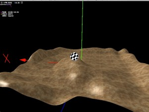

<strong>原创博文，转载请声明</strong>

上一篇的例子中，已经通过四叉树找到了目标三角形。所以已经完成了第一步。

第二步：

根据指定点(x,z)计算出高度，并写入高度图。

其中高度图的写入不是必须的，因为有了三角形，只需要将点带入平面方程就可以得到该点的高度。所以高度图只是作为一种优化方法。

<a href="http://blog.as3er.com/demo/TerrainMeshTest.html" target="_blank">打开Demo</a>(地形模型的面有点多(2w面)，初始化并构建树时有点慢)

>TerrainMesh.as 地形追踪类


package copper3d.terrain
{
    import flash.geom.Vector3D;
    
    import away3d.core.base.CompactSubGeometry;

    /**
     * 地形追踪用Mesh 
     * @author vancopper
     * 
     */ 
    public class TerrainMesh
    {
        private var _terrainQuadTree:TerrainQuadTree;
        private var _numTrianglePerNode:int;
        private var _minNodeSize:Number;
        private var _geo:CompactSubGeometry;
        private var _textTbbox:TerrainBoundingBox;
        /**
         *  
         * @param geo 地形Geometry
         * @param numTrianglePerNode 地形四叉树节点最大三角数量
         * @param minNodeSize 地形四叉树节点包围框对角线大小
         * 
         */     
        public function TerrainMesh(geo:CompactSubGeometry, numTrianglePerNode:int = 10, minNodeSize:Number = 400)
        {
            if(!geo)return;
            _geo = geo;
            _numTrianglePerNode = numTrianglePerNode;
            _minNodeSize = minNodeSize;
            _textTbbox = new TerrainBoundingBox();
            buildTerrain();
        }
        
        public function getTerrainHeight(posX:Number, posZ:Number):Number
        {
            var terrainTriV:Vector.<TerrainTriangle> = getCollisionTriangle(posX, posZ);
            var height:Number = -10000000;
            for(var i:int = 0; i < terrainTriV.length; i++)
            {
                height = Math.max(height, getHeightInTriangle(posX, posZ, terrainTriV[i]));
            }
            return height;
        }
        
        private function buildTerrain():void
        {
            _terrainQuadTree = new TerrainQuadTree();
            _terrainQuadTree.setTerrainGeo(_geo);
            _terrainQuadTree.buildQuadTree(_numTrianglePerNode, _minNodeSize);
        }
        
        /**
         * 获取点所在的三角形 
         * @param posX
         * @param posZ
         * @return 
         * 
         */     
        private function getCollisionTriangle(posX:Number, posZ:Number):Vector.<TerrainTriangle>
        {
            var terrainTriV:Vector.<TerrainTriangle> = new Vector.<TerrainTriangle>();
            _textTbbox.reset(posX, posZ, 10, 10);
            var v:Vector.<TerrainTriangle> = _terrainQuadTree.getTriangles(_textTbbox);
            for(var i:int = 0; i < v.length; i ++)
            {
                if(TerrainTriangle.checkPointInTriangle(posX, posZ, 
                    v[i].getVertex(0), v[i].getVertex(1),
                    v[i].getVertex(2)))
                {
                    terrainTriV.push(v[i]);
                }
            }
            return terrainTriV;
        }
        
        /**
         * 获取点(x,z)在三角形平面上的高度 
         * @param x
         * @param z
         * @param terrainTri
         * @return 
         * 
         */     
        private function getHeightInTriangle(x:Number, z:Number, terrainTri:TerrainTriangle):Number
        {
            var h:Number;
            var a:Number;
            var b:Number;
            var c:Number;
            var d:Number;
            var p1 : Vector3D = terrainTri.getVertex(0);
            var p2 : Vector3D = terrainTri.getVertex(1);
            var p3 : Vector3D = terrainTri.getVertex(2);

            a = ( (p2.y-p1.y)*(p3.z-p1.z)-(p2.z-p1.z)*(p3.y-p1.y) );
            b = ( (p2.z-p1.z)*(p3.x-p1.x)-(p2.x-p1.x)*(p3.z-p1.z) );
            c = ( (p2.x-p1.x)*(p3.y-p1.y)-(p2.y-p1.y)*(p3.x-p1.x) );
            d = ( 0-(a*p1.x+b*p1.y+c*p1.z) );
            
            //Ax+By+Cz+D=0的一般方程
            h = -(a*x + c*z + d)/b
            
            return h;
        }
    }
}


>TerrainMeshTest.as 测试类


package
{
    import flash.display.Sprite;
    import flash.display.StageAlign;
    import flash.display.StageScaleMode;
    import flash.events.Event;
    import flash.events.KeyboardEvent;
    import flash.events.MouseEvent;
    import flash.ui.Keyboard;
    
    import away3d.containers.View3D;
    import away3d.controllers.HoverController;
    import away3d.debug.AwayStats;
    import away3d.debug.Trident;
    import away3d.entities.Mesh;
    import away3d.events.AssetEvent;
    import away3d.library.assets.AssetType;
    import away3d.lights.DirectionalLight;
    import away3d.loaders.Loader3D;
    import away3d.loaders.parsers.Parsers;
    import away3d.materials.TextureMaterial;
    import away3d.materials.lightpickers.StaticLightPicker;
    import away3d.primitives.SphereGeometry;
    import away3d.utils.Cast;
    
    import copper3d.primitives.WireframeTriangle;
    import copper3d.terrain.TerrainMesh;
    
    [SWF(backgroundColor="#FF0000", frameRate="30", width="800", height="600")]
    
    public class TerrainMeshTest extends Sprite
    {
        [Embed(source="./assets/1.3DS",mimeType="application/octet-stream")]
        public static var Terrain:Class;
        
        [Embed(source="./assets/a1dun_ca.png")]
        public static var TerrainTexture:Class;
        
        private var _view:View3D;
        private var _cameraController:HoverController;
        
        private var _move:Boolean = false;
        private var _lastPanAngle:Number;
        private var _lastTiltAngle:Number;
        private var _lastMouseX:Number;
        private var _lastMouseY:Number;
        
        private var _wireframeTriangle:WireframeTriangle;
        private var _terrainMesh:TerrainMesh;
        
        private var _sphereMesh:Mesh;
        private var _xSpeed:Number = 0;
        private var _zSpeed:Number = 0;
        private var _speed:Number = 8;
        
        private var _dirLight:DirectionalLight;
        private var _lightPicker:StaticLightPicker;
        public function TerrainMeshTest()
        {
            super();
            init();
        }
        
        private function init():void
        {
            stage.scaleMode = StageScaleMode.NO_SCALE;
            stage.align = StageAlign.TOP_LEFT;
            
            initEng();
            initLight();
            initObject();
        }
        
        private function initEng():void
        {
            _view = new View3D();
            addChild(_view);
            
            addChild(new AwayStats(_view));
            
            addEventListener(Event.ENTER_FRAME, onEnterFrame);
            stage.addEventListener(MouseEvent.MOUSE_DOWN, onMouseDown);
            stage.addEventListener(MouseEvent.MOUSE_UP, onMouseUp);
            stage.addEventListener(MouseEvent.MOUSE_WHEEL, onMouseWheel);
            stage.addEventListener(Event.RESIZE, onResize);
            
            stage.addEventListener(KeyboardEvent.KEY_DOWN, onkeyDown);
            stage.addEventListener(KeyboardEvent.KEY_UP, onkeyUp);
        }
        
        private function initObject():void
        {
            Parsers.enableAllBundled();
            var loader:Loader3D = new Loader3D();
            loader.addEventListener(AssetEvent.ASSET_COMPLETE, onAssetComplete);
            loader.loadData(new Terrain());
            _view.scene.addChild(loader);
            _view.scene.addChild(new Trident());
            
            var sphereGeo:SphereGeometry = new SphereGeometry();
            _sphereMesh = new Mesh(sphereGeo);
            _view.scene.addChild(_sphereMesh);
            
            _view.camera.lens.far = 10000;
            _cameraController = new HoverController(_view.camera, _sphereMesh, 45, 20, 1000);
        }
        
        private function initLight():void
        {
            _dirLight = new DirectionalLight(-50, -20, 10);
            _dirLight.color = 0xffffff;
            _dirLight.ambient = 10;
            _dirLight.ambientColor = 0xffffee;
            _view.scene.addChild(_dirLight);
            
            _lightPicker = new StaticLightPicker([_dirLight]);
        }
        
        private function onAssetComplete(event:AssetEvent):void
        {
            if(event.asset.assetType == AssetType.MESH)
            {
                var mesh:Mesh = event.asset as Mesh;
//              _wireframeTriangle =  new WireframeTriangle(mesh.geometry.subGeometries[0].indexData, mesh.geometry.subGeometries[0].vertexPositionData);
//              _view.scene.addChild(_wireframeTriangle);
                _terrainMesh = new TerrainMesh(mesh.geometry.subGeometries[0]);
                var mat:TextureMaterial = new TextureMaterial(Cast.bitmapTexture(TerrainTexture));
                mat.lightPicker = _lightPicker;
                mat.repeat = true;
                mesh.material = mat; 
            }
        }
        
        private function onkeyDown(event:KeyboardEvent):void
        {
            switch(event.keyCode)
            {
                case Keyboard.LEFT:
                    _xSpeed = _speed;
                    break;
                case Keyboard.RIGHT:
                    _xSpeed = -_speed;
                    break;
                case Keyboard.UP:
                    _zSpeed = -_speed;
                    break;
                case Keyboard.DOWN:
                    _zSpeed = _speed;
                    break;
            }
        }
        
        private function onkeyUp(event:KeyboardEvent):void
        {
            _zSpeed = 0;
            _xSpeed = 0;
        }
        //-----------------------------------------------------------------------------//
        //-----------------------------------------------------------------------------//
        private function onEnterFrame(event:Event):void
        {
            if (_move) 
            {
                _cameraController.panAngle = 0.3*(stage.mouseX - _lastMouseX) + _lastPanAngle;
                _cameraController.tiltAngle = 0.3*(stage.mouseY - _lastMouseY) + _lastTiltAngle;
            }
            
            if(_sphereMesh && _terrainMesh)
            {
                _sphereMesh.z += _zSpeed;
                _sphereMesh.rotationZ -= _xSpeed;
                _sphereMesh.x += _xSpeed;
                _sphereMesh.rotationX += _zSpeed;
                _sphereMesh.y = _terrainMesh.getTerrainHeight(_sphereMesh.x, _sphereMesh.z) + 50;
            }
            
            _view.render();
        }
        
        private function onMouseWheel(event:MouseEvent) : void
        {
            _cameraController.distance -= event.delta*5;
            
            if (_cameraController.distance < 400)
                _cameraController.distance = 400;
            else if (_cameraController.distance > 10000)
                _cameraController.distance = 10000;
        }
        
        private function onMouseDown(event:MouseEvent):void
        {
            _lastPanAngle = _cameraController.panAngle;
            _lastTiltAngle = _cameraController.tiltAngle;
            _lastMouseX = stage.mouseX;
            _lastMouseY = stage.mouseY;
            _move = true;
            stage.addEventListener(Event.MOUSE_LEAVE, onStageMouseLeave);
        }
        
        private function onMouseUp(event:MouseEvent):void
        {
            _move = false;
            stage.removeEventListener(Event.MOUSE_LEAVE, onStageMouseLeave);
        }
        
        private function onStageMouseLeave(event:Event):void
        {
            _move = false;
            stage.removeEventListener(Event.MOUSE_LEAVE, onStageMouseLeave);
        }
        
        private function onResize(event:Event = null):void
        {
            _view.width = stage.stageWidth;
            _view.height = stage.stageHeight;
        }
    }
}
