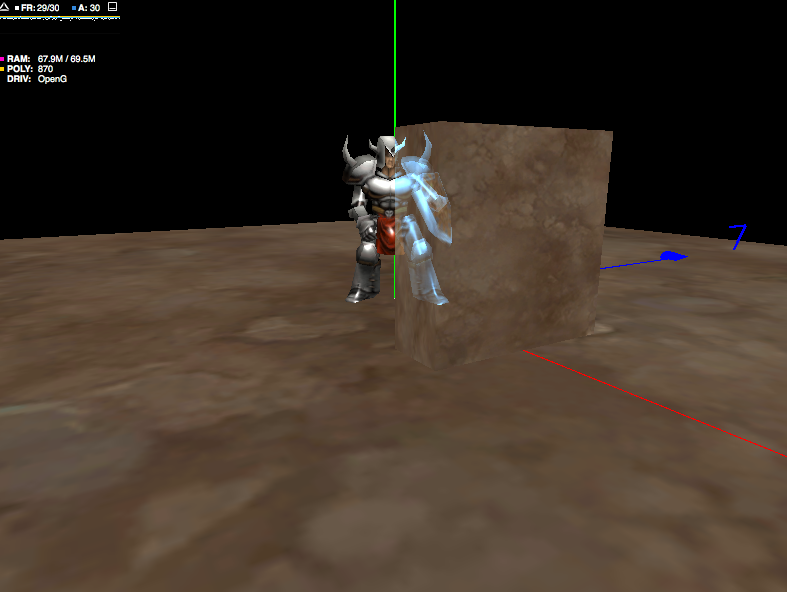
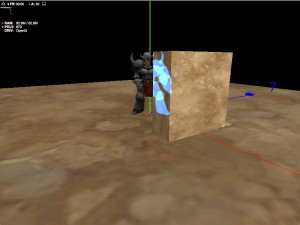
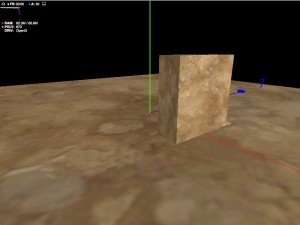
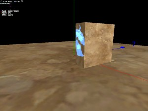

<strong>原创博文，转载请声明</strong>

首先要跟各位认真阅读该篇文章的朋友说声Sorry，由于“分割线”一下的内容对该效果的说明不是很清楚，并且的确存在很严重的Bug，以至于已经有好几位朋友通过QQ和邮件联系我说明相关问题。在此谢谢关注该Blog的朋友。

修改了一下这个效果，解决了掉帧严重的问题，但不知道是否还能满足各位对效果的要求。如果还有问题还请邮件我(qq邮箱)。效果图如下：

分割线以下内容 我已修复更新。

&#8212;&#8212;&#8212;&#8212;&#8212;&#8212;&#8212;&#8212;&#8212;&#8212;&#8212;我是分割线&#8212;&#8212;&#8212;&#8212;&#8212;&#8212;&#8212;&#8212;&#8212;&#8212;&#8212;&#8212;&#8212;&#8212;&#8212;-

xRay Effect 先来看张效果图：

分三个步骤来完成这个效果。

## 第一步：正常渲染场景物件以及遮挡物

在away3d里面对应的代码是  DefaultRenderer.as 的draw()方法  

drawRenderables(entityCollector.opaqueRenderableHead, entityCollector, which);
drawRenderables(entityCollector.blendedRenderableHead, entityCollector, which);


到这里先把场景物件以及遮挡物渲染完成了

## 第二步：渲染人物被遮挡的部分

在DefaultRenderer.as的draw()方法中添加遮挡部分的渲染代码:  

//xRay层渲染
drawRenderables(entityCollector.xRayRenderableHead, entityCollector, which, true);


下面是修改过的drawRenderables方法


private function drawRenderables(item:RenderableListItem, entityCollector:EntityCollector, which:int, isXRay:Boolean = false):void
        {
            var numPasses:uint;
            var j:uint;
            var camera:Camera3D = entityCollector.camera;
            var item2:RenderableListItem;
            var singlePassMat:SinglePassMaterialBase;
            while (item) {
                _activeMaterial = item.renderable.material;
                _activeMaterial.updateMaterial(_context);
                
                singlePassMat = _activeMaterial as SinglePassMaterialBase;
                if(isXRay && singlePassMat)
                {
                    singlePassMat.activateMaterialForXRay(_stage3DProxy);
                }
                
                numPasses = _activeMaterial.numPasses;
                j = 0;
                
                do {
                    item2 = item;
                    
                    var rttMask:int = _activeMaterial.passRendersToTexture(j)? 1 : 2;
                    
                    if ((rttMask & which) != 0) {
                        _activeMaterial.activatePass(j, _stage3DProxy, camera);
                        do {
                            _activeMaterial.renderPass(j, item2.renderable, _stage3DProxy, entityCollector, _rttViewProjectionMatrix);
                            item2 = item2.next;
                        } while (item2 && item2.renderable.material == _activeMaterial);
                        _activeMaterial.deactivatePass(j, _stage3DProxy);
                    } else {
                        do
                            item2 = item2.next;
                        while (item2 && item2.renderable.material == _activeMaterial);
                    }
                    
                } while (++j < numPasses);
                
                if(isXRay && singlePassMat)
                {
                    singlePassMat.deactivateMaterialForXRay(_stage3DProxy);
                }
                item = item2;
            }
        }


还有一处修改是比较重要的，就是在SinglePassMaterialBase.as中添加activateMaterialForXRay，deactivateMaterialForXRay方法并且在EffectMethodBase.as中添加activateEffect,deactivateEffect方法，并在XRayMethod中复写。


public function activateMaterialForXRay(stage3DProxy:Stage3DProxy):void
{
    if(xRayMethod)
    {
        xRayMethod.activateEffect();
    }
}
        
public function deactivateMaterialForXRay(stage3DProxy:Stage3DProxy):void
{
    if(xRayMethod)
    {
        xRayMethod.deactiveEffect();
    }
}
//--------------------------------------------
public function activateEffect():void
{
    //Override
}
        
public function deactiveEffect():void
{
    //Override
}


xRayRenderableHead是添加过xRay 效果的渲染列表，这里需要在EntityCollector.as里面添加对应的处理代码以收集到已添加xRay效果的渲染项。


// xray渲染项
var singlePassMat:SinglePassMaterialBase = material as SinglePassMaterialBase;
if(singlePassMat && singlePassMat.xRayMethod)
{
   item.next = _xRayRenderableHead;
   _xRayRenderableHead = item;
}


SinglePassMaterialBase的xRayMethod属性是EffectMethodBase类型，就是我们自己扩展的xray的shader。在该博文最后会提供出代码。

## 第三步：正常渲染人物，就可以得到下面的效果

在DefaultRenderer.as的draw()方法中添加人物的渲染代码


//avatar层渲染
_context.setBlendFactors(Context3DBlendFactor.ONE, Context3DBlendFactor.ZERO);
_context.setDepthTest(true, Context3DCompareMode.LESS_EQUAL);
drawRenderables(entityCollector.avatarRenderableHead, entityCollector, which);


avatarRenderableHead是人物渲染列表，这里需要在EntityCollector.as里面添加对应的处理代码来收集人物渲染项


if(renderable.sourceEntity.renderLayer == Entity.AVATAR_LAYER)//Avatar层
{
    item.next = _avatarRenderableHead;
    _avatarRenderableHead = item;
}else if(material.requiresBlending) 
{
    item.next = _blendedRenderableHead;
    _blendedRenderableHead = item;
} else
{
    item.next = _opaqueRenderableHead;
    _opaqueRenderableHead = item;
}


至此就完成了xray效果的渲染。现将XRayMethod.as提供。如有问题可在置顶的About页面中找到我的联系方式。 XRayMethod.as


package copper3d.materials.methods
{
    import flash.display3D.Context3DBlendFactor;
    import flash.display3D.Context3DCompareMode;
    
    import away3d.arcane;
    import away3d.core.managers.Stage3DProxy;
    import away3d.materials.compilation.ShaderRegisterCache;
    import away3d.materials.compilation.ShaderRegisterElement;
    import away3d.materials.methods.EffectMethodBase;
    import away3d.materials.methods.MethodVO;
    
    /**
     * xRay效果 
     * @author vancopper
     * 
     */ 
    public class XRayMethod extends EffectMethodBase
    {
        private var _color:uint;
        private var _r:Number = 0;
        private var _g:Number = 0;
        private var _b:Number = 0;
        private var _a:Number = 0;
        
        public function XRayMethod()
        {
            super();
        }
        
        public function get xRayColor():uint
        {
            return _color;
        }
        
        public function set xRayColor(value:uint):void
        {
            _color = value;
            _r = ((_color >> 16) &#038; 0xff) / 0xff;
            _g = ((_color >> 8) &#038; 0xff) / 0xff;
            _b = (_color &#038; 0xff) / 0xff;
        }
        
        arcane override function initVO(vo:MethodVO):void
        {
            vo.needsNormals = true;
            vo.needsProjection = true;
        }
        
        arcane override function activate(vo:MethodVO, stage3DProxy:Stage3DProxy):void
        {
//          if(!_isActive)return;
            var vData:Vector.<Number> = vo.vertexData
            var index:int = vo.fragmentConstantsIndex;
            var data:Vector.<Number> = vo.fragmentData;
            if(_isActive)
            {
                data[index] = _r;
                data[index + 1] = _g;
                data[index + 2] = _b;
                data[index + 3] = _a;
                stage3DProxy.context3D.setBlendFactors(Context3DBlendFactor.ONE, Context3DBlendFactor.ONE);
                stage3DProxy.context3D.setDepthTest(false, Context3DCompareMode.GREATER);
            }else
            {
                data[index] = 1;
                data[index + 1] = 1;
                data[index + 2] = 1;
                data[index + 3] = 0;
                stage3DProxy.context3D.setBlendFactors(Context3DBlendFactor.ONE, Context3DBlendFactor.ZERO);
                stage3DProxy.context3D.setDepthTest(true, Context3DCompareMode.LESS_EQUAL);
            }
        }
        
        private var _isActive:Boolean = false;
        override public function activateEffect():void
        {
            _isActive = true;
        }
        
        override public function deactiveEffect():void
        {
            _isActive = false;
        }
        
        arcane override function getFragmentCode(vo:MethodVO, regCache:ShaderRegisterCache, targetReg:ShaderRegisterElement):String
        {
            var dataRegister:ShaderRegisterElement = regCache.getFreeFragmentConstant();
            vo.fragmentConstantsIndex = dataRegister.index * 4;
            
            var temp1:ShaderRegisterElement = regCache.getFreeFragmentVectorTemp();
            var temp2:ShaderRegisterElement = regCache.getFreeFragmentVectorTemp();
            var code:String = "";

//          code += "nrm " + temp1 + ".xyz, " + _sharedRegisters.normalVarying + ".xyz \n" +
//              "dp3 " + temp2 + ".a, " + targetReg + ".xyz, " + _sharedRegisters.projectionFragment + ".xyz \n" +
//              "sat " + temp2 + ".a, " + temp2 + ".a \n" +
//              "mov " + temp2 +  ".r, " + dataRegister + ".r \n" +
//              "mov " + temp2 + ".g, " + dataRegister + ".g \n" +
//              "mov " + temp2 + ".b, " + dataRegister + ".b \n" +
//              "mul " + temp2 + ".rgb, " + temp2 + ".rgb, " + temp2 + ".aaa \n" +
//              "mov " + targetReg + "," + temp2 + "\n";
//          return code;

            code += "mov " + temp2 + ".r, " + dataRegister + ".r \n" +
                "mov " + temp2 + ".g, " + dataRegister + ".g \n" +
                "mov " + temp2 + ".b, " + dataRegister + ".b \n" +
                "mov " + temp2 + ".a, " + dataRegister + ".a \n" +
                "mul " + temp2 + ".rgb, " + targetReg + ".rgb, " + temp2 + ".rgb \n" +
                "mov " + targetReg + ", " + temp2 + "\n";
            return code;
        }
    }
}
