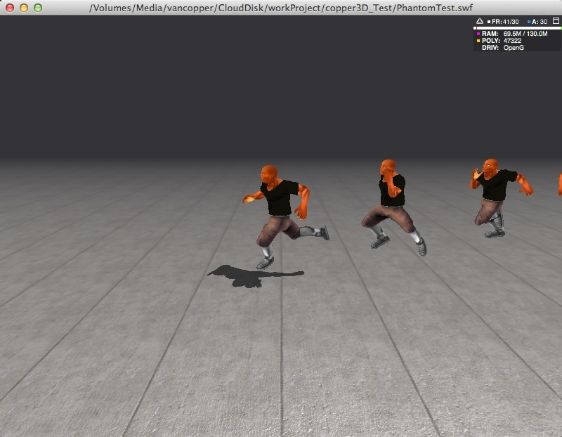
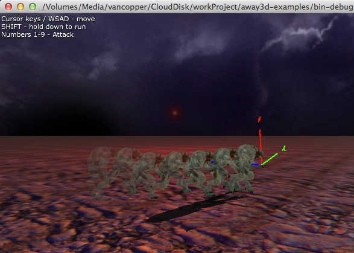

<strong>原创博文，转载请声明</strong>

幻影(或者残影)效果通常用来表现角色的快速移动效果。如下图：

关闭了Alpha的过渡效果，因为有透贴所以开启Alpha过渡有问题。

开启Alpha过渡效果：

PhantomMesh.as

幻影体，用于clone目标对象

<pre class="brush:as3">package copper3d.entities
{
    import flash.utils.getTimer;
    
    import away3d.arcane;
    import away3d.core.base.Geometry;
    import away3d.entities.Mesh;
    import away3d.materials.MaterialBase;
    import away3d.materials.TextureMaterial;
    
    use namespace arcane;

    /**
     * 幻影体 
     * @author vancopper
     * 
     */ 
    public class PhantomMesh extends Mesh
    {
        public var lifecycle:Number = 0;
        private var _creatTime:Number;
        public function PhantomMesh(geometry:Geometry, material:MaterialBase=null)
        {
            super(geometry, material);
            _creatTime = getTimer();
        }
        
        public function tick(time:Number):Boolean
        {
            var passTime:Number = time - _creatTime;
            if(passTime &gt;= lifecycle)
            {
                if(this.parent)
                {
                    this.parent.removeChild(this);
                }
                return true;
            }
            TextureMaterial(material).alpha = (1 - passTime/lifecycle) + 0.3;
            return false;
        }
        
        public static function getCloneByMesh(mesh:Mesh):PhantomMesh
        {
            var phantomMesh:PhantomMesh = new PhantomMesh(mesh.geometry.cloneAnimationGeo());
            var mat:TextureMaterial = new TextureMaterial(TextureMaterial(mesh.material).texture);
//          mat.alphaBlending = true;
            phantomMesh.material = mat;
            
            phantomMesh.transform = mesh.transform;
            phantomMesh.pivotPoint = mesh.pivotPoint;
            phantomMesh.partition = mesh.partition;
            phantomMesh.mouseEnabled = mesh.mouseEnabled;
            phantomMesh.mouseChildren = mesh.mouseChildren;
            phantomMesh.castsShadows = false;
            return phantomMesh;
        }
    }
}</pre>

有个地方需要注意：

<pre class="brush:as3">var phantomMesh:PhantomMesh = new PhantomMesh(mesh.geometry.cloneAnimationGeo());</pre>

这里为Geometry以及ISubGeometry扩展了一个cloneAnimationGeo()方法，原来的clone方法得到的是Mesh BindPose下的Geometry,所以在克隆有动画的ISubGeometry时，需要把\_vertexData替换为\_animatedData以获得当前动作下的ISubGeometry。下面是SkinnedSubGeometry.as的cloneAnimationGeo()方法

<pre class="brush:as3">override public function cloneAnimationGeo():ISubGeometry
        {
            var clone:SkinnedSubGeometry = new SkinnedSubGeometry(_jointsPerVertex);
            clone.updateData(_animatedData.concat());//替换为当前动作对应的顶点数据
            clone.updateIndexData(_indices.concat());
            clone.updateJointIndexData(_jointIndexData.concat());
            clone.updateJointWeightsData(_jointWeightsData.concat());
            clone._autoDeriveVertexNormals = _autoDeriveVertexNormals;
            clone._autoDeriveVertexTangents = _autoDeriveVertexTangents;
            clone._numCondensedJoints = _numCondensedJoints;
            clone._condensedIndexLookUp = _condensedIndexLookUp;
            clone._condensedJointIndexData = _condensedJointIndexData;
            return clone;
        }</pre>

用于clone目标的mesh有了，下面只要有一个管理器来管理这些PhantomMesh就可以了。

PhantomRenderManager.as

<pre class="brush:as3">package copper3d.manager
{
    import flash.utils.Dictionary;
    import flash.utils.getTimer;
    
    import away3d.arcane;
    import away3d.containers.ObjectContainer3D;
    import away3d.entities.Mesh;
    import away3d.materials.methods.EffectMethodBase;
    
    import copper3d.entities.PhantomMesh;
    
    use namespace arcane;

    /**
     * 幻影管理器 
     * @author vancopper
     * 
     */ 
    public class PhantomRenderManager
    {
        private static var _instance:PhantomRenderManager;
        
        private var _targetMeshDic:Dictionary = new Dictionary(true);
        private var _phantomMeshV:Vector.&lt;PhantomMesh&gt;;
        
        public function PhantomRenderManager()
        {
            if(_instance == null)
            {
                _instance = this;
                _phantomMeshV = new Vector.&lt;PhantomMesh&gt;();
            }else
            {
                throw new Error("实例化单例类出错-PhantomRenderManager");
            }
        }
        
        public static function get instance():PhantomRenderManager
        {
            if(_instance == null)
            {
                _instance = new PhantomRenderManager(); 
            }
            return _instance;
        }
        
        /**
         * 播放幻影
         * @param target 要生成幻影的对象
         * @param parentContainer 幻影的容器
         * @param interval 幻影生成间隔
         * @param lifecycle 幻影生命周期
         * @param effectMethod 幻影效果Sharder
         * 
         */     
        public function playPhantom(target:Mesh, parentContainer:ObjectContainer3D, interval:uint = 50, lifecycle:uint = 1000, effectMethod:EffectMethodBase = null ):void
        {
            if(!target || !parentContainer)return;
            var phantomVO:PhantomVO = new PhantomVO();
            phantomVO.target = target;
            phantomVO.parentContainer = parentContainer;
            phantomVO.interval = interval;
            phantomVO.lifecycle = lifecycle;
            phantomVO.effectMethod = effectMethod;
            phantomVO.time = getTimer();
            phantomVO.lastX = target.x;
            phantomVO.lastY = target.y;
            phantomVO.lastZ = target.z;
            _targetMeshDic[target] = phantomVO;
        }
        
        /**
         * 停止播放幻影 
         * @param target
         * 
         */     
        public function stopPhantom(target:Mesh):void
        {
            delete _targetMeshDic[target];
        }
        
        /**
         * 每帧都执行更新 
         * 
         */     
        public function tick():void
        {
            var phantomVO:PhantomVO;
            for(var i:* in _targetMeshDic)
            {
                phantomVO = _targetMeshDic[i];
                if(phantomVO.interval &lt; (getTimer() - phantomVO.time))
                {
                    if(phantomVO.lastX == phantomVO.target.x && phantomVO.lastY == phantomVO.target.y
                        && phantomVO.lastZ == phantomVO.target.z)continue;
                    var phantomMesh:PhantomMesh = PhantomMesh.getCloneByMesh(phantomVO.target);
                    phantomMesh.x = phantomVO.lastX = phantomVO.target.x;
                    phantomMesh.y = phantomVO.lastY = phantomVO.target.y;
                    phantomMesh.z = phantomVO.lastZ = phantomVO.target.z;
                    phantomMesh.lifecycle = phantomVO.lifecycle;
                    phantomVO.parentContainer.addChild(phantomMesh);
                    phantomVO.time = getTimer();
                    _phantomMeshV.push(phantomMesh);
                }
            }
            
            for(var j:int = 0; j &lt; _phantomMeshV.length; j++)
            {
                var mesh:PhantomMesh = _phantomMeshV[j];
                if(mesh.tick(getTimer()))
                {
                    _phantomMeshV.splice(j, 1);
                }
            }
        }
    }
}
import away3d.containers.ObjectContainer3D;
import away3d.entities.Mesh;
import away3d.materials.methods.EffectMethodBase;

class PhantomVO
{
    public var target:Mesh;
    public var parentContainer:ObjectContainer3D;
    public var interval:uint;
    public var lifecycle:uint;
    public var effectMethod:EffectMethodBase;
    public var time:Number;
    public var lastX:Number;
    public var lastY:Number;
    public var lastZ:Number;
}</pre>

&nbsp;

 [1]: http://blog.as3er.com/wp-content/uploads/2014/02/phantom.jpg
 [2]: http://blog.as3er.com/wp-content/uploads/2014/02/phantom02.jpg