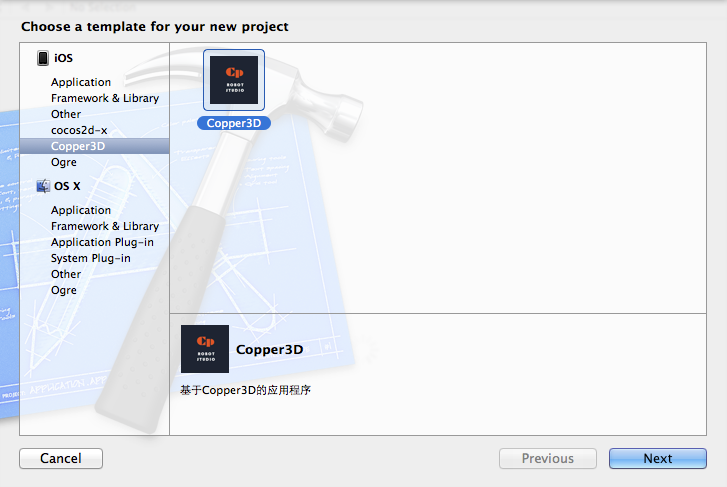
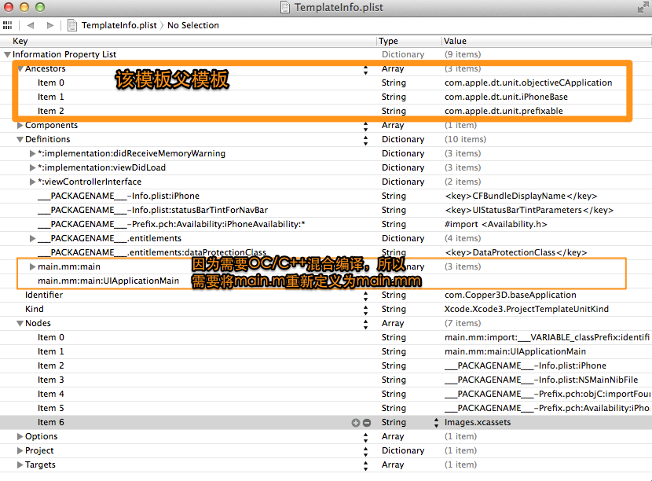
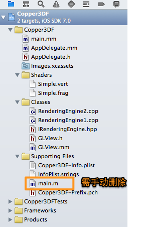
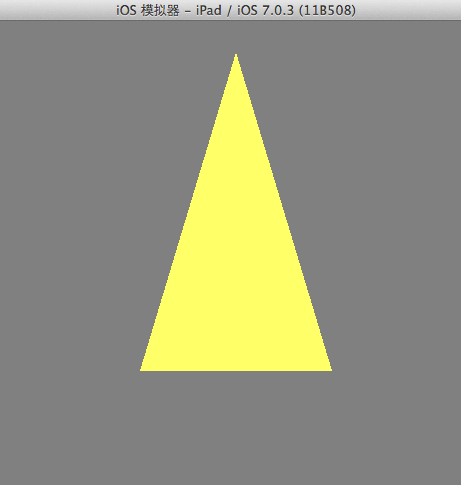

俗话说：工欲善其事必先利其器。Xcode是可以自定义 文件模板&项目模板的，对于特定的项目配置一个模板是非常有必要的，不然每次都配置库，编译参数一堆东西是非常头痛的。像Cocos2D,Ogre都有现成的项目模板，截图是Copper3D。

首先最好新建一个基础（父）模板。进入 ：

<pre class="brush:shell">/Applications/Xcode.app/Contents/Developer/Platforms/iPhoneOS.platform/Developer/Library/Xcode/Templates/Project Templates/Application/</pre>

复制Cocoa Touch Application.xctemplate后重命名为Copper3D Base.xctemplate ，接下来就只要编辑TemplateInfo.plist了，关于TemplateInfo.plist详细介绍可查看<a href="http://www.learn-cocos2d.com/store/xcode4-template-documentation/" target="_blank">这里</a>。需要先删除AppDelegate.h,AppDelegate.m,main.m相关的配置，如图：

父模板配置好了以后，就可以配置实际使用模板的相关文件和库等。进入用户目录~/Library/Developer/Xcode/Templates/新建项目模板目录

最后编辑Copper3D.xctemplate中的 TemplateInfo.plist文件，将AppDelegate.h/mm 以及Classes,Shaders文件配置进模板，然后在Xcode中新建Copper3D项目应用程序。

最后把Objective-C Automatic Reference Counting选项设置为NO。搞定，编译运行。

