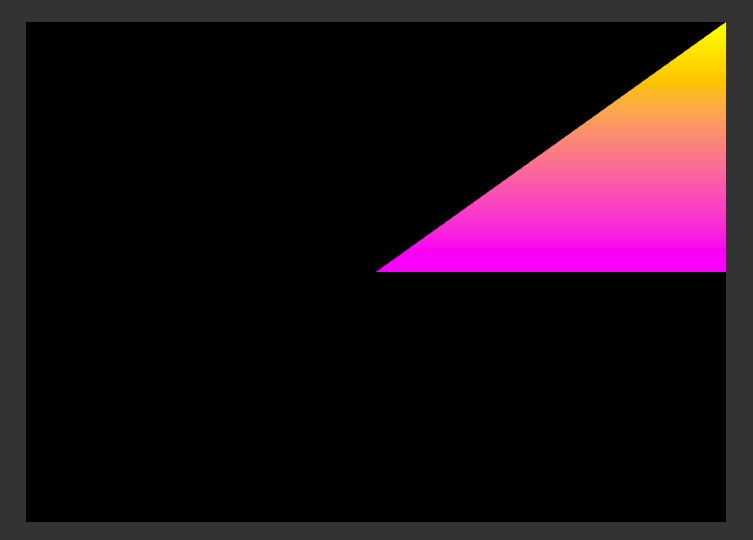

<span style="color: #ff6600;"><strong>原创博文，转载请声明</strong></span>

本篇主要是通过简单例子理解相关概念以及基本的渲染流程。对于一些知识点，后面会展开讨论。

通过`Stage3D`来渲染，最基本的步骤如下：
1. 向`Stage3D`请求一个`Context3D`的实例
2. 配置`Context3D`
3. 创建顶点缓冲`vertexBuffer`，索引缓冲`indexBuffer`
4. 将顶点数据，索引数据上传至`Context3D`
5. 创建顶点着色器，片段着色器
6. 创建`Program3D`
7. 执行渲染

先来解释几个概念：

`Stage3D`:可将Stage3D理解为容器，它始终在stage下面。一共有4个可用的Stage3D层。你通过`Context3D`渲染的所有东西都会最终呈现在Stage3D层。

	stage.stage3Ds[0]

通过上面的代码可获取对应的Stage3D。

`Context3D`:渲染用上下文，跟显卡的所有交互都需要通过Context3D来完成。当我们获取到了Stage3D就可以对应的去请求一个Context3D。

	_stage3d.requestContext3D(Context3DRenderMode.AUTO, Context3DProfile.STANDARD);

`vertexBuffer`,`indexBuffer`:分别用来存储渲染用的顶点数据，索引数据。

`Program3D`:着色器程序，包含了顶点着色器，片段着色器。

按部就班的来：

####1.向Stage3D请求一个Context3D的实例

	if(this.stage.stage3Ds.length > 0)
			{
				_stage3d = this.stage.stage3Ds[0];
				_stage3d.addEventListener(ErrorEvent.ERROR, onCreateContext3DError);
				_stage3d.addEventListener(Event.CONTEXT3D_CREATE, onContext3DCreated);
				_stage3d.requestContext3D(Context3DRenderMode.AUTO, Context3DProfile.STANDARD);
			}

这一步需要注意的是在`requestContext3D`之前一定要先监听`Event.CONTEXT3D_CREATE`事件。

####2.配置Context3D

	private function initContext3D():void
{
	_context3d = _stage3d.context3D;
	_context3d.configureBackBuffer(700, 500, 2);
}

在成功创建`Context3D`，通过`Stage3D`拿到实例后配置可渲染的范围以及消除锯齿的品质。


| value         | 品质           |
| ------------- |:--------------:|
|    0     | 不消除锯齿          |
|    2     | 最小消除锯齿        |
|    4     | 高质量消除锯齿      |
|    16    | 极高质量消除锯齿    |

####3.创建顶点缓冲vertexBuffer，索引缓冲indexBuffer

	var vertexData:Vector.<Number> = Vector.<Number>(
				[
			    	// x, y, z, r, g, b
					0, 0, 0, 1, 0, 1,
					1, 1, 0, 1, 1, 0,
					1, 0, 0, 1, 0, 0
				]);
var indexData:Vector.<uint> = Vector.<uint>(
				[0, 1, 2]);

_vertexBuffer = _context3d.createVertexBuffer(vertexData.length/6, 6);
_indexBuffer = _context3d.createIndexBuffer(indexData.length);

`vertexData`里存放的是三个顶点的数据，每行的前三个数字是坐标，后三个数字是颜色值。`indexData`里存放的索引值的先后顺序代表了你绘制三个点的顺序。

	_context3d.createVertexBuffer(vertexData.length/6, 6);

通过此方法创建顶点缓冲。第一个参数是顶点数量，第二个参数是每个顶点包含的数据个数。
_indexBuffer = _context3d.createIndexBuffer(indexData.length);
```
通过此方法创建索引缓冲。参数为顶点数量。

####4.将顶点数据，索引数据上传至Context3D

	//第一个参数为顶点数据，第二个参数为顶点开始的索引，第三个为顶点数
	_vertexBuffer.uploadFromVector(vertexData, 0, vertexData.length/6);
	//第一个参数为索引数据，第二个参数为索引数据的开始索引，第三个为数量
	_indexBuffer.uploadFromVector(indexData, 0, 3);  

####5.创建顶点着色器，片段着色器

####6.创建Program3D

	var vertexSrc:String = "mov op, va0\n" +
					"mov v0, va1\n";
	var fragmentsrc:String = "mov oc, v0\n";
	var shaderAssembler:AGALMiniAssembler = new AGALMiniAssembler();
	_program3d = shaderAssembler.assemble2(_context3d, 2, vertexSrc, 	fragmentsrc);

这部分是比较重要的一步，包含了顶点，片段着色器。这里我们使用的是AGAL2的版本。关于AGAL后面会详细讲解。

####7.执行渲染

	_context3d.clear(0, 0, 0);
	_context3d.setVertexBufferAt(0, _vertexBuffer, 0,
		Context3DVertexBufferFormat.FLOAT_3);
	_context3d.setVertexBufferAt(1, _vertexBuffer, 3,
		Context3DVertexBufferFormat.FLOAT_3);
	_context3d.setProgram(_program3d);
	_context3d.drawTriangles(_indexBuffer);
	_context3d.present();

最后一定要执行`_context3d.present()`来显示后台渲染缓冲区。  
最终结果：

完整代码：


package
{
	import com.adobe.utils.extended.AGALMiniAssembler;

	import flash.display.Sprite;
	import flash.display.Stage3D;
	import flash.display3D.Context3D;
	import flash.display3D.Context3DProfile;
	import flash.display3D.Context3DRenderMode;
	import flash.display3D.Context3DVertexBufferFormat;
	import flash.display3D.IndexBuffer3D;
	import flash.display3D.Program3D;
	import flash.display3D.VertexBuffer3D;
	import flash.events.ErrorEvent;
	import flash.events.Event;

	[SWF(backgroundColor="#333333", frameRate="60", width="800", height="600")]
	public class HelloTriangle extends Sprite
	{
		private var _context3d:Context3D;
		private var _stage3d:Stage3D;

		private var _vertexBuffer:VertexBuffer3D;
		private var _indexBuffer:IndexBuffer3D;

		private var _program3d:Program3D;

		public function HelloTriangle()
		{
			super();
			addEventListener(Event.ADDED_TO_STAGE, onAddToStage);
		}

		private function onAddToStage(e:Event):void
		{
			removeEventListener(Event.ADDED_TO_STAGE, onAddToStage);
			if(this.stage.stage3Ds.length > 0)
			{
				_stage3d = this.stage.stage3Ds[0];
				_stage3d.addEventListener(ErrorEvent.ERROR, onCreateContext3DError);
				_stage3d.addEventListener(Event.CONTEXT3D_CREATE, onContext3DCreated);
				_stage3d.requestContext3D(Context3DRenderMode.AUTO, Context3DProfile.STANDARD);
			}
		}

		private function onContext3DCreated(event:Event):void
		{
			initContext3D();
			initBuffer();
			initProgram();

			addEventListener(Event.ENTER_FRAME, render);
		}

		private function render(event:Event):void
		{
			_context3d.clear(0, 0, 0);
			_context3d.setVertexBufferAt(0, _vertexBuffer, 0,
				Context3DVertexBufferFormat.FLOAT_3);
			_context3d.setVertexBufferAt(1, _vertexBuffer, 2,
				Context3DVertexBufferFormat.FLOAT_3);
			_context3d.setProgram(_program3d);
			_context3d.drawTriangles(_indexBuffer);
			_context3d.present();
		}

		private function onCreateContext3DError(event:ErrorEvent):void
		{
			trace(event.text);
		}

		private function initContext3D():void
		{
			_context3d = _stage3d.context3D;
			_stage3d.x = 50;
			_stage3d.y = 50;
			_context3d.configureBackBuffer(700, 500, 2);
		}

		private function initBuffer():void
		{
			var vertexData:Vector.<Number> = Vector.<Number>(
				[
				// x, y, z, r, g, b
					0, 0, 0, 1, 0, 1,
					1, 1, 0, 1, 1, 0,
					1, 0, 0, 1, 0, 1
				]);
			var indexData:Vector.<uint> = Vector.<uint>(
				[0, 1, 2]);

			_vertexBuffer = _context3d.createVertexBuffer(vertexData.length/6, 6);
			_vertexBuffer.uploadFromVector(vertexData, 0, vertexData.length/6);

			_indexBuffer = _context3d.createIndexBuffer(indexData.length);
			_indexBuffer.uploadFromVector(indexData, 0, 3);
		}

		private function initProgram():void
		{
			var vertexSrc:String = "mov op, va0\n" +
				"mov v0, va1\n";
			var fragmentsrc:String = "mov oc, v0\n";
			var shaderAssembler:AGALMiniAssembler = new AGALMiniAssembler();
			_program3d = shaderAssembler.assemble2(_context3d, 2, vertexSrc, fragmentsrc);
		}

	}
}


***
>原创博文，转载请注明  
>作者：vanCopper  
>Blog: http://blog.as3er.com http://blog.copper3d.org

```