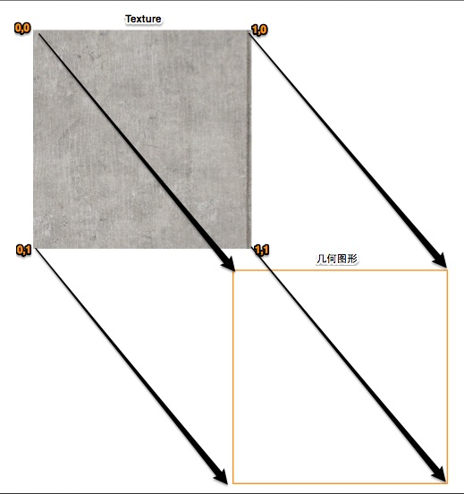
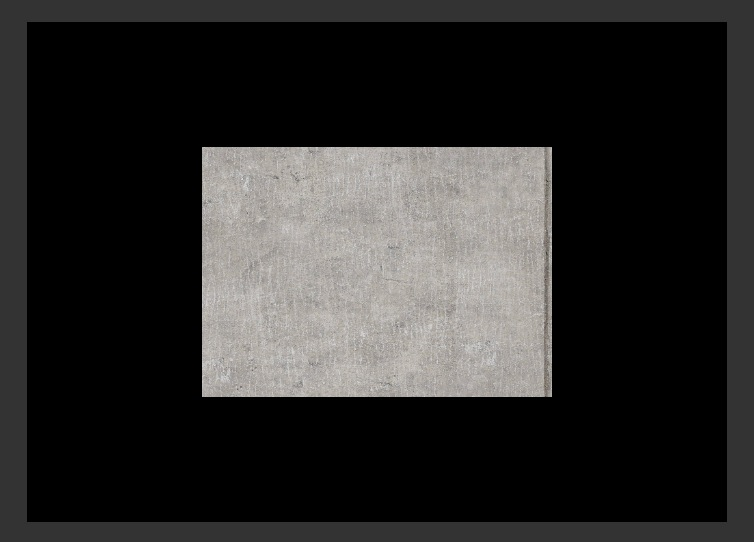

前一篇了解了如何渲染一个颜色填充的三角形。这篇先来理解一下** 纹理（texture）**或** 纹理贴图（texture map)**，以及如何创建，上传以及渲染**texture**。

当我们把图像数据应用到一个几何图形上时，我们称之为**texture**或**texture map**。整过程就是将图像上的每个点对应到几何图形上的每个点。这里又会牵扯到一个新的概念**UV坐标**。

**UV坐标：**坐标**U**代表纹理的水平轴，取值范围是0~1。坐标**V**代表纹理的垂直轴，取值范围是0~1。纹理与几何图形的对应关系如下图：  

了解完必备的知识，我们来看如何完成渲染：

1. 加载贴图
2. 创建`Texture`对象
3. 将纹理上传至显卡
4. 设置纹理索引
5. 编写对应的AGAL
6. 渲染

#### 1.加载贴图

贴图加载进来或者直接嵌入都可以，这里我直接嵌入在程序内
<pre>
[Embed(source="./assets/floor_diffuse.jpg")]
private static var TextureClass:Class;
</pre>

显卡对纹理的尺寸是有要求的，即长宽必须是2的幂。所以图片尺寸会是：2，4，8，16，32，64，128，256，512......。这里我用的是宽高为512x512的图片。我们暂时不考虑`minmap`。

我们在实际的游戏开发中，纹理的制作均需要按照高分辨率（4096x4096）来制作，然后按照需求导出为不同的分辨率的纹理。这么做的好处是，我们可以在后期对纹理做优化。实际上只有需要近距离观察的物件才会需要用到高分辨率纹理。如果只是场景中的一个小石子，大概只需用16x16的纹理即可。

#### 2.创建Texture对象

#### 3.将纹理上传至显卡

<pre>
_texture = _context3d.createTexture(512, 512, Context3DTextureFormat.BGRA, true);
_texture.uploadFromBitmapData((new TextureClass() as Bitmap).bitmapData);
</pre>
创建并上传纹理。

#### 4.设置纹理索引
<pre>
_context3d.setTextureAt(0, _texture);
</pre>
这一步是给纹理设置一个可供片段着色器访问的索引。即通过`fs0`就可以访问到这张纹理。

#### 5.编写对应的AGAL
<pre>
var vertexSrc:String = "mov op, va0\n" +
				"mov v0, va1\n";
var fragmentsrc:String = "tex ft0, v0, fs0 <2d, repeat, linear, nomip>\n" +
				"mov oc ft0\n";
var shaderAssembler:AGALMiniAssembler = new AGALMiniAssembler();
_program3d = shaderAssembler.assemble2(_context3d, 2, vertexSrc, fragmentsrc);
</pre>
`tex ft0, v0, fs0 <2d, repeat, linear, nomip>`代码中的`v0`就是我们上传的**UV**信息，`fs0`就是我们上传的纹理。最后根据**UV**将纹理进行正确的映射（即上图表达的对应）后保存在`ft0`中，然后输出。

#### 6.渲染
<pre>
_context3d.clear(0, 0, 0);
_context3d.drawTriangles(_indexBuffer);
_context3d.present();
</pre>

最终结果：

完整代码：  

package
{
import com.adobe.utils.extended.AGALMiniAssembler;

import flash.display.Bitmap;
import flash.display.BitmapData;
import flash.display.Sprite;
import flash.display.Stage3D;
import flash.display3D.Context3D;
import flash.display3D.Context3DProfile;
import flash.display3D.Context3DRenderMode;
import flash.display3D.Context3DTextureFormat;
import flash.display3D.Context3DVertexBufferFormat;
import flash.display3D.IndexBuffer3D;
import flash.display3D.Program3D;
import flash.display3D.VertexBuffer3D;
import flash.display3D.textures.Texture;
import flash.events.ErrorEvent;
import flash.events.Event;

[SWF(backgroundColor="#333333", frameRate="60", width="800", height="600")]
public class TextureTest extends Sprite
{
    private var _context3d:Context3D;
    private var _stage3d:Stage3D;

    private var _vertexBuffer:VertexBuffer3D;
    private var _indexBuffer:IndexBuffer3D;

    private var _program3d:Program3D;

    private var _texture:Texture;

    [Embed(source="./assets/floor_diffuse.jpg")]
    private static var TextureClass:Class;

    public function TextureTest()
    {
        super();
        addEventListener(Event.ADDED_TO_STAGE, onAddToStage);
    }

    private function onAddToStage(e:Event):void
    {
        removeEventListener(Event.ADDED_TO_STAGE, onAddToStage);
        if(this.stage.stage3Ds.length > 0)
        {
            _stage3d = this.stage.stage3Ds[0];
            _stage3d.addEventListener(ErrorEvent.ERROR, onCreateContext3DError);
            _stage3d.addEventListener(Event.CONTEXT3D_CREATE, onContext3DCreated);
            _stage3d.requestContext3D(Context3DRenderMode.AUTO, Context3DProfile.STANDARD);
        }
    }

    private function onContext3DCreated(event:Event):void
    {
        initContext3D();
        initBuffer();
        initTexture();
        initProgram();

        addEventListener(Event.ENTER_FRAME, render);
    }

    private function render(event:Event):void
    {
        _context3d.clear(0, 0, 0);
        _context3d.drawTriangles(_indexBuffer);
        _context3d.present();
    }

    private function onCreateContext3DError(event:ErrorEvent):void
    {
        trace(event.text);
    }

    private function initContext3D():void
    {
        _context3d = _stage3d.context3D;
        _stage3d.x = 50;
        _stage3d.y = 50;
        _context3d.configureBackBuffer(700, 500, 2);
    }

    private function initBuffer():void
    {
        var vertexData:Vector.<Number> = Vector.<Number>(
            [
                // x, y, z, u, v
                -0.5, 0.5, 0, 0, 0,
                0.5, 0.5, 0, 1, 0,
                0.5, -0.5, 0, 1, 1,
                -0.5, -0.5, 0, 0, 1
            ]);

        var indexData:Vector.<uint> = Vector.<uint>(
            [0, 1, 2, 2, 3, 0]);

        _vertexBuffer = _context3d.createVertexBuffer(vertexData.length/5, 5);
        _vertexBuffer.uploadFromVector(vertexData, 0, vertexData.length/5);

        _indexBuffer = _context3d.createIndexBuffer(indexData.length);
        _indexBuffer.uploadFromVector(indexData, 0, indexData.length);
    }

    private function initTexture():void
    {
        _texture = _context3d.createTexture(512, 512, Context3DTextureFormat.BGRA, true);
        _texture.uploadFromBitmapData((new TextureClass() as Bitmap).bitmapData);
    }

    private function initProgram():void
    {
        var vertexSrc:String = "mov op, va0\n" +
            "mov v0, va1\n";
        var fragmentsrc:String = "tex ft0, v0, fs0 <2d, repeat, linear, nomip>\n" +
            "mov oc ft0\n";
        var shaderAssembler:AGALMiniAssembler = new AGALMiniAssembler();
        _program3d = shaderAssembler.assemble2(_context3d, 2, vertexSrc, fragmentsrc);

        _context3d.setVertexBufferAt(0, _vertexBuffer, 0,
            Context3DVertexBufferFormat.FLOAT_3);
        _context3d.setVertexBufferAt(1, _vertexBuffer, 3,
            Context3DVertexBufferFormat.FLOAT_2);
        _context3d.setTextureAt(0, _texture);
        _context3d.setProgram(_program3d);

    }

}
}

***
>原创博文，转载请注明  
>作者：vanCopper  
>Blog: http://blog.as3er.com http://blog.copper3d.org
