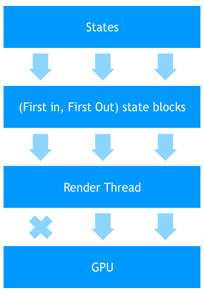
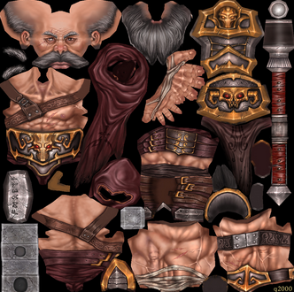
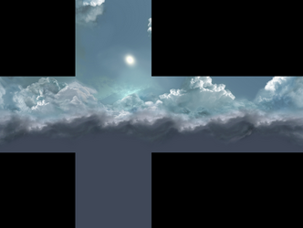

<strong>原创博文，转载请声明</strong>

> 并非逐字翻译，感兴趣的朋友可直接访问下方的原文。

hi，各位。本文是我在使用Stage3D的基础上，总结的一些使用经验。虽然很都是很小的细节，但很重要的。

***Stage3D API***是在Flash Player11.2，Adobe AIR 3.2之后提供的一套新的API。它建立在OpenGL和Direct3D APIS的基础上，为使用者提供了一套跨平台的GPU编程方案。
Stage3D API 支持：OpengGL,Direct3D9,Direct3D11。这意味着每次对GPU的调用，都会将当前的shader编译为当前硬件支持的字节码。Stage3D类提供了`Context3D`接口来执行渲染。

#### 如何执行渲染

你不能直接实例化`Context3D`来获得`Context3D`的实例。通过Stage3D实例的`context3d`属性得到`Context3D`的实例。

渲染流程：

* 通过`Stage3D`的实例方法`requestContext3D()`来请求获取`Context3D`的实例
* 通过`configureBackBuffer()`方法配置缓冲区
* 调用`Context3D`的一系列方法来创建需要上传至显卡的资源：`createCubeTexture`, `createIndexBuffer`, `createProgram`, `createRectangleTexture`, `createTexture`, `createVertexBuffer`。

每帧执行：
1. 调用`Context3D.clear`清除缓冲区
2. 设置渲染状态，为下一步`drawTriangles`做准备。例如：设置`blendMode`，绑定材质，绑定`shaders`，为绑定常量数据，设置深度测试等。
3. 调用`drawTriangles()`方法绘制。
4. 重复执行直到当前场景无可绘制的对象。
5. 调用`present()`方法呈现后台缓冲区至舞台。

#### 分层
Flash Player运行时存在三个分层，由远至近分别为：StageVideo->Stage3D->Stage。其中`StageVideo`和`Stage3D`层是不支持透明的。

#### Context3D.enableErrorChecking
Flash运行时有两个线程，第一个为主线程，第二个线程则是执行GPU渲染。`drawTriangles`方法执行后，会将当前渲染对象推入一个列表，渲染线程会按照顺序验证渲染列表中的项并执行渲染。所以如果你想在主线程中得到渲染线程中出现的错误就需要设置`Context3D.enableErrorChecking = true`以便得到错误信息。  

调用`present()`方法后，主线程和GPU渲染线程就需要立刻执行同步。这时候要特别注意的是帧频问题，不管是主线程执行时间长还是GPU线程执行时间长都会导致帧频下降。因为两个线程会互相等待。

#### Context3D Profiles
请求获取`Context3D`的时候可以指定`Context3D`的`Profiles`。
* `Context3DProfile.BASELINE`-使用默认的profile
* `Context3DProfile.BASELINE_CONSTRAINED`-使用受限功能支持配置文件面向更早期的 GPU。此配置文件主要用于这样的设备，它们仅支持类似 Intel GMA 9xx 系列的 PS_2.0 级着色器。使用此profile时，性能更高。
* `Context3DProfile.BASELINE_EXTENDED` - 使用一个扩展功能支持配置文件以支持更新的 GPU，后者支持更大的纹理。此配置文件将 2D 纹理和矩形纹理的大小增加到最大 4096x4096
* `Context3DProfile.STANDARD`- 针对支持 MRT、AGAL2 和浮点纹理的 GPU，使用标准配置文件。

#### Textures
GPU内存是非常有限的。所以，你必须经常考虑材质的大小。Stage3D支持有限的材质类型以及材质格式

Texture Formats:
* `Context3DTextureFormat.BGRA`- 每个颜色通道占8位，每个像素占32位。
* `Context3DTextureFormat.BGRA_PACKED`- 每个颜色通道占4位，每个像素占16位。
* `Context3DTextureFormat.BGR_PACKED`- 每个像素占16位，通道比 为 5:6:5
* `Context3DTextureFormat.COMPRESSED`- 每个像素占4位
* `Context3DTextureFormat.COMPRESSED_ALPHA`-每个像素占8位

在桌面和web平台，Stage3D都支持材质的实时压缩。所以你可以从`BitmapData`或者`ByteArray`中上传单通道8位的图像数据。
***WARNING!*** 需要谨慎使用透明像素，如果你从BitmapData或者BitmapData.getPixels()上传数据，需要在shader中重置或者选用合适的BlendMode.

使用`COMPRESSED`和`COMPRESSED_ALPHA`格式的材质，将获得最佳性能。另外贴图大小必须是2的N次方。访问[Adobe Texture Format](http://www.adobe.com/devnet/flashruntimes/articles/atf-users-guide.html)了解如何利用ATF SDK 创建 ATF类型材质。

#### Texture types
* 2D

* Cube

* Rectangle Texture
此类型材质只能在Adobe AIR上使用，并且不限制尺寸。唯一的限制就是不能使用`COMPRESSED`和`COMPRESSED_ALPHA`格式。

#### 渲染至纹理
`Render Targets`允许将后台缓冲区渲染至任何类型的纹理。如果想对整个场景做后期效果，可以按照以下流程执行操作：

* 清除backbuffer。
* 调用`Context3D.setRenderToTexture(texture)`方法，将渲染目标渲染至指定纹理。
* 执行drawcall。
* 调用`Context3D.setRenderToBackBuffer`方法，恢复正常渲染。
* 在第二步中得到纹理，就可以通过编写对应的shader来实现后期效果。
* 调用`Context3D.present()`呈现。

***WARNING!*** 只可以使用`Context3DTextureFormat.BGRA`格式的纹理作为RT（Render Target）纹理。并且调用`createTexture`, `createCubeTexture`, `createRectangleTexture`创建该类型纹理时需要讲`optimizeForRenderToTexture`设置为`true`。

#### Backbuffer

缓冲区包含两个纹理：
1. 颜色纹理，单通道8位，每个颜色值占32位
2. 深度缓冲和模板缓冲，24位存储深度值，8位用来存储模板值。

Stage3D使用的是双缓冲。意思是主线程需要等后台缓冲绘制完成后，再将后台缓冲整个交换或复制到帧缓冲用于呈现。更多内容可以[点这里](http://en.wikipedia.org/wiki/Multiple_buffering)。

关于优化屏幕抖动可参考这里[image flickering](http://en.wikipedia.org/wiki/Flicker_(screen))。

#### Vsync 垂直同步
垂直同步是显卡的一项功能，它解决了[vertical blanking interval(垂直回扫期)](http://en.wikipedia.org/wiki/Vertical_blanking_interval)问题。如果没有垂直同步，就会出现画面不连续的问题。垂直同步虽然可以解决画面不连续问题，但同时会限制FPS。因为显卡刷新画面时，必须等显示器刷新完当前帧，并发出同步消息才可以执行下一帧画面的刷新。

原文解释的有点复杂，其实可以简单的理解一下：由于垂直同步的限制，游戏运行的最高帧速是没有办法超过显示器的刷新频率的。但实际的游戏中的FPS还受到FlashPlayer中运行的代码效率和显卡执行的效率的影响。

#### Programs, VertexBuffer and IndexBuffer
`Program3D`是运行在GPU上的程序，它包括`vertex shader`和`fragment shader`两部分。`vertex shader`可以访问并操作存储在`VertexBuffer3D`中的数据，并负责将顶点投影至投影空间和提供`fragment shader`所需的数据。`vertex shader`为每个顶点执行一次，`fragment shader`为每个像素执行一次。通过`varying variables(va0-va7)`可将数据从`vertex shader`中传递到`fragment shader`。同时也可以上传 `Constants`数据至shader中。

每次`drawcall`都需要设置一个`IndexBuffer3D`。它定义了顶点绘制的顺序。顶点数据包括很多顶点属性。这些顶点数据又可以绑定在多个`Vertex Buffer`中提供给`vertex shader`访问和使用。这个机制是非常有用的，如果你的顶点数据中包括了静态(UV)或者动态数据(postion)，就可以将他们分别存储在两个`Vertex Buffer`中，并在创建`Vertex Buffer`是指定`Context3DBufferUsage`类型。这在很大程度上可优化你的程序执行效率。 关于`Context3DBufferUsage`参见[这里](http://help.adobe.com/zh_CN/FlashPlatform/reference/actionscript/3/flash/display3D/Context3DBufferUsage.html)

#### Depth Buffer
在默认状态下，深度测试是开启的。像素着色器程序的源像素输出的深度将与深度缓冲区中的当前值进行比较。如果比较计算结果为 false，则丢弃源像素。如果为 true，则呈现管道中的下一步“印模测试”将处理源像素。此外，只要 depthMask 参数设置为 true，就会使用源像素的深度更新深度缓冲区。

#### Stencil Buffer

你同样可以通过模板测试来确定需要丢弃的源像素。你需要为模板缓冲设置一个8-bits的参考值来每次渲染的时候执行模板测试。执行渲染时，会将参考值和当前模板缓冲区中的值进行对比测试。模板测试的结果决定了像素的颜色值是否要被写入到渲染目标，像素的深度值是否要被写入深度缓冲。

在像素渲染过程中，首先执行深度测试。如果深度测试失败，则模板测试也将无法正确执行。如果深度测试通过，则紧接着执行模板测试。模板测试的参考值可通过`setStencilReferenceValue()`进行设置。对于遮罩，模板测试是非常有用的。也可以利用模板测试实现阴影（Stencil Shadows）。

当然你也可以使用[裁剪矩形](http://help.adobe.com/zh_CN/FlashPlatform/reference/actionscript/3/flash/display3D/Context3D.html#setScissorRectangle())来绘制遮罩。

#### Mobile Rendering
这部分请参照原文吧，没做个相关的东西。怕是翻不正确。

***

> 译者：vanCopper  
> 原文链接：http://gonchar.me/blog/goncharposts/2287
