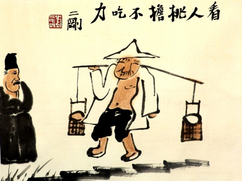

> 难的是，你没办法做到不在乎别人的对你的看法。

我这人喜欢给人讲笑话。我笑点低，但嘴皮子也不利索。所以我讲笑话，一般十次会有九次冷场。如果很幸运没有冷场，那肯定是听笑话的人觉得我实在讲的太认真了，不笑一下都没办法和我继续相处了。  
所以今天开始聊**“不讨好”**这一严肃话题前，先讲个笑话。其实也不是笑话，是关于我同事的一件事情。

下班，和同事一起走去地铁。小路上有人扔了一个空了的牛奶盒子在地上，很干净的路上它显得很不协调。我快步迈了过去，同事却停了下来。我见他停了下来，稍有些惊讶。当时的心理活动是这样的：我去，这货素质还挺高啊！这是要捡起来的节奏吗？我等下必须要给他32个赞。但是，他没有立刻捡起来。而是站在那里对我说：这种垃圾最坑爹了，上次我跟我老婆逛街，她不小心就踩了一个这样的牛奶盒子，然后里面残留的牛奶就溅了我一身。太TMD恶心了。然后，他淡定的跨过地上的盒子，走了~~~走了~~~走了~~~~！还好我的32个赞还没点完。

**言归正传**，有这样一种人：话不多，但说起话来轻声细语，做事勤勤恳恳，与世无争。和他共事，你会觉得他脾气怎么那么好，请他帮忙他都从来不会拒绝。即使不是他分内的工作，他也愿意去做。哪里需要就去哪里搬砖。在同事眼里，他是一个极其安全的人。玩笑随便开，工作上出了错他也不会怪罪于你。我们大多都喜欢这样的同事。我把这个定义为：**发自内心的，不刻意讨好**。这种讨好其实没什么好处。别人会把你当做老好人，认为你好说话，各种求帮忙。你辛辛苦苦做出的成绩还很容易被人抢功，你还时不时的被背黑锅。就算如此这样的为他人着想，最后直接决定你薪水高低的老板，还很有可能视你如空气。发现不了，或看不到你的付出和能力。

那么问题来了，那要什么样的讨好，才是对自己有好处的？我个人认为是**不讨好**。

##不讨好
不讨好，首先是要说“不”。合作伙伴之间的互相帮助是应该的，但必须是不影响本职工作的情况下。不要为他人不负责任的错误买单。不要跟人做无谓的争论，讨论问题讲事实情况，不发泄情绪。对于领导嘛，准确领会其意图，把事情完成就是最漂亮的“讨好”。大概这样就可以避免**发自内心的，不刻意讨好**。

