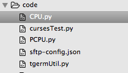
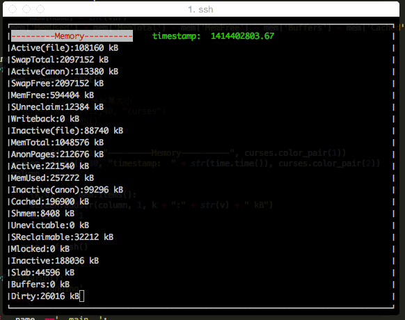

准备写点服务器相关的东西，这算是个开篇。先把准备工作做好，好的工作流才是王道。

###工具

> * SublimeText
> * SFTP-SublimeText
> * Python + Curses

####SublimeText

这个就不用多讲了，主要用来Python编码。

####SFTP-SublimeText 

插件[主页](http://wbond.net/sublime_packages/sftp)
用法也很简单，只要在本地文件夹内配置`sftp-config.json`文件即可。


{
    // The tab key will cycle through the settings when first created
    // Visit http://wbond.net/sublime_packages/sftp/settings for help
    
    // sftp, ftp or ftps
    "type": "sftp",

    "save_before_upload": true,
    "upload_on_save": false,
    "sync_down_on_open": false,
    "sync_skip_deletes": false,
    "sync_same_age": true,
    "confirm_downloads": false,
    "confirm_sync": true,
    "confirm_overwrite_newer": false,
    
    "host": "远程主机",
    "user": "登陆账号",
    "password": "登陆密码",
    //"port": "22",
    
    "remote_path": "对应的远程文件夹路径",
    "ignore_regexes": [
        "\\.sublime-(project|workspace)", "sftp-config(-alt\\d?)?\\.json",
        "sftp-settings\\.json", "/venv/", "\\.svn/", "\\.hg/", "\\.git/",
        "\\.bzr", "_darcs", "CVS", "\\.DS_Store", "Thumbs\\.db", "desktop\\.ini"
    ],
    //"file_permissions": "664",
    //"dir_permissions": "775",
    
    //"extra_list_connections": 0,

    "connect_timeout": 30,
    //"keepalive": 120,
    //"ftp_passive_mode": true,
    //"ftp_obey_passive_host": false,
    //"ssh_key_file": "~/.ssh/id_rsa",
    //"sftp_flags": ["-F", "/path/to/ssh_config"],
    
    //"preserve_modification_times": false,
    //"remote_time_offset_in_hours": 0,
    //"remote_encoding": "utf-8",
    //"remote_locale": "C",
    //"allow_config_upload": false,
}



参考我的文件夹：  

配置好开发环境，就剩下码字了。

###编码

####Curses

Curses是一个能提供基于文本终端窗口功能的库。用它在终端窗口写一个记事本程序都是分分钟钟的事情😄~  
更多关于Curses的内容，可查看[Linux Documentation Project’s NCURSES Programming How To](http://www.linux.org/docs/ldp/howto/NCURSES-Programming-HOWTO/index.html)

####Python 脚本

#-*- coding: utf-8 -*-
#!/usr/bin/env python
from os import system
from threading import Timer  

import time 
import curses

# 初始化窗口
screen = curses.initscr()
# 使用颜色模式
curses.start_color()
# 设置配色
curses.init_pair(1, curses.COLOR_RED, curses.COLOR_WHITE)
curses.init_pair(2, curses.COLOR_GREEN, curses.COLOR_BLACK)
# 禁止用户窗口输入
curses.noecho()
screen.border(0)

def memory_stat():  
    mem = {}  
    f = open("/proc/meminfo")  
    lines = f.readlines()  
    f.close()  
    for line in lines:  
        if len(line) < 2: continue  
        name = line.split(':')[0]  
        var = line.split(':')[1].split()[0]  
        mem[name] = int(var)  
    mem['MemUsed'] = mem['MemTotal'] - mem['MemFree'] - mem['Buffers'] - mem['Cached']  
    return mem  

timer_interval=1  
def run():  
    mem = memory_stat()
    
    screen.addstr(1,1, "---------Memory----------", curses.color_pair(1))
    screen.addstr(1,30, "timestamp:  " + str(time.time()), curses.color_pair(2))
    column = 2

    for (k,v) in  mem.items(): 
        screen.addstr(column, 1, k + ":" + str(v) + " kB")
        column += 1

    screen.refresh()

if __name__=='__main__': 
    while True:  
        time.sleep(timer_interval)  
        run() 



上传至服务器，并执行脚本：  

➜  pyServer  python tgermUtil.py


执行效果：

