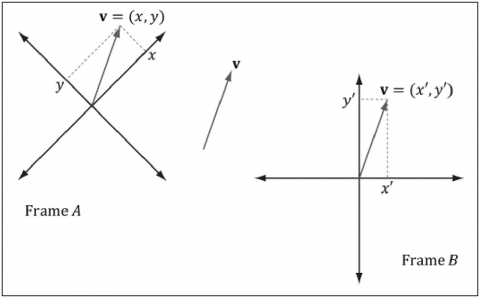
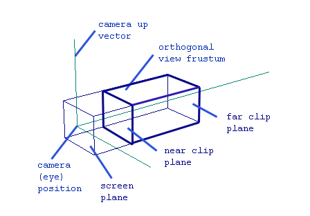
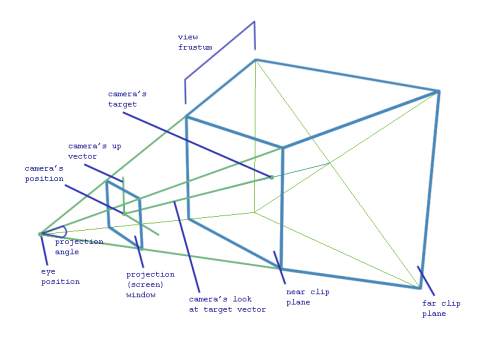
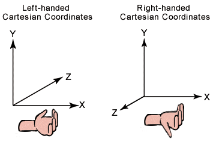
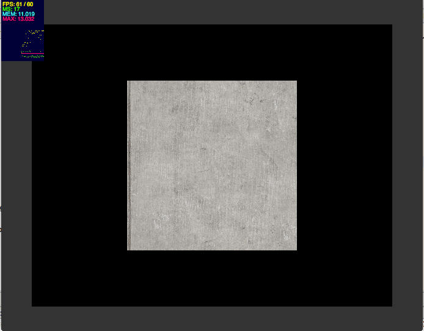

<strong>原创博文，转载请声明</strong>

前段时间弄了几篇关于**Stage3D**的文章，每次写例子都要码半天。花时间写了一个小的库，以方便写测试例子。 代码很少，所以基本上也没什么注释。 

> GitHub:[https://github.com/vanCopper/Stage3DGuide]( https://github.com/vanCopper/Stage3DGuide)

之前的几篇文章：  

> [Stage3D-HelloTriangle](http://tgerm.org/stage3d-hellotriangle/)  
> [Stage3D-Texture](http://tgerm.org/stage3d-texture/)  
> [Stage3D-AGAL](http://tgerm.org/stage3d-agal/)  
> [Stage3D-3D世界](http://tgerm.org/stage3d-3d_world/)  
> [Stage3D-光照](http://tgerm.org/stage3d_light/)  

---
Camera所完成的其实就是[Stage3D-3D世界](http://tgerm.org/stage3d-3d_world/)里面所提到的视图变换。  
这里我们是通过Camera来观察3D场景，场景中的物件都具有x,y,z坐标。最终我们将观察到的结果通过投影（正交或者透视投影）呈现在2D平面（屏幕）上。

###基础知识

####多坐标系变换

同一个向量**V**可以在不同的坐标系中正确表示：  

从上图可以看出，在不同的坐标系空间可以表示同一个向量**V**。那么如何将空间**FrameA**中的**V**转换到空间**FrameB**中？这里利用矩阵就可以很方便的将向量**V**转换至该矩阵对应的坐标空间。  
  
[x', y', z', w'] = [x, y, z, w] * View  


**View**就是Camera对应的坐标系矩阵，矩阵左乘后得到向量**V**在Camera坐标系中的向量**V'**。实际上在应用时，我们同样是用矩阵来存储一个物体的坐标和旋转缩放等信息。  
接下来就需要将通过Camera坐标系转换后的矩阵投影至2D平面。投影后的结果储存在矩阵M中。  


M = View * Projection


所以最终的转换公式是：


[x', y', z', w'] = [x, y, z, w] * View * Projection


**Projection**既是投影矩阵。

####投影

在[Stage3D-3D世界](http://tgerm.org/stage3d-3d_world/)中，大概了解了一下关于投影的知识。这里再结合Camera详细理解一下。

**正交投影（正投影）：** 正交投影会将3D点直接映射到2D屏幕而没有透视效果。如果我们做一套基于GPU的UI或者文字，就需要用到正交投影。因为UI或者文字的大小不会受Camera的距离影响。

从上图可以看出，该frustum是一个立方体。限制区域对应的六个面分别为：top, left, bottom, right, near clip, far clip。所有处于该frustum中的物件均会被正确的投影至屏幕。近截面（near clip）和 远截面（far clip）是为了防止距离Camera过近或者过远的物件也被错误渲染到。这大大节省了显卡资源。  
最后要注意的是，因为正交投影与Camera距离无关，所以如果两个距离不同但同样大小的物件最后渲染到屏幕后的大小也是一样的。

**透视投影 ：** 

这部分直接参考[Stage3D-3D世界](http://tgerm.org/stage3d-3d_world/)中的透视投影的内容。

####坐标系

这坐标系好像没什么好说的，要么左手坐标系，要么右手坐标系。如图：

###实现
此版本的Camera3D只实现了两个最基本的相机功能：

* 相机在指定位置的相机旋转
* 相机在指定位置的相机前进后退

相机空间的坐标系是右手坐标系。这个简单的相机已基本可以满足后面的一些使用需求。

Camera3D.as



package com
{
	import com.adobe.utils.PerspectiveMatrix3D;
	
	import flash.geom.Matrix3D;
	import flash.geom.Vector3D;

	/**
	 * Camera3D
	 * @author vancopper
	 * 
	 */	
	public class Camera3D
	{
		private var _distance:Number = 20;
		public var minDistance:Number = 6;
		public var maxDistance:Number = 25;
		
		private var _transformationMatrix:Matrix3D = new Matrix3D();
		
		/**
		 * 相机位置 
		 */		
		public var camPos:Vector3D = new Vector3D();
		/**
		 * 相机目标点 
		 */		
		public var camTarget:Vector3D = new Vector3D();
		
		public var camUp:Vector3D = Vector3D.Y_AXIS;
		public var camRight:Vector3D = Vector3D.X_AXIS;
		public var camForward:Vector3D = Vector3D.Z_AXIS;
		public var viewWidth:Number = 800;
		public var viewHeight:Number = 600;
		public var near:Number = 0.02;
		public var far:Number = 100;

​		
		public var projectionMatrix:PerspectiveMatrix3D = new PerspectiveMatrix3D();
		private var _viewMatrix:Matrix3D = new Matrix3D();	
		
		private static var XV:Vector3D = new Vector3D();
		private static var YV:Vector3D = new Vector3D();
		private static var ZV:Vector3D = new Vector3D();
		private static var WV:Vector3D = new Vector3D();
		
		private var _needUpdate:Boolean = true;
		
		public function Camera3D()
		{
			// 45 degrees FOV, 700/500 aspect ratio, 0.1=near, 100=far
			projectionMatrix.perspectiveFieldOfViewRH(Math.PI/4, viewWidth / viewHeight, near, far);
		}
		
		private function update():void
		{
			_transformationMatrix.identity();
			_transformationMatrix.appendRotation(_xDegrees, Vector3D.X_AXIS);
			_transformationMatrix.appendRotation(_yDegrees, Vector3D.Y_AXIS);
			_transformationMatrix.appendRotation(_zDegrees, Vector3D.Z_AXIS);
			
			var camRU:Vector3D = _transformationMatrix.transformVector(Vector3D.Y_AXIS);
			camUp = new Vector3D().add(camRU);
			
			camPos = _transformationMatrix.transformVector(camForward);
			camPos.scaleBy(-distance);

//			camPos = camPos.add(camTarget);
		}
		
		private var _xDegrees:Number = 0;
		private var _yDegrees:Number = 0;
		private var _zDegrees:Number = 0;
		public function rotaion(degrees:Number, axis:String):void
		{
			axis = axis.toLowerCase();
			switch(axis)
			{
				case "x":
					_xDegrees += degrees;
					break;
				case "y":
					_yDegrees += degrees;
					break;
				case "z":
					_zDegrees += degrees;
					break;
			}
			_needUpdate = true;
		}
		
		public function updateView(w:Number, h:Number):void
		{
			viewWidth = w;
			viewHeight = h;
			
			projectionMatrix.perspectiveFieldOfViewRH(Math.PI/4, viewWidth/viewHeight, near, far);	
		}
		
		public function get viewMatrix():Matrix3D
		{
			if(_needUpdate)
			{
				update();
				_viewMatrix = lookAtRH();
				_needUpdate = false;
			}
			return _viewMatrix;
		}
		
		private function lookAtRH():Matrix3D
		{
			var vm:Matrix3D = new Matrix3D();
			
			XV = camPos.subtract(camTarget);
			XV.normalize();
			
			ZV.copyFrom(camUp);
			crossProd(ZV, XV);
			ZV.normalize();
			
			YV.copyFrom(XV);
			crossProd(YV, ZV);
			
			var raw:Vector.<Number> = vm.rawData;
			raw[0] = ZV.x;
			raw[1] = YV.x;
			raw[2] = XV.x;
			raw[3] = 0.0;
			
			raw[4] = ZV.y;
			raw[5] = YV.y;
			raw[6] = XV.y;
			raw[7] = 0.0;
			
			raw[8] = ZV.z;
			raw[9] = YV.z;
			raw[10] = XV.z;
			raw[11] = 0.0;
			
			raw[12] = - ZV.dotProduct(camPos);
			raw[13] = -YV.dotProduct(camPos);
			raw[14] = -XV.dotProduct(camPos);
			raw[15] = 1.0;
			
			vm.copyRawDataFrom(raw);
			
			return vm;
		}
		
		private function crossProd(a:Vector3D, b:Vector3D):void
		{
			WV.x = a.y * b.z - a.z * b.y;
			WV.y = a.z * b.x - a.x * b.z;
			WV.z = a.x * b.y - a.y * b.x;
			WV.w = 1.0;
			a.copyFrom(WV);
		}
	
		public function get distance():Number
		{
			return _distance;
		}
	
		public function set distance(value:Number):void
		{
			_distance = value;
			_needUpdate = true;
		}
	}
}


