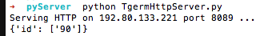

用Python搭建一个HttpServer的目的是为了方便后面以web的方式来查看当前服务器监控信息。Python默认提供了简单的HttpServer,但为了更方便的处理请求需要重新封装一下。

###SimpleHTTPServer

*SimpleHttpServer*是Python提供的简单Http服务，通过简单的命令就可以在机器上启动一个简易的Http服务。  

 

➜  ~  cd pyServer  
➜  pyServer  python -m SimpleHTTPServer 


这样Http服务就会在8000端口提供服务。当你访问对应地址时，会默认读取_pyServer_目录下的`index.html`文件并返回，如果没有`index.html`文件那么就直接显示当前文件夹目录。 
更多信息可以访问[link](https://docs.python.org/2/library/simplehttpserver.html#module-SimpleHTTPServer)

###TgermHttpServer
我们需要扩展一下默认提供的这个Http服务，让我们可以自己处理如何响应Http请求。并且能够处理请求发送过来的`GET`或者`POST`数据。

**TgermHttpServer.py**



#-*- coding: utf-8 -*-
#!/usr/bin/python
import sys
import BaseHTTPServer
import cgi
from SimpleHTTPServer import SimpleHTTPRequestHandler
from BaseHTTPServer import BaseHTTPRequestHandler,HTTPServer
from urlparse import urlparse, parse_qs

class HttpReqHandler(BaseHTTPRequestHandler):
	dic = {}
	def do_GET(self):
		dic = parse_qs(urlparse(self.path).query)
		print(dic)
		self.send_response(200)
		self.send_header('Content-type','text/html')
		self.end_headers()
		# Send the html message
		self.wfile.write("HttpResponse!")
		return

	def do_POST(self):
		dic = cgi.FieldStorage()
		self.send_response(200)
		self.send_header('Content-type','text/html')
		self.end_headers()
		# Send the html message
		self.wfile.write("HttpResponse!")
		return

HandlerClass = HttpReqHandler
ServerClass  = BaseHTTPServer.HTTPServer
Protocol     = "HTTP/1.0"
Host		 = "192.80.133.221"
Port		 = 8089

server_address = (Host, Port)
 
HandlerClass.protocol_version = Protocol
httpd = ServerClass(server_address, HandlerClass)
 
sa = httpd.socket.getsockname()
print "Serving HTTP on", sa[0], "port", sa[1], "..."
httpd.serve_forever()



###启动服务

访问：`http://192.80.133.221:8089/index.html?id=90`可见结果：

