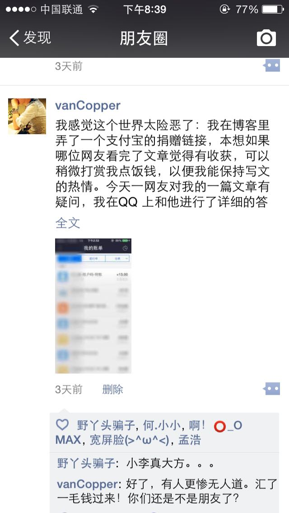
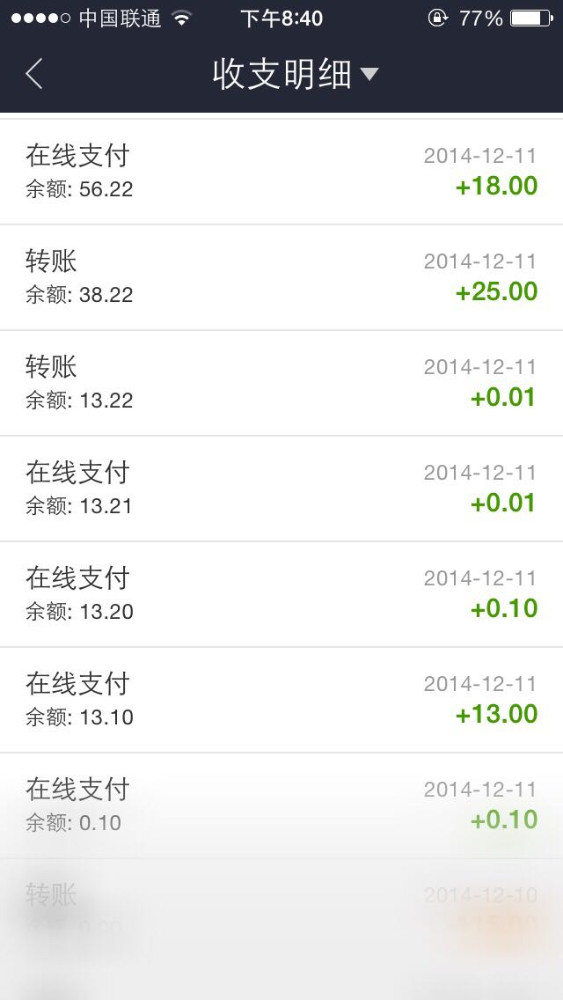
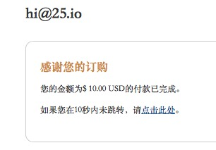
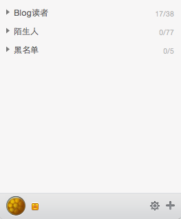

##钱是怎么来的？
前几日，突发奇想（太闲）去支付宝申请了一个二维码支付。原意是想放在Blog里，以便有好心的网友对我的文章打赏。正巧，有朋友来和我讨论Blog中的文章。当然，要坑人的话当然要先从熟人下手。于是在我的威逼下给我的支付宝账户汇了**13.00RMB**。虽然他侮辱了我，但我丝毫没有生气的意思（为了钱这点侮辱算的了什么！）。然后我发了朋友圈：

 

然后，朋友都陆续给我汇了钱：

可以看到最大的一笔汇款是**25.00RMB**。我猜她是想说我真是个250，但是汇250块钱给我有点划不来。干脆25.00好了，意思肯定是表达的清楚的。第二大的一笔是**18.00RMB**。我相信，这个朋友是真心支持我的，这么一个吉利的数字。最后统计一下：

> 一共7人汇款，共计：56.22 RMB

##钱要怎么花？
我心里盘算着，这些钱给儿子买奶粉肯定是不够的。但这钱一定要花出去，因为我要告诉汇钱给我的人，这钱我用来干了什么。

我一直使用**Mou**这款MarkDown的编辑器来写文章。这个软件本身是免费的，前段时间软件的作者想以60W的价格出售这软件。但好像没成功，于是他就到网站众筹，以支撑他继续维护这个软件。他成功筹到了**$27,334 USD**。他会在明年发布该软件的1.0版本，为了表示对他的支持。我花**$10 USD**买了他1.0版本的预售。折合人民币差不多就是大家汇给我钱。

##谢谢大家
我码字起初只是想让自己坚持做一件事，虽然我都不知道到底有多少人会看，有几篇文章是真正有价值的。但还是坚持下来了。我要谢谢朋友们哈~

最后，我的稳定读者。看下图：

