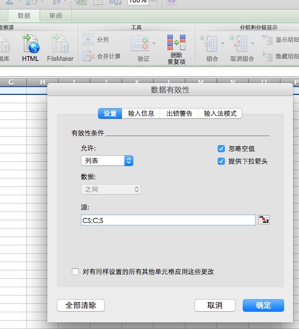
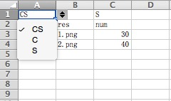
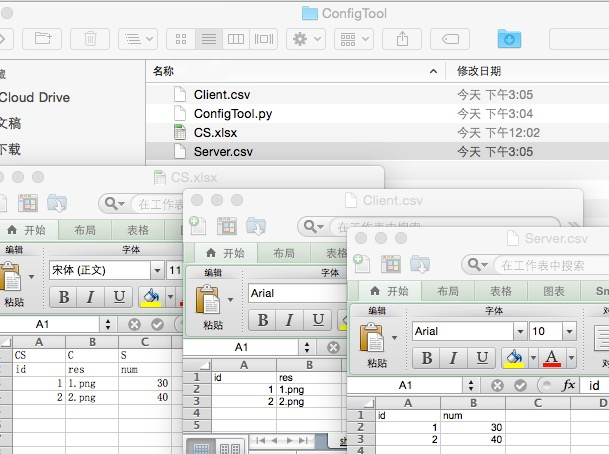

###情景
策划A:小B，有Bug啦~快来看啊。这里应该显示2，现在怎么显示的是B？

小B程序:我艹，这是你丫表配错了吧！

策划A:*（*（&*&……#（&#（）*…^））我去看看哦。

不得不承认，配置表填错的几率还是非常大的。策划同学每天都有很多表要配，前端表要配，服务器的表要配，资源表要配，各种配...然后把自己配的分不清东西南北了。

有些Bug可以很容易定位到配置问题，有些就比较难定位。可能查了几个小时后，才发现是配置表配错了。所以，配置表出问题是非常坑爹的。

###配置表会有那些问题？

* 多平台配置问题
* 配置表错误检查问题
* 配置表发布（加密、压缩）问题
* 前后端配置共用问题
* ...

###解决部分问题
讨论一下前端配置公用问题。如果前后端使用同一张配置表，自然不会有什么问题。但共用会带来数据冗余问题，即有些字段配置是服务端使用，而前端使用不到的。如果是两张表，那么共用的字段部分，策划就需要配置两次。这个过程中又很容易出错。

解决的方法就是在同一张表中配置，但标记数据是给前端还是服务端使用的，还是两者都要使用。然后用工具发布成两张表。当然，既然有了这个发布工具，自然是可以把配置加密和压缩问题一并处理掉。

#####1. 固定格式的配置表

如图：选中表格的第一行，在数据->验证->数据有效性中配置源为：`CS;C;S`。

> CS-> 客户端服务端都要使用的数据

> C-> 只有客户端使用的数据

> S-> 只有服务端使用的数据

填写数据的时候，先通过设置好的下拉列表来指定数据使用场景：

#####2. 使用工具导出可使用的配置表
这里我只提供一个简单的Python脚本来完成表拆分的工作。实际项目中使用的话，这个导出脚本要复杂的多。

*Python脚本依赖的库：*

> [xlrd](https://pypi.python.org/pypi/xlrd)

> [xlwt](https://pypi.python.org/pypi/xlwt)

脚本：



#coding: utf-8
import xlrd
import xlwt

print("ConfigTool>>>>")
book = xlrd.open_workbook("CS.xlsx")
sh = book.sheet_by_index(0)

serverBook = xlwt.Workbook(encoding='utf-8', style_compression=0)  
serverSheet = serverBook.add_sheet('sheet', cell_overwrite_ok=True) 
serverCol = 0

clientBook = xlwt.Workbook(encoding='utf-8', style_compression=0)
clientSheet = clientBook.add_sheet('sheet', cell_overwrite_ok=True)
clientCol = 0

for cx in range(sh.ncols):
	cel = sh.col(cx)
	# print(cel)
	typeFlag = cel[0].value
	# print typeFlag
	if typeFlag == "CS" or typeFlag == "S":	
		for vx in xrange(1, len(cel)):
			v = cel[vx]
			print vx
			print v
			serverSheet.write(vx - 1, serverCol, v.value)
		serverCol += 1

	if typeFlag == "CS" or typeFlag == "C":
		for vc in xrange(1,len(cel)):
			c = cel[vc]
			clientSheet.write(vc - 1, clientCol, c.value)
		clientCol += 1	

serverBook.save("Server.csv")	
clientBook.save("Client.csv")



最终结果：

