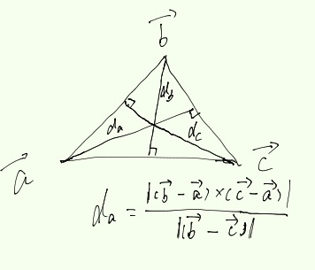

用线框模式渲染模型是比较常用的调试方法。在DX和OpenGL中都内置了线框模式渲染。在Stage3D中，桌面（AIR）中是有这个线框渲染模式的。插件版，还是要自己写。

###原理
实现原理就是用一个颜色值填充靠近三角形三个边的像素点。实现步骤：

1. 对于单个三角，分别计算点到对边的距离，并上传至显卡。因为Stage3D是没有Geometry Shader，所以这一步需要在AS里面做预计算。
2. 在片段着色器中，取三点到对边距离最短的距离，作为标准参考值。
3. 如果距离足够靠近边缘，就填充。否则，丢弃。

###实现

**分别计算三点到对边的距离**

需要注意的是因为是用顶点计算距离，所以不同的三角形不能共用顶点，需要复制顶点。关于计算公式，我自个画了一个很搓的图：


/**
		 * 计算 v0 至线段 v1-v2 的距离 
		 * @param v0
		 * @param v1
		 * @param v2
		 * @return 
		 * 
		 */		
		private function vertexEdgeDistance(v0:Vector3D, v1:Vector3D, v2:Vector3D):Number
		{
			var sub1:Vector3D = subtractV(v1, v0);
			var sub2:Vector3D = subtractV(v2, v1);
			var sub3:Vector3D = subtractV(v2, v1);
			
			var c:Vector3D = cross(sub1, sub2);
			
			return magnitude(c)/magnitude(sub3);
		}
		
		private function subtractV(v0:Vector3D, v1:Vector3D):Vector3D
		{
			return new Vector3D(v0.x - v1.x, v0.y - v1.y, v0.z - v1.z);
		}
		
		private function cross(v0:Vector3D, v1:Vector3D):Vector3D
		{
			return new Vector3D(v0.y * v1.z - v0.z * v1.y,
								v0.z * v1.x - v0.x * v1.z,
								v0.x * v1.y - v0.y * v1.x);
		}
		
		private function magnitude(v0:Vector3D):Number
		{
			return Math.sqrt(v0.x * v0.x + v0.y * v0.y + v0.z * v0.z);
		}


**第二点和第三点都需要在Shader中处理**

`Vexter Shader:`


override public function get vertexSrc():String
		{
			var str:String = 
				//va0: pos va1: uv va2: Normal va3: distance
				"m44 op, va0, vc0\n" +
				"mov v0, va1\n" +
				"mov v1, va2\n" +
				"mov v2, va3\n";
			
			return str;
		}


`Fragment Shader:` 


var str:String = 
				//采样
				"tex ft0, v0, fs0 <2d, linear, nomip>\n" +
				//线的颜色存储至 ft1
				"mov ft1, fc0\n" +
				//取三条垂线距离最短的存储至 ft2.x
				"min ft2.x, v2.x, v2.y\n" +
				"min ft2.x, ft2.x, v2.z\n" +
				// ft3 = ft2.x < fc1.x ? 1 : 0  fc1.x为线的粗细
				"slt ft3, ft2.x, fc1.x\n" +
				//线的颜色 ft1 = ft1 x ft3(1或者0)
				"mul ft1, ft1, ft3\n" +
				//ft3 = 1 - ft3 (取反)
				"sub ft3, fc1.y, ft3\n" +
				//材质颜色 ft0 = ft0 x ft3 (1或者0)
				"mul ft0, ft0, ft3\n" +
				//输出最终颜色
				"add oc, ft1, ft0\n ";
			return str;



**Demo:**

###平滑
可以明显看到线框的锯齿很严重，下一篇文章会讨论关于平滑。

###参考资料
> [Nvidia Developer:SolidWireframe](http://developer.download.nvidia.com/SDK/10.5/direct3d/Source/SolidWireframe/Doc/SolidWireframe.pdf)

> [Stage3D Wireframe](http://volgogradetzzz.blogspot.com/2012/06/wireframe-shader.html)

完整的代码访问gitHub即可：

> GitHub:[https://github.com/vanCopper/Stage3DGuide]( https://github.com/vanCopper/Stage3DGuide)