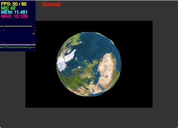
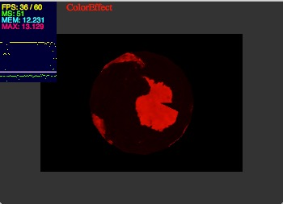
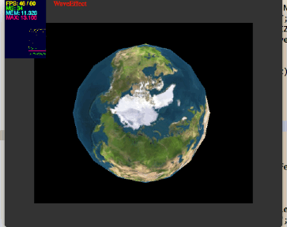

> 2015年第一篇博客竟然还是拖到了2月份。但好歹还是挤出了这么一篇。

**Post-processing**直译一下就是后期处理。理解一下就是对已经渲染完成的场景进行再处理。再处理其实就是对渲染完成的场景加一下滤镜，比较常用的滤镜：

* Bloom 全屏泛光
* Motion Blur 运动模糊
* Depth Of Field 景深效果
* HDR
* Shadow Mapping 
* ...

这里实现了两个简单的**Post-processing**效果。

----
**晚上到家没忍住又开机码字，加了一个效果。**

###实现步骤
其实不是很复杂，代码我已经提交至gitHub。原理也没什么要详细讲的。只说一下实现步骤：

1. 调用Context3D.setRenderToTexture()将场景渲染至Texture
2. 对上面的贴图进行处理（ColorEffect, GrayscaleEffect）
3. 最后将渲染好的画面呈现即可

###相关代码
相关代码可查看：

* PostProcessingRender.as
* ColorEffect.as
* GrayscaleEffect.as 

完整的代码访问gitHub即可：

> GitHub:[https://github.com/vanCopper/Stage3DGuide]( https://github.com/vanCopper/Stage3DGuide)