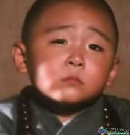

当然他真名不叫狗蛋。之所以叫他狗蛋完全是为了配合其气质。

狗蛋很小的时候就有了啤酒肚，这给他带来了很多烦恼。农村的孩子大多喜欢在外面追逐打闹，偶尔还举行个短跑比赛什么的。但举行这种比赛大多是旁边的大人们提出的，他们都喜欢看一下缺少运动细胞或者小胖子在后面拽啊拽的滑稽样。每次狗蛋满怀喜悦的拽到了终点，大人们早已笑的岔气。起初，狗蛋也跟着笑。后来，狗蛋直接拒绝参加这种比赛。每次拒绝参加这种比赛的时候大人们会说：你是怕跑不过其他人家吧？你看你胖的，哈哈哈~ 狗蛋就很窘迫的站在旁边，不知道该说什么，或者要说什么。

要说狗蛋胖不是没有原因的，他非常容易饿。24年前的农村，幼儿园大多非常简陋。一个老师把所有学生的德智体美劳全包了。每天孩子各自背着小布包，三五一群去上课。狗蛋五岁那年准备去上幼儿园了。第一天上学，小伙伴们都很兴奋。唯独狗蛋，他看起来有点焦虑。这种焦虑终于在上第二节课的时候爆发。狗蛋站起来说：老师，我饿了。我要回家吃馒头。后来，老师不忍心看狗蛋哭就让他回家了。然后，他直到满六周岁才去上的第二节课。

后来，发生了一件打架斗殴事件。严格来讲是“狗蛋被揍事件”。这件事情对狗蛋的影响很大。狗蛋不仅胖而且胆子很小。狗蛋走路有点慢，这可能和他胖有点说不清的关系，所以小伙伴们上学，放学都是一溜烟不见了。每次都是他一个人拿着个小木棍，一边拨弄路上的小石子一边往家走。但命中注定的事情，它终究都会发生。狗蛋在放学回来的路上被人从后面一脚踹到在地上，然后几个小伙伴依次从他肉肉的身上踩过，然后很快消失在巷子里。狗蛋甚至都没来得及记住都有谁踩了他。手掌被摔破了。回家狗蛋妈问，狗蛋答不上来啊。狗蛋妈后来听路边的大人说了事情经过。回到家，狗蛋妈没忍住还是在狗蛋面前哭了。

这时候，关键人物就出场了。狗蛋爸下班回到家，知道了这件事。狗蛋爸可不是好惹的。据狗蛋妈后来讲，他们谈恋爱那会，别的不说，就说狗蛋爸的衣服，他爸的衣服总是会开线。衣服的什么地方开线呢？是肩膀的地方。你知道，那肌肉有多厉害了吧。

晚饭后，狗蛋爸把狗蛋叫到院子里。说：蛋儿，你知道爸爸平时喜欢练练拳脚。就是因为喜欢这个，爸年轻那会没少给你爷爷惹事。所以一直不想你练这玩意。但今儿你太令我失望了，你为什么不敢追上去跟他们打一架？怕打不过就认孬？从今儿起，我让你练，你好好练。

虽然狗蛋不是很懂爸爸的话，也正儿八经的练了起来。每天晚上：压腿，弓步，马步，金鸡独立，前踢，侧踢。。。。。一套练下来，狗蛋连吃奶的劲都用光了。当然这其中狗蛋没少吃苦。据狗蛋后来回忆，跟身体上的辛苦比有件事对他的伤害更大。

那时候的农村电视机是极少见的。就算如此，狗蛋的爷爷还是在狗蛋很小的时候弄了一台熊猫牌黑白电视机。狗蛋的爷爷还在院子里自制了一颗天线，用一根很长的竹竿，绑着一顶破旧的大锅盖。那段时间，鹿鼎记正在热播。晚饭后，几乎整个大队几十口子人都来院子里看这剧。狗蛋也爱看，通常狗蛋练好正好可以看。偏偏这次狗蛋爸回来晚了，正在播剧的时候，狗蛋才开始练。可狗蛋完全没心思练啊，一心想着韦小宝，一边练一边侧耳听剧情。那自然是练不好的，狗蛋爸在旁边看的很生气。最后，狗蛋爸爆发了，放了狠话：今儿练不好不准睡觉。狗蛋就一边抹泪一边站马步，练到金鸡独立的时候，已经哭不出眼泪了，就一直抽抽。就见他，一只脚立着，抽一下身子一晃站不稳，他就跳一下。像独脚的鸡在跳。

若干个月后，狗蛋觉得仿佛时机已到，可以出去行侠仗义了...

**未完待续**

