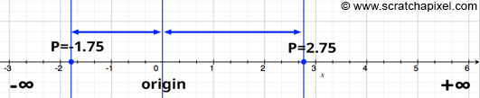
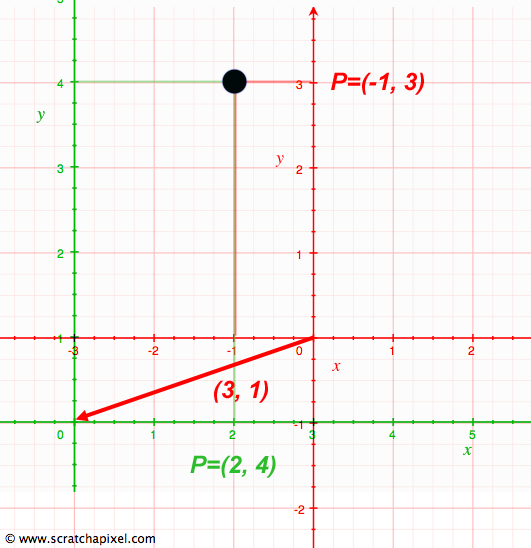
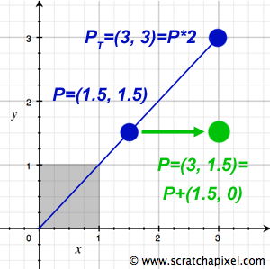

<strong>原创博文，转载请声明</strong>

> 原文：[Coordinate Systems](http://www.scratchapixel.com/lessons/mathematics-physics-for-computer-graphics/geometry/coordinate-systems)

##Introducing Coordinate Systems

坐标系在图形渲染中扮演着重要的角色。坐标系并不复杂，在我们学生时代一开始学习几何的时候就已经接触过了。但是，深入了解下坐标系更有助于我们理解矩阵。

在上一章节我们介绍了点和向量，两者均是用具体数字来表示。那么，那些数字的具体含义是什么？其中每个数字均代表从原点出发的一条有方向的直线上的距离。例如，我们画一条直线，并在中点做一个标记，那么我们就可以称这个标记为原点。原点即成为测量一个点到另外一个点距离的参考点。如果点在原点右边那么记为大于0的距离，如果点在原点左边那么记为负数。

我们可以将原点左右无限延伸。所以，理论上两个点之间的距离是可以为无限大的。但是，这里有个问题是：在计算机中，数字大小的表示是有限的。幸运的是，在多数3d场景中计算机所能表达的数字大小都是能满足需求的。

现在我们有一条直线，并且在线上标记了原点。在原点的两侧添加了标尺来表示距离的大小，这样我们就可以很容易的得到点的坐标。在计算机图形和数学中我们称这条水平的线为**轴**。

如果点并不在这条线上，那么可以将点垂直投影到线上。投影点所在的坐标值就是点在坐标轴上距原点的距离。

##Dimensions and Cartesian Coordinate Systems

我们称水平的标尺线为**x轴**。我们画一条通过原点并垂直**x轴**的标尺线，称为**y轴**。对于任何点我们都可以用点到x轴和y轴的距离来表示这个点的位置。那么最终我们就用两个数字来表示一个点，一个表示x轴坐标（点到x轴的距离），另外一个表示y轴坐标（点到y轴的坐标）。这时候点和原点就组成了一个2d空间，称为平面。

相交于原点的两条数轴，构成了平面仿射坐标系。如两条数轴上的度量单位相等，则称此仿射坐标系为笛卡尔坐标系。两条数轴互相垂直的笛卡尔坐标系，称为笛卡尔直角坐标系，否则称为笛卡尔斜角坐标系。

如果我们知道点P在坐标系A中的位置，那么我们如何在坐标系B中找到和P相同的点？在CG运算中（以及数学运算中），这是一种非常重要的操作。我们会在后面的章节中了解到坐标转换的相关知识。

