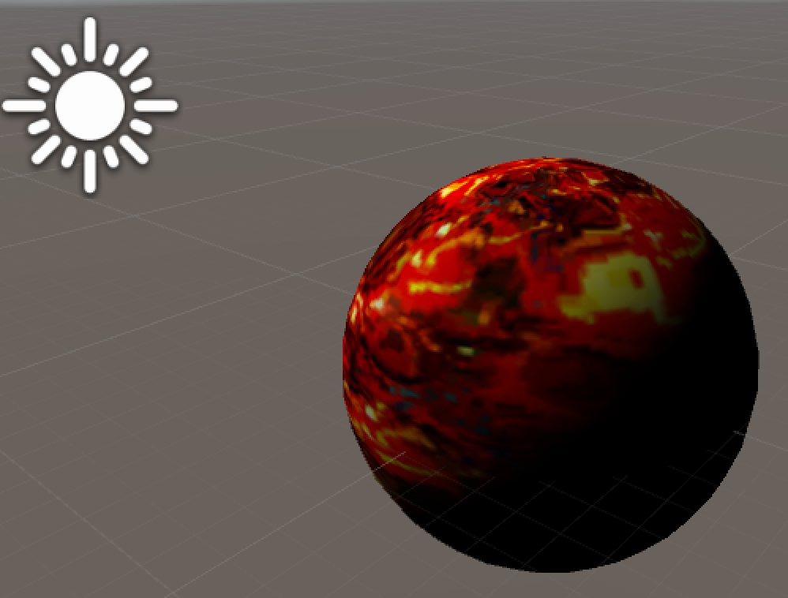
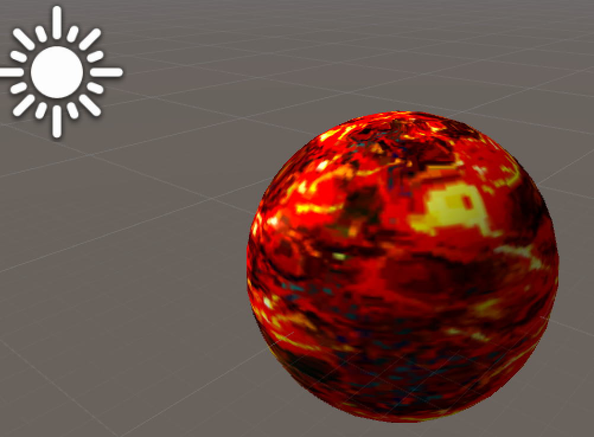

AGAL实在太反人类，U3D里写shader，调试shader方便的不要不要的。弃暗投明了。

所有代码以及资源均提交在Github上了：

> Github：https://github.com/vanCopper/CGShader
> 
> 资源目录：
> 
> - Materials
> - Scripts
> - Shaders
> - Texture

### 环境光(Ambient Light)

由物体表面所产生的发射光的照明，称为环境光。环境光是对光照现象的简单抽象，它给予物体各个点的光照强度相同且无方向之分。在只有环境光的情况下，物体各个点的明暗程度均相同。

在只有环境光的情况下是不能产生真实感的，实际情况是光是有方向的。光照射在不同点所产生的光线反射是不一样的。

### 漫反射

粗糙的物体表面向各个方向等强度地反射光,这种等同地向各个方向散射的现象称为光的漫反射(diffuse reflection)。产生光的漫反射现象的物体表面称为理想漫反射体,也称为朗伯(Lambert)反射体。(摘自：《GPU编程与CG语言之阳春白雪下里巴人》尼玛，这什么鬼书名。)

在方向光下的Lambert光照模型即可描述为：

$$
{I}_{ldiff} = K_{d}I_{l}cos{\theta}
$$

即： 漫反射光强=材质对环境光的反射系数x环境光强度x入射光方向与顶点法线的夹角

如果N为顶点单位法向量，L表示从顶点指向光源的单位向量，那么公式即可表示为：

$$
I_{ldiff}=K_{d}I_{l}(N \cdot L)
$$

### 代码实现



Shader "Unlit/DiffuseShader"

{

    Properties 

       {

           _MainTex ("Base (RGB)", 2D) = "white" {}

       }

       SubShader 

       {

           Pass

           {

               Tags { "RenderType"="Opaque" "LightMode"="ForwardBase"}

               CGPROGRAM

               #pragma vertex vert

               #pragma fragment frag

               #include "UnityCG.cginc"

               sampler2D _MainTex;

               float4    _LightColor0; //灯光颜色

               struct VertexOutput 

               {

                   float4 pos:SV_POSITION;

                   float2 uv_MainTex:TEXCOORD0;

                   float3 normal:TEXCOORD1;

               };

               VertexOutput vert(appdata_base input)

               {

                   VertexOutput o;

                   o.pos = mul(UNITY_MATRIX_MVP,input.vertex);

                   o.uv_MainTex = input.texcoord.xy;

                   o.normal = normalize(input.normal);

                   return o;

               }

               float4 frag(VertexOutput input):COLOR

               {

                    // 顶点法向量

                   float3 normalDir = normalize(input.normal);

                    // 顶点指向光源的方向向量

                   float3 lightDir = normalize(_WorldSpaceLightPos0.xyz);

                    // 材质对环境光的反射系数即材质的颜色分量

                   float3 Kd = tex2D(_MainTex,input.uv_MainTex).xyz;

                    // 计算漫反射

                   float3 diffuseColor = Kd * _LightColor0.rgb * max(0,dot(normalDir,lightDir));

                   return float4(diffuseColor,1);

               }

               ENDCG

           }

       } 

       FallBack "Diffuse"

}



效果如下图：

可以看到球体的右下方是黑色的，实际情况下由于环境光的存在右下方也是会被照亮的。

### 加入环境光

上面提到环境光与方向位置均无关，故加入环境光后的最终公式为:

$$
I_{diff}=I_{ambdiff}+I_{ldiff} = K_{d}I_{a} + K_{d}I_{l}(N \cdot L)
$$



Shader "Unlit/DiffuseShader"

{

    Properties 

       {

           _MainTex ("Base (RGB)", 2D) = "white" {}

           _Ambient ("Ambient", Range (0, 1)) = 0

       }

       SubShader 

       {

           Pass

           {

               Tags { "RenderType"="Opaque" "LightMode"="ForwardBase"}

               CGPROGRAM

               #pragma vertex vert

               #pragma fragment frag

               #include "UnityCG.cginc"

               sampler2D _MainTex;

               float4    _LightColor0; //灯光颜色

               float    _Ambient;        //环境光系数

               struct VertexOutput 

               {

                   float4 pos:SV_POSITION;

                   float2 uv_MainTex:TEXCOORD0;

                   float3 normal:TEXCOORD1;

               };

               VertexOutput vert(appdata_base input)

               {

                   VertexOutput o;

                   o.pos = mul(UNITY_MATRIX_MVP,input.vertex);

                   o.uv_MainTex = input.texcoord.xy;

                   o.normal = normalize(input.normal);

                   return o;

               }

               float4 frag(VertexOutput input):COLOR

               {

                    // 顶点法向量

                   float3 normalDir = normalize(input.normal);

                    // 顶点指向光源的方向向量

                   float3 lightDir = normalize(_WorldSpaceLightPos0.xyz);

                    // 材质对环境光的反射系数即材质的颜色分量

                   float3 Kd = tex2D(_MainTex,input.uv_MainTex).xyz;

                    // 计算漫反射

                   float3 diffuseColor = Kd * _LightColor0.rgb * max(0,dot(normalDir,lightDir));

                    // 计算环境光

                   float3 ambientColor = Kd * _Ambient;

                   return float4(diffuseColor + ambientColor,1);

               }

               ENDCG

           }

       } 

       FallBack "Diffuse"

}



最终效果如下图：

