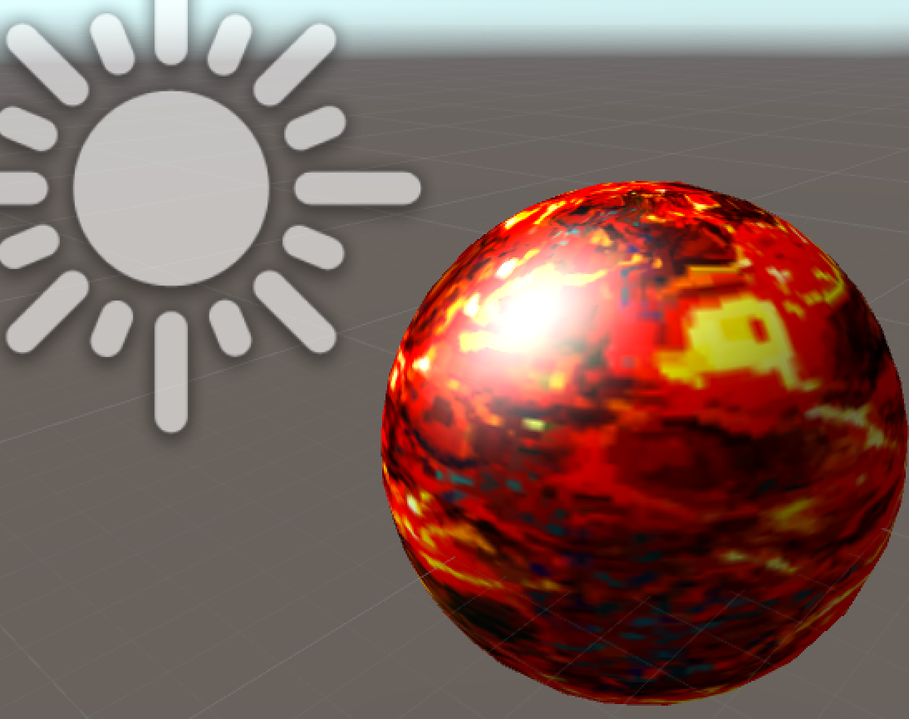

> Github: https://github.com/vanCopper/CGShader
> 
> 参考资料：《GPU编程与CG语言之阳春白雪下里巴人》

### 镜面反射

表面光滑的物体被照射时，可以在某个方向上看到很强的反射光。这是因为在接近镜面反射角的一个区域内，反射了入射光的全部或绝大部分光线，该现象称为镜面反射。

镜面反射可用Phong模型来表达，镜面反射与反射光线和视线的夹角相关，数学表达公式为：

$$
I_{spec}=K_{s}I_{l}(V \cdot R)^{n_{s}}
$$

$K_{s}$为材质的镜面发射系数（即反射光颜色，多为白色）。

$n_{s}$是反射指数，反映了物体表面的光泽程度，值越大表示越接近镜面。

$V$表示从顶点到视点的观察方向。

$R$代表反射光方向。

反射光方向$R$可以通过入射光方向$L$(从顶点指向光源)和顶点法向量求出：

$$
R+L=(2N\cdot L)N
$$

即：

$$
R=(2N\cdot L)N -L
$$

U3D中可通过`reflect`函数求出$R$。

效果图如下：



### 代码实现

``` c
Shader "Unlit/SpecularShader"
{
	Properties 
       {
           _MainTex ("Base (RGB)", 2D) = "white" {}
           _Ambient ("Ambient", Range (0, 1)) = 0
           _Shininess ("Shininess", Range(0, 10)) = 8 
           _SpecColor ("Specular Material Color", Color) = (1,1,1,1)  
       }
       SubShader 
       {
           Pass
           {
               Tags { "RenderType"="Opaque" "LightMode"="ForwardBase"}
               CGPROGRAM
               #pragma vertex vert
               #pragma fragment frag
               #include "UnityCG.cginc"

               sampler2D _MainTex;
               float4    _LightColor0; //灯光颜色
               float	_Ambient;        //环境光系数
               float	_Shininess;		
               float4	_SpecColor;

               struct VertexOutput 
               {
                   float4 pos:SV_POSITION;
                   float2 uv_MainTex:TEXCOORD0;
                   float3 normal:NORMAL;
                   float3 viewDir:TEXCOORD1;
               };

               VertexOutput vert(appdata_base input)
               {
                   VertexOutput o;
                   float4x4 modelMatrix = _Object2World;
                   float4x4 modelMatrixInverse = _World2Object;
     				
                   o.pos = mul(UNITY_MATRIX_MVP,input.vertex);
                   o.uv_MainTex = input.texcoord.xy;
                   o.normal = normalize(float3(mul(float4(input.normal, 0.0), modelMatrixInverse)));  
                   o.viewDir = normalize(float3(float4(_WorldSpaceCameraPos, 1.0)- mul(modelMatrix, input.vertex)));             
                   return o;
               }

               float4 frag(VertexOutput input):COLOR
               {
                  float3 N = normalize(input.normal);
                  float3 L = normalize(_WorldSpaceLightPos0);
                  float3 V = normalize(input.viewDir);
                  float3 R = 2*max(dot(N,L),0)*N - L;
                  R = normalize(R);

                  float3 Kd = tex2D(_MainTex,input.uv_MainTex).xyz;
               	 
               	  
               	  float3 diffuseColor = Kd * _LightColor0.rgb * max(0, dot(N, L));
               	   
               	  float3 ambientColor = Kd * _Ambient;

                  //float3 specularColor = _SpecColor*_LightColor0.rgb*pow(max(0.0, dot(reflect(-L, N),V)), _Shininess);
                  float3 specularColor = _SpecColor*_LightColor0.rgb*pow(max(dot(V,R),0), _Shininess);


                  return float4(diffuseColor+ ambientColor + specularColor,1);
               }
               ENDCG
           }
       } 
       FallBack "Diffuse"
}
```

