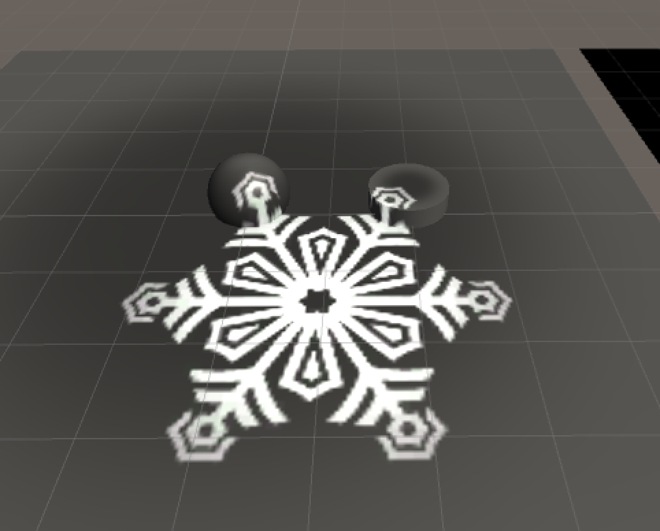

<span style="color: #ff6600;"><strong>原创博文，转载请声明</strong></span>

Demo:




代码实现：

``` c
Shader "Unlit/ProjectorShader"
{
Properties {
		_MainTex ("Base (RGB)", 2D) = "white" {}
        _Ambient ("Ambient", Range (0, 1)) = 0
        _Shininess ("Shininess", Range(0, 10)) = 8 
        _SpecColor ("Specular Material Color", Color) = (1,1,1,1)  

        _ProjTex ("Proj Tex", 2D) = "white" {}

    }
    SubShader {
    	
        Pass {
           Tags { "RenderType"="Opaque" "LightMode"="ForwardBase"}
               CGPROGRAM
               #pragma vertex vert
               #pragma fragment frag
               #include "UnityCG.cginc"
   				
               sampler2D _MainTex;
               float4    _LightColor0; //灯光颜色
               float	_Ambient;        //环境光系数
               float	_Shininess;		
               float4	_SpecColor;
               uniform float4x4 projectM;
	           sampler2D _ProjTex;
	           

			 struct VertexOutput 
               {
                   float4 pos:SV_POSITION;
                   float2 uv_MainTex:TEXCOORD0;
                   float3 normal:NORMAL;
                   float3 viewDir:TEXCOORD1;
                   float4 shadowUV : TEXCOORD2;
               };

               VertexOutput vert(appdata_base input)
               {
                   VertexOutput o;
                   float4x4 modelMatrix = _Object2World;
                   float4x4 modelMatrixInverse = _World2Object;

                   o.pos = mul(UNITY_MATRIX_MVP,input.vertex);
                   o.uv_MainTex = input.texcoord.xy;
                   o.normal = normalize(float3(mul(float4(input.normal, 0.0), modelMatrixInverse)));  
                   o.viewDir = normalize(float3(float4(_WorldSpaceCameraPos, 1.0)- mul(modelMatrix, input.vertex)));             

                   o.shadowUV = mul(mul(projectM, modelMatrix), input.vertex);
                   return o;
               }

               float4 frag(VertexOutput input):COLOR
               {
                  float3 N = normalize(input.normal);
                  float3 L = normalize(_WorldSpaceLightPos0);
                  float3 V = normalize(input.viewDir);
                  float3 R = 2*max(dot(N,L),0)*N - L;
                  R = normalize(R);

                  float3 Kd = tex2D(_MainTex,input.uv_MainTex).xyz;
               	 
               	  
               	  float3 diffuseColor = Kd * _LightColor0.rgb * max(0, dot(N, L));
               	   
               	  float3 ambientColor = Kd * _Ambient;

                  //float3 specularColor = _SpecColor*_LightColor0.rgb*pow(max(0.0, dot(reflect(-L, N),V)), _Shininess);
                  float3 specularColor = _SpecColor*_LightColor0.rgb*pow(max(dot(V,R),0), _Shininess);

				  float4 textureColor = tex2Dproj(_ProjTex, input.shadowUV);
				  
                 // return textureColor;
                  return float4((diffuseColor+ ambientColor + specularColor) + textureColor,1);
               }
            ENDCG
        }
    } 
    FallBack "Diffuse"
}
```

源码：

> Github:https://github.com/vanCopper/CGShader