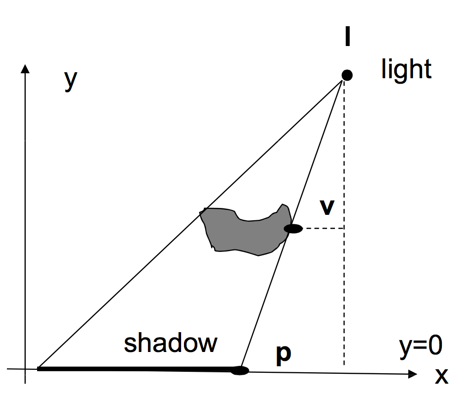

### 阴影

什么鬼本影，半影在此不在赘述。一般只有本影我们称为“Hard Shadows",同时包含本影及半影称为”Soft Shadows"。这里我们只讨论“Hard Shadows"。常见的算法有：

* Planar Shadows
* Shadow Maps
* Shadow Volume

### Planar Shadows(平面阴影)

字面意思就是投影在平面上的阴影。平面阴影的算法比较简单：



* 将灯光的位置(点光源)或灯光方向向量(平行光)转换至receive平面空间


* 将caster顶点转换至receive平面空间


* 根据相似三角形定理计算出P点


* 将P点转换至Clip Space

### 实现


旋转Plane后：


Shader部分：

``` c
Shader "Unlit/PlanarShadow" {
	Properties{
		_MainTex ("My Texture", 2D) = "white" {}
	}
	SubShader {
	pass {      
		Tags { "LightMode" = "ForwardBase" }
		SetTexture [_MainTex] {}
		//Lighting On
	}
	pass {   
		Tags { "LightMode" = "ForwardBase" } 
		Blend DstColor SrcColor
		zTest off
		CGPROGRAM
		#pragma vertex vert 
		#pragma fragment frag
		#include "UnityCG.cginc"
		float4x4 _World2Ground;
		float4x4 _Ground2World;
		float4 vert(float4 vertex: POSITION) : SV_POSITION
		{
			float3 litDir;
			litDir=WorldSpaceLightDir(vertex); 
			litDir=mul(_World2Ground,float4(litDir,0)).xyz;
			litDir=normalize(litDir);
			float4 vt;
			vt= mul(_Object2World, vertex);
			vt=mul(_World2Ground,vt);
			vt.x=vt.x-(vt.y/litDir.y)*litDir.x;
			vt.z=vt.z-(vt.y/litDir.y)*litDir.z;
			vt.y=0;
			//vt=mul(vt,_World2Ground);//back to world
			vt=mul(_Ground2World,vt);
			vt=mul(_World2Object,vt);
			return mul(UNITY_MATRIX_MVP, vt);
		}
		
 		float4 frag(void) : COLOR 
		{
			return float4(0.2,0.2,0.2,1);
		}
 		ENDCG 
		}
   }
}
```

注：**_Ground2World**和**_World2Ground**需要在Caster上绑定的脚本中将此矩阵传入Shader。

### 问题

* Planar Shadows会导致z-fight问题
  1. 通过设置顶点偏移可解决（Offset)
  2. 先渲染receivers,然后关闭z-test(本文做法）
* 阴影渲染会超出receivers范围
  1. 使用stencil buffer
* 阴影需要每帧渲染
  1. 将阴影渲染只材质

> Github:https://github.com/vanCopper/CGShader
> 
> 参考资料：
> 
> http://web.cse.ohio-state.edu/~whmin/courses/cse5542-2013-spring/19-shadow.pdf
> 
> 《ShaderLab开发实战详解》


