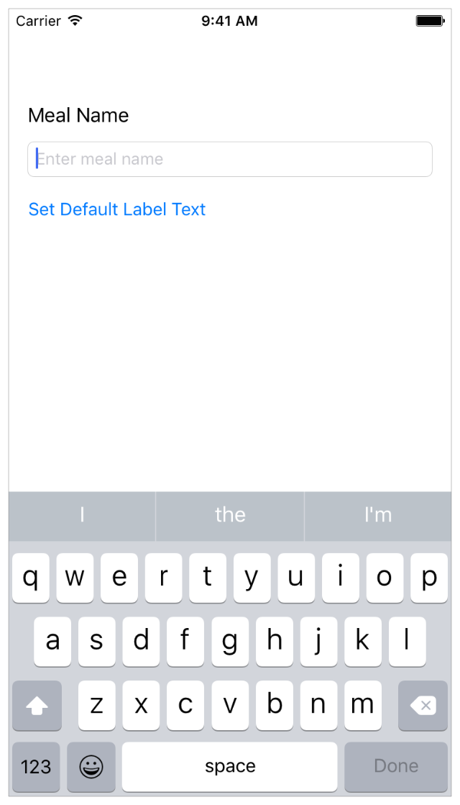

### Getting Started

非常赞的一篇入门教程，步骤详细，涉及到的知识点也很多。跟着教程做好这个简单的App，会有一种“我TM会写App啦”的错觉。所以这是一篇非常值得学习的教程。这里并非逐字翻译（我英文这么烂，根本不可能逐字翻译的出），只是把知识再梳理一遍。我相信梳理完了，我就真的会写App了。

### Jump Right In

- 开发工具： Xcode Version 7.2
- 编程语言：Swift
- 环境：OS X Yosemite 10.10.5

#### About the Lessons

我们即将创建一个牛逼的App：**FoodTracker**。你看下面的截图也能感受到此App非常高大上。通过此App你可以在吃饭前，给盘中的美食拍张照片，然后评个级，存到手机里。饿了，馋了的时候可以拿出来瞅几眼。如果看哪道菜觉得不好了，就动动手指删掉记录。

接下来的第一课内容是通过*playground*来熟悉一些基础知识。*playground*是运行在Xcode中的一种所见即所得的文件，你可以实时看到*playground*中**Swift**代码执行的结果。剩下的课程就是教你一步一步的完成这个App。

#### Get the Tools

首先你得有一台苹果电脑（当然黑苹果也行），系统版本最好是OS X 10.10以后的，因为你要用最新版本的Xcode。本课程所有例子均基于Xcode 7.0&iOS SDK 9.0。

**从App Store免费下载Xcode**

1. 在你的Mac中找到App Store应用程序（如果你找不到的话，可以关闭此页面，该打游戏打游戏，该撩妹的去撩妹）。
2. 在App Store应用程序的搜索框中输入*xcode*,然后按下回车键。*Xcode*将出现在搜索结果中。
3. 点击获取，然后点击安装。
4. 输入你的Apple ID和密码，*Xcode*下载完成后将出现在你的*/Applications*文件夹内。

### Learn the Essentials of Swift

这第一课将用*Swift playground*带你熟悉Swift的相关知识。

> Note
>
> 在Xcode中打开本课程的playground。
>
> [Download Playground](https://developer.apple.com/sample-code/swift/downloads/Start-Dev-iOS-Apps-01.zip)

####Learning Objectives

这节课结束后，你将get的知识：

* 理解**常量**与**变量**的区别
* 学习何时是使用隐式声明，何时使用显式声明
* 理解可选类型以及可选绑定的优势
* 区分可选类型和可选隐式可选类型
* 理解条件语句和循环语句
* 使用**switch**语句控制流程
* 使用**where**语句添加约束条件
* 理解**functions**,**methods**以及**initializers**
* 理解**classes**,**structures**以及**enumerations**
* 理解继承以及实现的语法
* 使用Xcode的快速帮助
* 导入并使用**UIKit**

####Basic Types

常量必须在你声明时就赋值，并且不会再改变。变量则在你声明后可改变其值。

使用*let*定义常量，使用*var*定义变量：



var myVariable = 42

myVariable = 50

let myConstant = 42



每个常量，变量在Swift中都是有类型的，但你不一定要显式的声明其类型。上面的例子中编译器会推断*myVariable*是 integer类型，这称作类型推断。一旦你声明了变量或者常量的数据类型，那么将无法修改其类型。

如果初始的值无法为类型推断提供足够的信息（或者没有初始值），那么可以在变量名后添加分号并写明类型。



let implicitInteger = 70

let implicitDouble = 70.0

let explicitDouble: Double = 70



> EXPERIMENT
>
> 在xCode中，按住Option键单击某个变量，可以查看该变量的类型等详细信息。

变量是可以执行类型转换的，如下将integer类型的width转换为String类型。



let label = "The width is"
let width = 94
let widthLabel = label + String(width)



> EXPERIMENT
>
> 可以尝试将*String*移除，看会得到什么错误。

这里有种简单的方式\\()来完成字符串转换。



let apples = 3

let oranges = 5

let appleSummary = "I have \\(apples) apples."

let fruitSummary = "I have \\(apples + oranges) pieces of fruit."



可以使用[optionals](https://developer.apple.com/library/ios/referencelibrary/GettingStarted/DevelopiOSAppsSwift/GlossaryDefinitions.html#//apple_ref/doc/uid/TP40015214-CH12-SW11)来定义一个可能会出现空值的变量。如果你定义的变量或者常量会出现*nil*值，那么定义是就需要在类型后面添加*?*来标识变量或者常量为*optionals*。



let optionalInt: Int? = 9



当你确定一个使用*?*定义的变量或常量的值不为*nil*时，可以使用*!*来对此变量或常量进行解析后取值。



let actualInt: Int = optionallInt!



*Optionals*在Swift中非常常见，而且非常有用。



var myString = "7"

var possibleInt = Int(myString)

print(possibleInt)



在上面的代码中，*possibleInt*的值为*7*，因为myString包含一个有效的可转换的*Int*值*7*。如果我们把*myString*的值换成“banana",那么就无法转换为有效的*Int*值，最终*possibleInt*的值为*nil*。



myString = "banana"

possibleInt = Int(myString)

print(possibleInt)



[array](https://developer.apple.com/library/ios/referencelibrary/GettingStarted/DevelopiOSAppsSwift/GlossaryDefinitions.html#//apple_ref/doc/uid/TP40015214-CH12-SW28)(数组还是元组？我见有网友翻译成元组）是一组有序的，包含了若干数据的集合。创建数组使用([]).可以通过索引来访问数组内的元素。数组的开始索引为*0*。



var ratingList = ["Poor", "Fine", "Good", "Excellent"]

ratingList[1] = "OK"

ratingList



可以使用initializer来创建一个空的制定类型的数组。稍后会有更多关于initializer的介绍。



//Create an empty array.

let emptyArray = *[String]()*



看到上面代码中的注释了吗？没错，*//*用于单行注释，/\*…*/代表多行注释。

#### Control Flow

流程控制这对程序员来说喜闻乐见了。Swift有两种流程控制，*if* 和*switch*。当流程语句中条件为*true*时则会执行。循环语句则有*for-in*和*while*。



let number = 23
if number < 10 {
    print("The number is small")
} else if number > 100 {
    print("The number is pretty big")
} else {
    print("The number is between 10 and 100")
}



**我决定略过语法部分了。。。都是些简单但又繁琐的东西。**

### Build a Basic UI

这节课就开始有意思了，首先你会接触到xCode，然后你需要熟悉各种组件。并且开始编写**FoodTracker**这个牛逼闪闪的App。

#### Learning Objectives

本节结束，可以了解到：

* 在Xcode中创建project
* 通过Xcode的模板创建包含确定方法的文件
* 在Xcode中打开切换文件
* 在Simulator中运行app
* 在storyboard中添加，移动，重新布局UI元素
* 在storyboard中利用Attributes inspector来修改UI元素的属性
* 在outline view中查看并整理UI元素
* 利用Preview assistant预览storyboard中的UI
* 利用Auto Layout来自动布局UI

#### Create a New Project

