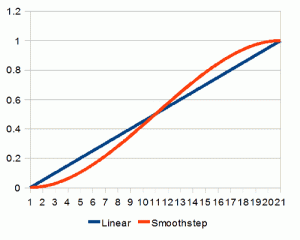
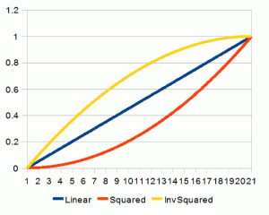
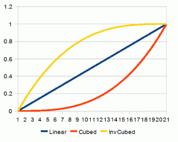
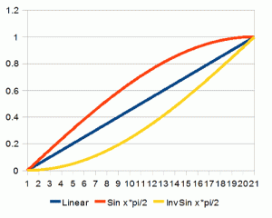
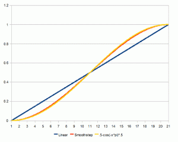
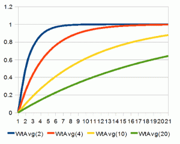
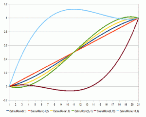

---
layout:	post
comments: true
tag: [Stage3D]
title: Interpolation 插值
---

#### 插值

在离散数据的基础上补差连续函数，使得这条连续曲线通过全部的离散数据点。插值是离散函数逼近的重要方法，利用它可通过函数在有限个点处的取值状况，估算出函数在其他点处的近似值。

插值比较常用在骨骼动画，物体移动，灯光渐隐，摄像机动画，图形渲染中。

#### Linear Interpolation(线性插值)

假如我们需要将物体X通过N步从A点移动到B点，可以使用下面的代码：

```c#
for(i = 0; i < N; i++)
{    
   X = ((A * i) + (B * (N - i))) / N;
}
```

或者：

```c#
for(i = 0; i < N; i++)
{
	v = i / N;
  	X = (A * v) + (B * (1 - v));
}
```

可以看到**v**的取值范围是0-1，插值中我们均可归一化至0-1范围内。

用N个离散数将0移动至1称为线性插值(lerp)。


<div id="flashcontent"></div><script type="text/javascript">var flashvars = {};var params = {wmode:'direct'};var attributes = {};swfobject.embedSWF('../swf/linear.swf','flashcontent','400','300','14.0',null,flashvars,params,attributes,null);</script><div id="flashcontent"></div><script type="text/javascript">var flashvars = {};var params = {wmode:'direct'};var attributes = {};swfobject.embedSWF('../swf/linear.swf','flashcontent','400','300','14.0',null,flashvars,params,attributes,null);</script>

是不是感觉这生硬的移动非常不和谐？如果将此移动用到游戏中人物行走，保证策划会过来和你撕五百回合。

#### Smoothstep

利用此函数平滑：

```c#
function smoothstep(x)
{
	return (x * x * (3 - 2 * x));  
}
```

不要问一个学渣这函数到底怎么解释，如果真想知道建议**Google**。那么上面的lerp就可以改写为：

```c#
for(i = 0; i < N; i++)
{
	v = i / N;
  	v = smoothstep(v);
  	X = (A * v) + (B * (1 - v));
}
```



<div id="flashcontent1"></div><script type="text/javascript">var flashvars = {};var params = {wmode:'direct'};var attributes = {};swfobject.embedSWF('../swf/smoothstep.swf','flashcontent1','400','300','14.0',null,flashvars,params,attributes,null);</script><div id="flashcontent1"></div><script type="text/javascript">var flashvars = {};var params = {wmode:'direct'};var attributes = {};swfobject.embedSWF('../swf/smoothstep.swf','flashcontent1','400','300','14.0',null,flashvars,params,attributes,null);</script>

自然多了，有没有？当快接近目标时移动会慢下来。

#### Higher Powers(高次幂)

如果运动时想有缓慢加速效果，简单利用N次幂就可以：

```c#
for(i = 0; i < N; i++)
{
  v = i / N;
  v = v * v;
  X = (A * v) + (B * (1 - v));	
}
```

如果运动时想有缓慢减速，上面的公式反相即可：

```c#
for(i = 0; i < N; i++)
{
  v = i / N;
  v = 1 - (1 - v) * (1 - v);
  X = (A * v) + (B * (1 - v));
}
```



<div id="flashcontent2"></div><script type="text/javascript">var flashvars = {};var params = {wmode:'direct'};var attributes = {};swfobject.embedSWF('../swf/squared.swf','flashcontent2','400','300','14.0',null,flashvars,params,attributes,null);</script><div id="flashcontent2"></div><script type="text/javascript">var flashvars = {};var params = {wmode:'direct'};var attributes = {};swfobject.embedSWF('../swf/squared.swf','flashcontent2','400','300','14.0',null,flashvars,params,attributes,null);</script>

如果把次幂调整到三次方，曲线如图：



<div id="flashcontent3"></div><script type="text/javascript">var flashvars = {};var params = {wmode:'direct'};var attributes = {};swfobject.embedSWF('../swf/cube.swf','flashcontent3','400','300','14.0',null,flashvars,params,attributes,null);</script><div id="flashcontent3"></div><script type="text/javascript">var flashvars = {};var params = {wmode:'direct'};var attributes = {};swfobject.embedSWF('../swf/cube.swf','flashcontent3','400','300','14.0',null,flashvars,params,attributes,null);</script>

同样的，我们可以对已经*Smoothstep* 再次应用**Smoothstep**：


<div id="flashcontent4"></div><script type="text/javascript">var flashvars = {};var params = {wmode:'direct'};var attributes = {};swfobject.embedSWF('../swf/smoothstepX.swf','flashcontent4','400','300','14.0',null,flashvars,params,attributes,null);</script><div id="flashcontent4"></div><script type="text/javascript">var flashvars = {};var params = {wmode:'direct'};var attributes = {};swfobject.embedSWF('../swf/smoothstepX.swf','flashcontent4','400','300','14.0',null,flashvars,params,attributes,null);</script>

#### 正弦

正弦插值和次幂函数近似：

```c#
for(i = 0; i < N; i++)
{
  v = i / N;
  v = sin(v * Pi / 2);
  X = (A * v) + (B * ( 1 - v));
} 
```

反向后也同次幂函数近似：



<div id="flashcontent5"></div><script type="text/javascript">var flashvars = {};var params = {wmode:'direct'};var attributes = {};swfobject.embedSWF('../swf/sin.swf','flashcontent5','400','300','14.0',null,flashvars,params,attributes,null);</script><div id="flashcontent5"></div><script type="text/javascript">var flashvars = {};var params = {wmode:'direct'};var attributes = {};swfobject.embedSWF('../swf/sin.swf','flashcontent5','400','300','14.0',null,flashvars,params,attributes,null);</script>

如果使用整条曲线，那么将更接近smoothstep。但性能会打折。

```c#
for (i = 0; i < N; i++)
{
    v = i / N;
    v = 0.5 - cos(-v * Pi) * 0.5;
    X = (A * v) + (B * (1 - v));
}
```



<div id="flashcontent6"></div><script type="text/javascript">var flashvars = {};var params = {wmode:'direct'};var attributes = {};swfobject.embedSWF('../swf/fsin.swf','flashcontent6','400','300','14.0',null,flashvars,params,attributes,null);</script><div id="flashcontent6"></div><script type="text/javascript">var flashvars = {};var params = {wmode:'direct'};var attributes = {};swfobject.embedSWF('../swf/fsin.swf','flashcontent6','400','300','14.0',null,flashvars,params,attributes,null);</script>

#### Weighted Average(加权平均数)

非常方便的算法，特别是当你无法预知未来目标行为时（比如当摄像机跟随目标角色，而角色的位置是一直在改变的）。

```
v = (( v * (N-1)) + w )/N;
```

其中v代表当前值，w代表目标点，N是缓动因子，N值越大，v接近w就越慢：



<div id="flashcontent7"></div><script type="text/javascript">var flashvars = {};var params = {wmode:'direct'};var attributes = {};swfobject.embedSWF('../swf/wtavg.swf','flashcontent7','400','300','14.0',null,flashvars,params,attributes,null);</script><div id="flashcontent7"></div><script type="text/javascript">var flashvars = {};var params = {wmode:'direct'};var attributes = {};swfobject.embedSWF('../swf/wtavg.swf','flashcontent7','400','300','14.0',null,flashvars,params,attributes,null);</script>

#### Splines(样条)

样条函数支持你控制更多的插值点，也就是说你可以让运动轨迹更多样化。

```c#
float catmullrom(float t, float p0, float p1, float p2, float p3)
{
    return 0.5f * (
        (2 * p1) +
        (-p0 + p2) * t +
        (2 * p0 - 5 * p1 + 4 * p2 - p3) * t * t +
        (-p0 + 3 * p1 - 3 * p2 + p3) * t * t * t
    );
}
 
for (i = 0; i < N; i++)
{
    v = i / N;
    v = catmullrom(v, Q, 0, 1, T);
    X = (A * v) + (B * (1 - v));
}

```



<div id="flashcontent8"></div><script type="text/javascript">var flashvars = {};var params = {wmode:'direct'};var attributes = {};swfobject.embedSWF('../swf/catmullrom.swf','flashcontent8','400','300','14.0',null,flashvars,params,attributes,null);</script><div id="flashcontent8"></div><script type="text/javascript">var flashvars = {};var params = {wmode:'direct'};var attributes = {};swfobject.embedSWF('../swf/catmullrom.swf','flashcontent8','400','300','14.0',null,flashvars,params,attributes,null);</script>

原文：http://sol.gfxile.net/interpolation/

更多内容：

- [Quadratic/Cubic versus Linear Interpolations by Alain Brobecker](http://abrobecker.free.fr/text/quad.htm)
- [Interpolation Methods by Paul Bourke](http://paulbourke.net/miscellaneous/interpolation//)
- [Tweener transition types cheat sheet](http://hosted.zeh.com.br/tweener/docs/en-us/misc/transitions.html)
- [Hermite Curve Interpolation by Nils Pipenbrinck](http://www.cubic.org/docs/hermite.htm)
- [Tweening by Robert Penner (PDF link)](http://www.robertpenner.com/easing/penner_chapter7_tweening.pdf)
- [Easing Equations by Robert Penner](http://www.gizma.com/easing/)

