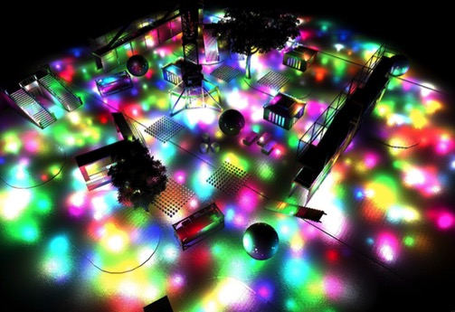
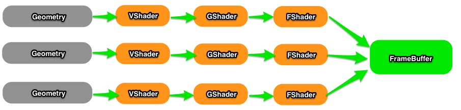
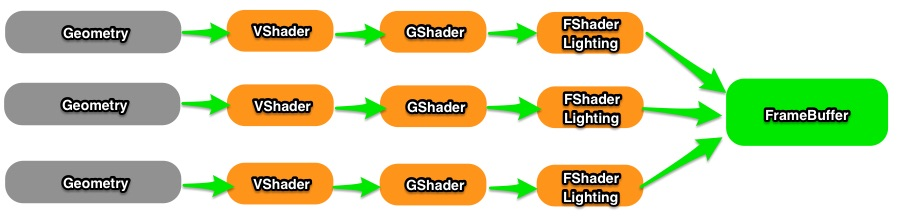
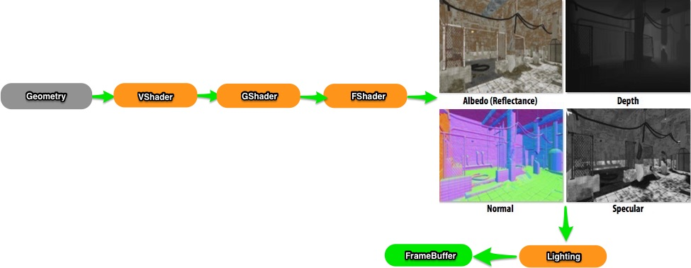

在游戏开发中，应该能比较经常的接触到这两个词汇**Forward Rendering**和**Deferred Rendering**。早一点的引擎由于硬件的限制(MRT)多数架构是**Forward Rendering**,比如Flash3D，FlashPlayer 16.0之前的版本是不支持MRT的，所以也只能是 **Forward Rendering**。当然这是插件本身不支持，并不是硬件限制。对于多光源渲染**Deferred Rendering**有天生优势，有些引擎完全是**Deferred Rendering**,有些则是混合存在。那么两者之间到底有什么区别，应该如何选择两项技术？

利用**Deferred Rendering**渲染1000盏灯光:

#### 渲染管线

我们早已步入可编程渲染管线时代，所谓可编程渲染管线是指可以上传代码至显卡，并在特定阶段执行特定的代码片段，可以改变显卡的渲染状态等。

VertexShader,GeometryShader,FragmentShader共同决定了显卡最终如何渲染我们的物件。

#### Forward Rendering

Forward Rendering 是一般引擎比较长采用的渲染方式。首先将Geometry上传至显卡，然后执行VertexShader->GeometryShader->FragmentShader,最后将结果输出至FrameBuffer。我们来考虑另外一种情况：场景中有多个光源需要渲染，那么流程就会变成下图这样：

可以看到，单个物件渲染与灯光数量是正相关的，假设场景中有100个Geometry，每个Geometry有1000个顶点，那么按照最少计算大概有100000个点是需要在Fragment Shading阶段进行光照计算。所以复杂度就会是O(num_geometry_fragments * num_lights)。每一个光源都要对当前的Geometry执行Fragment Shading，不管当前像素最终到FrameBuffer是否会被丢弃。这就导致Forward Rendering在灯光渲染上效率比较低。

#### Deferred Rendering

Deferred Rendering不只是用在Lighting上，但Deferred Lighting是最常用的做法。Fragment Shader利用MRT将不同的信息渲染至不同的G-Buffer:Albedo, Depth, Normal, Specular等。然后在Lighting阶段利用这些信息来进行光照运算，可以看到这种方式的光照运算，复杂度只跟光源数有关系。并且我们此时执行Lighting，只对最终显示的像素进行了计算，从而大大提高了效率。

##### 一些问题：

* Deferred Rendering需要显卡支持MRT，一些老的显卡并不支持此特性。
* MRT对显存的带宽要求较高，比如4个1024*1024的G-Buffer会让一些显卡直接奔溃
* 无法实现半透明，除非你先利用Forward Rendering处理一次
* 无法反锯齿

#### 最后

Deferred Rendering（Shading）原理不难，但真正应用中还是蛮多问题要解决的。后面会结合例子来深入理解下。