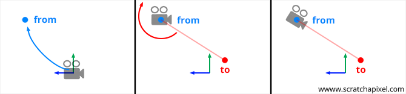

<span style="color: #ff6600;"><strong>原创博文，转载请声明</strong></span>

##### 移动镜头

在3D场景中移动镜头是最基本操作，如果只是通过一个4x4的矩阵来设置位置和旋转的方式来操作镜头是非常麻烦的。先把镜头移动到能观察到被观察者的位置，然后再进行角度调整才能最终获得想要的观察效果。

有一种方便的技术可以轻松的控制镜头，我们通常称LookAt。只需设置镜头位置以及将要观察的目标位置即可。下图既是整个LookAt过程。



form既是镜头位置，to既是目标点(被观察者)。

##### 实现

我们使用4x4的行矩阵来实现。坐标系使用右手坐标系。先来看即将得到的矩阵。


$$
\begin{matrix}
\color{red}{Right_x}&\color{red}{Right_y}&\color{red}{Right_z}&0\\
\color{green}{Up_x}&\color{green}{Up_y}&\color{green}{Up_z}&0\\
\color{blue}{Forward_x}&\color{blue}{Forward_y}&\color{blue}{Forward_z}&0\\
T_x&T_y&T_z&1
\end{matrix}
$$


在笛卡尔坐标系中我们使用x,y,z来表示轴，这里我们使用**right**(x-轴)，**up**(y-轴)，**forward**(z-轴)。这样更方便理解。镜头的坐标空间如下图:


我们分四步来分别获得**Right**,**Up**,**Forward**,**T**。

**Forward axis**

从上面的两张图里可以看出，**Forward**向量就是点form和点to定义的向量。所以我们只需要将to至form的向量标准化既可得到**Forward**。这里注意是to-form而不是form-to，两者方向是反的。

```c#
Vec3f forward = Normalize(from - to);
```

**Right vector**

计算right需要一个upDir。upDir一般是世界空间的up方向(0,1,0),我们假设镜头只能在两个轴上旋转，所以用upDir计算出来的right必定是垂直于upDir并平行于世界空间的z方向。因为right与upDir, forward垂直，既有：

```c++
Vec3f upDir(0, 1, 0)
Vec3f right = crossProduct(Normalize(upDir), forward);
```

**up vector**

我们已经有了forward, right那么up就更简单了，直接叉乘即可得到up：

```c++
Vec3f up = crossProduct(forward, right);
```

**组装一个 4x4的matrix**

* 第一行 right所表示的坐标轴
* 第二行 up所表示的坐标轴
* 第三行 forward所表示的坐标轴
* 第四行 from所设置的镜头位置

```c++
Matrix44f lookAt(const Vec3f& from, const Vec3f& to, const Vec3f& upDir = Vec3f(0, 1, 0)) 
{ 
    Vec3f forward = normalize(from - to); 
    Vec3f right = crossProduct(normalize(upDir), forward); 
    Vec3f up = crossProduct(forward, right); 
 
    Matrix44f camToWorld; 
 
    camToWorld[0][0] = right.x; 
    camToWorld[0][1] = right.y; 
    camToWorld[0][2] = right.z; 
    camToWorld[1][0] = up.x; 
    camToWorld[1][1] = up.y; 
    camToWorld[1][2] = up.z; 
    camToWorld[2][0] = forward.x; 
    camToWorld[2][1] = forward.y; 
    camToWorld[2][2] = forward.z; 
 
    camToWorld[3][0] = from.x; 
    camToWorld[3][1] = from.y; 
    camToWorld[3][2] = from.z; 
 
    return camToWorld; 
} 
```

