<span style="color: #ff6600;"><strong>原创博文，转载请声明</strong></span>

## EditorWindow

Game窗口，Scene窗口，Animator窗口，Inspector窗口这些都是EditorWindow。整个unity都是由这些窗口组成的。

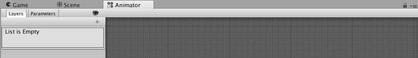

## 创建一个 EditorWindow

前面的例子我们都是在一个EditorWindow中来进行演示的。这里我们详细的看下，如何创建并使用**EditorWindow**。

1. 创建Example类，并继承EditorWindow

```c#
using UnityEngine;
using UnityEditor;

public class Example : EditorWindow
{
	
}
```

2. 在window菜单来绑定一个子菜单

```c#
using UnityEngine;
using UnityEditor;

public class Example : EditorWindow
{
	[MenuItem("window/Example")]
	static void Open()
	{
		
	}
}
```

3. 创建窗口，并显示

```c#
using UnityEngine;
using UnityEditor;

public class Example : EditorWindow
{
	[MenuItem("Window/Example")]
	static void Open()
	{
		var exampleWindow = CreateInstance<Example> ();
		exampleWindow.Show ();
	}
}
```

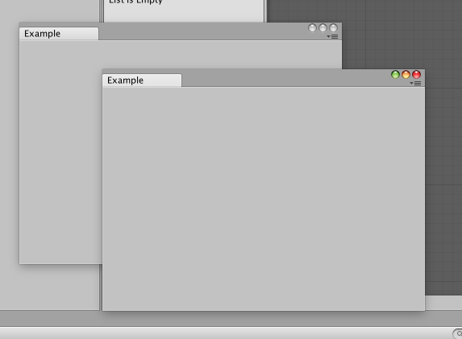

如图，通过菜单栏创建了两个**Example**窗口。

## EditorWindow.GetWindow

如果我们想只弹一个窗口，要怎么处理呢？使用单例。

```c#
using UnityEngine;
using UnityEditor;

public class Example : EditorWindow
{
	static Example exampleWindow;

	[MenuItem("Window/Example")]
	static void Open()
	{
		if (exampleWindow == null) {
			exampleWindow = CreateInstance<Example> ();
		}
		exampleWindow.Show ();
	}
}
```

还可以通过**GetWindow**方法来创建窗口并显示。**GetWindow**会使用第一次创建的该类型的窗口，如果该类型的窗口未创建过则直接创建一个并显示出来。

```c#
using UnityEngine;
using UnityEditor;

public class Example : EditorWindow
{

	[MenuItem("Window/Example")]
	static void Open()
	{
		GetWindow<Example> ();	
	}
}
```

还可以通过**GetWindow**来指定创建窗口显示的位置，比如和Scene面板在同一容器。

```c#
using UnityEngine;
using UnityEditor;

public class Example : EditorWindow
{

	[MenuItem("Window/Example")]
	static void Open()
	{
		GetWindow<Example> (typeof(SceneView));	
	}
}
```

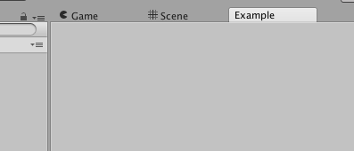

## 使用不同的方式来显示EditorWindow

### Show

直接调用实例的show方法，就是默认显示窗口。前面的例子里有涉及。

### ShowUtility

使用ShowUtility方法，会弹出一个独立的窗口来显示当前的**EditorWindow**。

```c#
using UnityEngine;
using UnityEditor;

public class Example : EditorWindow
{
	static Example exampleWindow;

	[MenuItem("Window/Example")]
	static void Open()
	{
		if (exampleWindow == null) 
		{
			exampleWindow = CreateInstance<Example> ();
		}

		exampleWindow.ShowUtility ();
	}
}
```

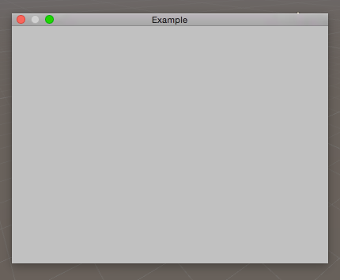

### ShowPopup

使用**ShowPopup**的话需要自己实现关闭按钮之类，或者直接快捷键关闭。

```c#
using UnityEngine;
using UnityEditor;

public class Example : EditorWindow
{
	static Example exampleWindow;

	[MenuItem("Window/Example")]
	static void Open()
	{
		if (exampleWindow == null) 
		{
			exampleWindow = CreateInstance<Example> ();
		}

//		exampleWindow.ShowUtility ();
		exampleWindow.ShowPopup();
	}

	void OnGUI()
	{
		if (Event.current.keyCode == KeyCode.Escape) {
			exampleWindow.Close ();
		}
	}
}
```

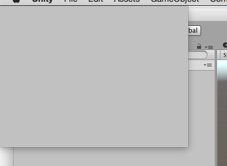

## PopupWindow

除了使用**ShowPopup()**来创建弹出窗口，还可以使用PopupWindow来实现。

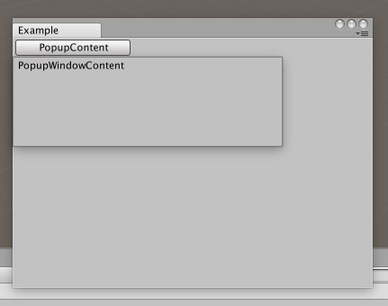

```c#
using UnityEngine;
using UnityEditor;

public class Example : EditorWindow
{

	[MenuItem("Window/Example")]
	static void Open()
	{
		GetWindow<Example> ();
	}

	ExamplePupupContent popupContent = new ExamplePupupContent();

	void OnGUI()
	{
		if (GUILayout.Button ("PopupContent", GUILayout.Width (128))) {
			var activatorRect = GUILayoutUtility.GetLastRect ();
			activatorRect.y = 20;
			PopupWindow.Show (activatorRect, popupContent);
		}
	}
}

public class ExamplePupupContent : PopupWindowContent
{
	public override void OnGUI (Rect rect)
	{
		EditorGUILayout.LabelField ("PopupWindowContent");
	}

	public override void OnOpen()
	{
		Debug.Log ("OnOpen>>>>>>");
	}

	public override void OnClose()
	{
		Debug.Log ("OnClose>>>>>>>");
	}

	public override Vector2 GetWindowSize()
	{
		return new Vector2 (300, 100);
	}
		
}
```

## ShowAuxWindow


**ShowAuxWindow**创建的窗口与**ShowUtility**创建的窗口一样，都不能作为tab window处理，区别是**ShowAuxWindow**创建的窗口，失去焦点时会自动关闭。

## ShowAsDropDown

**ShowAsDropDown**创建的弹出窗会自动对齐屏幕边缘。

```c#
using UnityEngine;
using UnityEditor;

public class Example : EditorWindow
{
	static Example exampleWindow;

	[MenuItem("Window/Example")]
	static void Open()
	{
//		GetWindow<Example> ();
		if (exampleWindow == null) 
		{
			exampleWindow = CreateInstance<Example> ();
		}

//		exampleWindow.ShowUtility ();
//		exampleWindow.ShowPopup();
//		exampleWindow.ShowAuxWindow();

		var buttonRect = new Rect (-30, 100, 300, 100);
		var windowSize = new Vector2 (300, 100);
		exampleWindow.ShowAsDropDown (buttonRect, windowSize);
	}
}
```

## ScriptableWizard

搞了半天了，终于出现一个有意思点的了。**ScriptableWizard**这玩意叫什么比较准确呢？创建向导？如果有创建某种资源时需要先设置一些参数的话，可以用这个组件来实现。

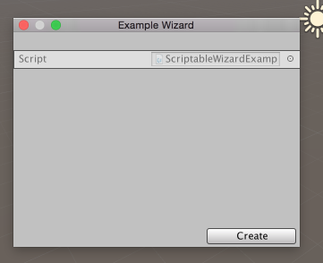

## OnWizardCreate

面板有个默认的Create按钮，按下后会执行**OnWizardCreate**方法。下面的例子我们在场景中创建了一个GameObject。


```c#
using UnityEngine;
using UnityEditor;

public class ScriptableWizardExample : ScriptableWizard
{
	[MenuItem("Window/ScriptableWizardExample")]
	static void Open()
	{
		DisplayWizard<ScriptableWizardExample> ("Example Wizard");
	}

	public string gameObjectName;
	void OnWizardCreate()
	{
		new GameObject (gameObjectName);
	}
}
```

## OnWizardOtherButton

如果想添加另外的按钮就需要在DisplayWizard添加，并在OnWizardOtherButton中编写对应的脚本。

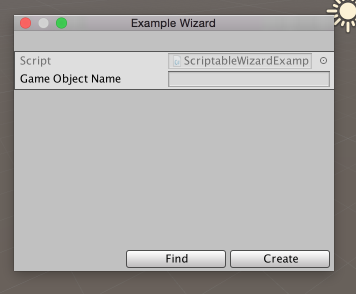

```c#
using UnityEngine;
using UnityEditor;

public class ScriptableWizardExample : ScriptableWizard
{
	[MenuItem("Window/ScriptableWizardExample")]
	static void Open()
	{
		DisplayWizard<ScriptableWizardExample> ("Example Wizard", "Create", "Find");
	}

	public string gameObjectName;
	void OnWizardCreate()
	{
		new GameObject (gameObjectName);
	}

	void OnWizardOtherButton()
	{
		var gameObject = GameObject.Find (gameObjectName);

		if (gameObject == null) {
			Debug.Log ("not found!");
		}
	}
}
```

## OnWizardUpdate

面板中任何属性的变化都会执行该方法。

## DrawWizardGUI

如果想自定义面板，复写**DrawWizardGUI**方法，并实现自己的布局即可。

```c#
using UnityEditor;
using UnityEngine;

public class Example : ScriptableWizard
{
    public string gameObjectName;

    [MenuItem ("Window/Example")]
    static void Open ()
    {
        DisplayWizard<Example> ("Example Wizard");
    }

    protected override bool DrawWizardGUI ()
    {
        EditorGUILayout.LabelField ("Label");
        return true;
    }
}
```

需要注意的是，ScriptableWizard是EditorWindow的子类，如果在脚本中定义了**OnGUI**方法，你们面板就会变成一个正常的EditorWindow,而不再包含Create按钮等。

## PreferenceItem

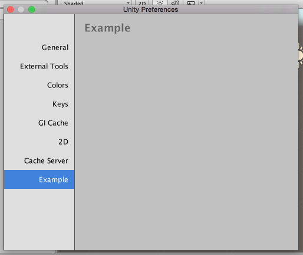

```c#
using UnityEditor;

public class PreExample
{
	[PreferenceItem("Example")]
	static void OnPreferenceGUI()
	{
	}
}
```

## 实现IHasCustomMenu 

实现**IHasCustomMenu**接口，定制在tab右键和点击≡时的弹出菜单。

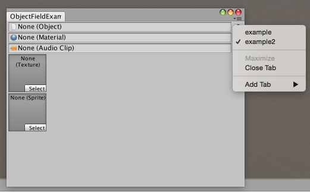

```c#
using UnityEngine;
using UnityEditor;

[ExecuteInEditMode]
public class ObjectFieldExample : EditorWindow, IHasCustomMenu
{

	public void AddItemsToMenu(GenericMenu menu)
	{
		menu.AddItem (new GUIContent ("example"), false, () => {
		});
		menu.AddItem (new GUIContent ("example2"), true, () => {
		});
	}

	[MenuItem("Window/ObjectFieldExample")]
	static void Open()
	{
		GetWindow<ObjectFieldExample> ();
	}

	void OnGUI()
	{
		EditorGUILayout.ObjectField (null, typeof(Object), false);
		EditorGUILayout.ObjectField (null, typeof(Material), false);
		EditorGUILayout.ObjectField (null, typeof(AudioClip), false);

		var options = new []{GUILayout.Width(64), GUILayout.Height(64) };
		EditorGUILayout.ObjectField (null, typeof(Texture), false, options);
		EditorGUILayout.ObjectField (null, typeof(Sprite), false, options);
	}

}
```

## 固定大小的EditorWindow

设置**maxSize**和**minSize**可将EditorWindow设置为固定大小。

```c#
using UnityEditor;
using UnityEngine;

public class Example : EditorWindow
{
    [MenuItem("Window/Example")]
    static void Open ()
    {
        var window = GetWindow<Example> ();
        window.maxSize = window.minSize = new Vector2 (300, 300);
    }
}
```

## 自定义Window的Icon

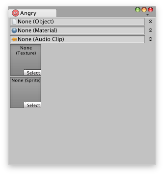

```c#
using UnityEngine;
using UnityEditor;

[ExecuteInEditMode]
public class ObjectFieldExample : EditorWindow, IHasCustomMenu
{

	public void AddItemsToMenu(GenericMenu menu)
	{
		menu.AddItem (new GUIContent ("example"), false, () => {
		});
		menu.AddItem (new GUIContent ("example2"), true, () => {
		});
	}

	[MenuItem("Window/ObjectFieldExample")]
	static void Open()
	{
		var window = GetWindow<ObjectFieldExample> ();
		window.maxSize = window.minSize = new Vector2 (300, 300);

		var icon = AssetDatabase.LoadAssetAtPath<Texture> ("Assets/EditorGuide/Editor/images/Angry-Face.png");
		window.titleContent = new GUIContent ("Angry", icon);
	}

	void OnGUI()
	{
		EditorGUILayout.ObjectField (null, typeof(Object), false);
		EditorGUILayout.ObjectField (null, typeof(Material), false);
		EditorGUILayout.ObjectField (null, typeof(AudioClip), false);

		var options = new []{GUILayout.Width(64), GUILayout.Height(64) };
		EditorGUILayout.ObjectField (null, typeof(Texture), false, options);
		EditorGUILayout.ObjectField (null, typeof(Sprite), false, options);
	}

}
```