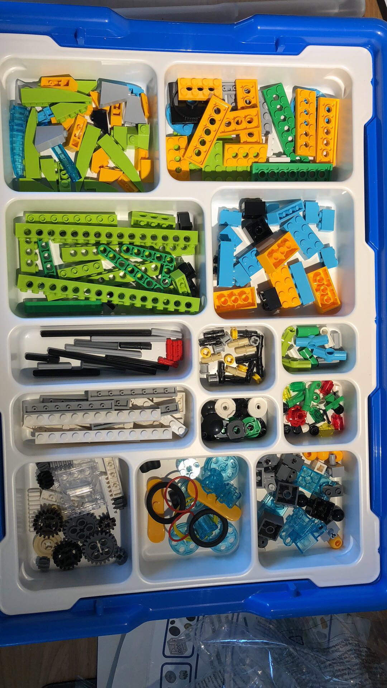
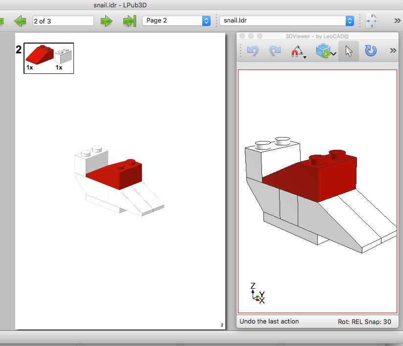
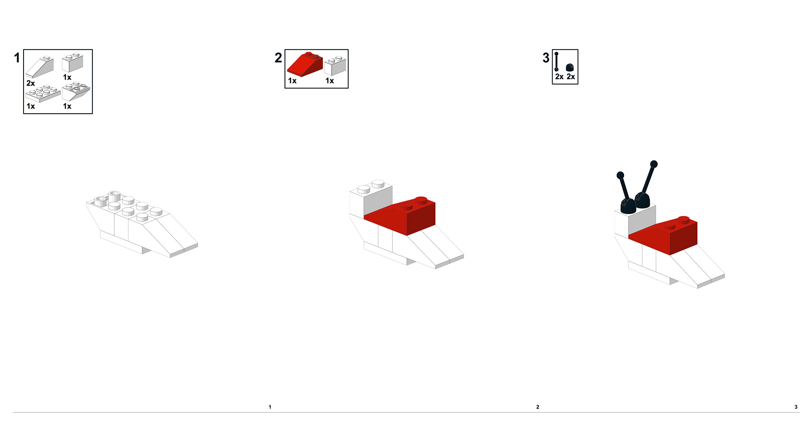

最近给娃买了 **LEGO WeDO 2.0**，一开始娃对照着配套的软件玩的不亦乐乎。教程里的几个模型都玩了一遍以后，又在模型库里找到了几个模型尝试玩，然后就出现了不愉快。因为这些模型都只有成品图，但没有拼装步骤的说明，这对小朋友来说有点困难，尝试几次后没成功，挫败感太强，小朋友就不乐意玩了。所以“厉害的”爸爸决定自己做步骤说明给他用。

找了蛮多软件，试用后决定使用 **Stud.io** 和 **LPub3D** 搭配来制作说明。

> Stud.io > https://studio.bricklink.com/v2/build/studio.page
>
> LPub3D > https://sites.google.com/site/workingwithlpub/lpub3d 

使用**Stud.io**来完成模型的拼装，并且整理好拼装步骤，导出格式使用**LDraw**的。因为LPub3D要使用**LDraw**的格式来生成步骤。

**Stud.io**要比乐高自己提供的**LDD**要好用一些，而且**LDD**已经不在更新，官网给的下载链接都无法下载了。导出**LDraw**文件后，就可以使用**LPub3D**来生成说明了。

需要注意的是，**LPub3D**有一些配置需要手动设置，跟着说明配就好了。

导出PDF或者图片就可以了。

