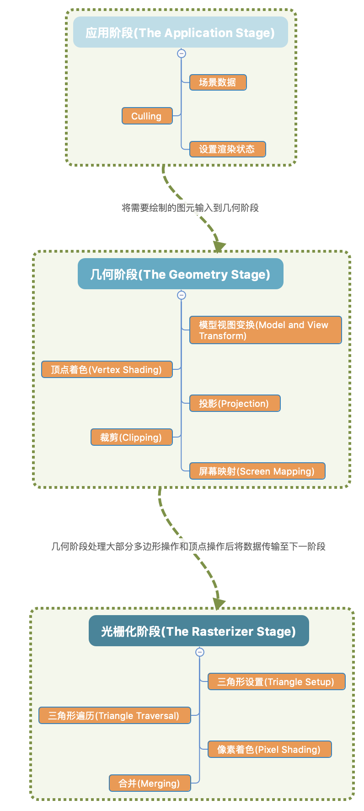
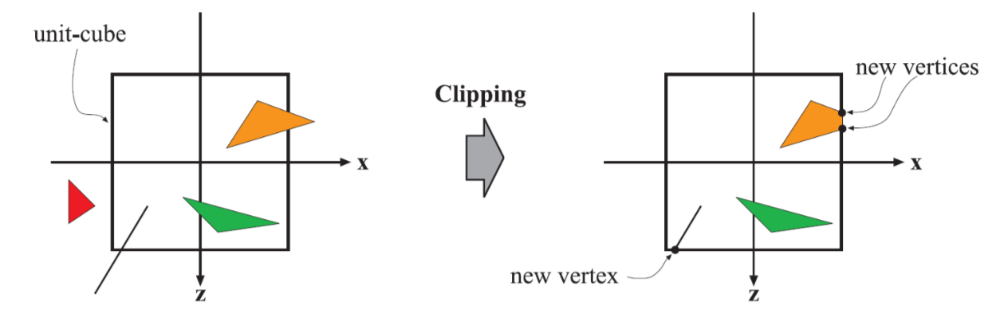
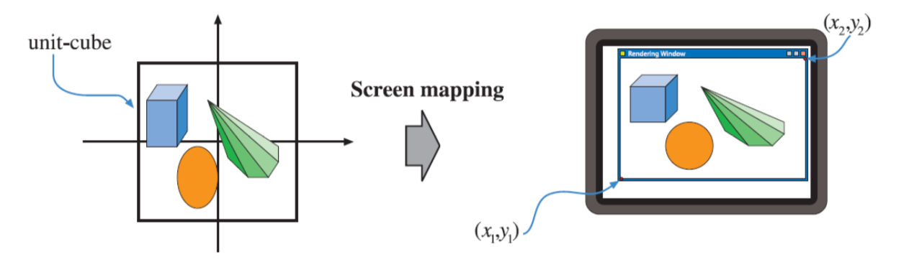
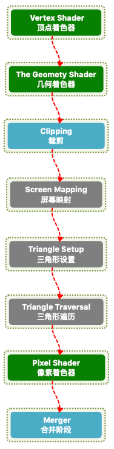

### 图形渲染管线&GPU渲染管线

先把这两个概念理解清楚。

#### 图形渲染管线

《Render-Time Rendering Third Edition》一书中将计算机图形渲染的流程划分为3个阶段：**应用阶段（Application Stage）、几何阶段（Geometry Stage）、光栅化阶段（Raterizer Stage）**组成了图形渲染管线。

* 应用阶段（Application Stage）：准备好要渲染的场景数据，如相机，模型，灯光等信息，为提高性能对不可见的物体进行剔除（Culling），最后设置好每个即将渲染的模型所对应的渲染状态。渲染状态包括但不限于材质，纹理，Shader等。

* 几何阶段 Geometry Stage：该阶段运行在GPU上

  1. 模型和视图变换 Model and View Transform 可参照之前的文章：

     [Stage3D-3D世界]: http://tgerm.org/stage3d-3d_world/

  2. 顶点着色 Vertex Shading

     顶点着色阶段的目的即确认顶点处材质的光照效果。像顶点位置，法线等数据都会通过该阶段发送到光栅化阶段。

  3. 投影 Projectiong 

     该阶段就是将模型从三维空间投射到二维空间的过程。

     常见的投影方式有两种：正交投影，透视投影

  4. 裁剪 Clipping

     

     * 当图元完全处于视体内部，直接进入下个阶段
     * 当图元完全处于视体外部，直接丢弃
     * 当图元部分处于视体内部，对图元进行裁剪并产生新的图元

     裁剪阶段即对部分处于视体内部的图元进行裁剪操作。

  5. 屏幕映射 Screen Mapping

     

     进入该阶段顶点坐标仍然是三维的，但x,y在经过上面的投影阶段已经是二维的状态。此时x,y与z坐标组成了窗口坐标系。

     假设在一个窗口里对场景进行绘制，窗口最小坐标(x1, y1)，最大坐标(x2, y2)。屏幕映射首先进行平移，随后进行缩放，在映射过程中z坐标不受影响。新的x和y坐标称为屏幕坐标系，并和z坐标进入光栅化阶段。

     屏幕映射阶段即是将得到的坐标映射到对应的屏幕坐标系上。

* 光栅化阶段（Rasterizer Stage）：该阶段也运行在GPU上

  1.  三角形设置 Triangle Setup

     计算三角形表面的差异和三角形表面的其他相关数据

  2. 三角形遍历 Triangle Traversal

     扫描三角形覆盖的像素区域，并将重合的像素生产片段（fragment）。

  3. 像素着色 Pixel Shading

     逐像素处理着色运算

  4. 合并 Merging

     图形系统一般都是使用双缓冲机制，也就是最终生产的图像会输出到后台缓冲区(backbuffer)，然后交换至屏幕。合并阶段就是将前面所有片段操作（如：颜色缓冲区，alpha通道，模板缓冲区，深度测试结果等）所产生的片段颜色合并至后台缓冲区(backbuffer)。

#### GPU渲染管线

* 绿色阶段完全可以编程
* 蓝色阶段可配置，不可编程
* 灰色阶段完全固定，不可配置，不可编程

搞清楚了管线概念，下一篇将理解Unity中的以下概念：

1. Unity中的渲染路径
   * Deferred Rendering Path
   * Forward Rendering Path
2. Unity中的可编程管线
   * High Definition Render Pipeline
   * LightWeight Render Pipeline
   * 自定义渲染管线

参考：

>1. 《Unity Shader 入门精要》
>2. [Real-Time-Rendering-3rd-CN-Summary-Ebook](https://github.com/QianMo/Real-Time-Rendering-3rd-CN-Summary-Ebook)

