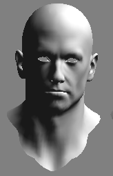
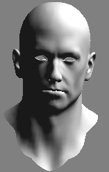
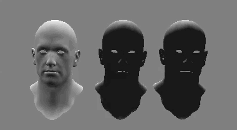

#### 漫反射与Lambert模型

##### 漫反射

粗糙的物体表面向各个方向等强度的反射光，这种现象称为光的漫反射（diffuse reflectiong)。产生光的漫反射现象的物体表面称为漫反射体，也称为朗伯（Lambert）反射体。

##### Lambert模型

当方向光照射到朗伯放射体上时，漫反射光的光强与入射光的方向和入射表面的法线夹角的余弦成正比，这称为Lambert定律，并由此构造出Lambert漫反射模型：
$$
c_{diffuse} = (c_{light}\ast m_{diffuse})\ast max(0, n \cdot l)
$$
$c_{light}$ : 光源颜色

$m_{diffuse}$ : 漫反射系数（颜色）

$n$ : 法向量

$l$ : 入射光向量

$max$ : 避免背面入射的光照亮表面

#### 实现

##### 高洛德着色（Gouraud Shading）



Gouraud Shading 即逐顶点光照，在顶点着色器中计算光照，然后在渲染图元时进行线性插值，最终得到光照结果。

Unity自定义管线中，如果shader中用到了**Lighting.cginc**，**UnityCG.cginc**中定义的变量，需要在运行时重新对其赋值，对**SRPTest_01.cs**进行修改：

```c#
// 定义需要用到变量
var _WorldSpaceLightPos0 =  Shader.PropertyToID("_WorldSpaceLightPos0");
var _LightColor0 = Shader.PropertyToID("_LightColor0");
// 因为只用到了全局的方向光，我们这里暂时只处理全局方向光
var lights = cullResults.visibleLights;
foreach(var light in lights){
    if(light.lightType != LightType.Directional) continue;

    Vector4 lightPos = light.localToWorld.GetColumn(2);
    Vector4 lightDir = new Vector4(-lightPos.x, -lightPos.y, -lightPos.z, 0);

    Color lightColor = light.finalColor;

    _lightCb.SetGlobalVector(_WorldSpaceLightPos0, lightDir);
    _lightCb.SetGlobalVector(_LightColor0, lightColor);
    _lightCb.SetGlobalVector("ambientLightSky", RenderSettings.ambientSkyColor);
    // RenderSettings.

    renderContext.ExecuteCommandBuffer(_lightCb);
    _lightCb.Clear();
}
```

新建**Diffuse_Vertex.shader** :

```c#

Shader "Dev/Diffuse_Vertex" 
{
	Properties
	{
        // Shader properties
		_Diffuse ("Diffuse", Color) = (1, 1, 1, 1)
        _MainTex ("Texture", 2D) = "white" {}
        
	}
	SubShader
	{
        // Shader code
        Tags { "RenderType"="Opaque" "Queue"="Geometry" "LightMode"="BasicLightMode" }
        // Tags { "LightMode"="ForwardBase" }
		Pass
        {
            CGPROGRAM
            #pragma vertex vert
            #pragma fragment frag
            
            #include "Lighting.cginc"
            #include "UnityCG.cginc"
           
           // 漫反射属性
            fixed4 _Diffuse;
            sampler2D _MainTex;
            float4 _MainTex_ST;

            struct a2v {
                float4 vertex : POSITION;
                float2 uv : TEXCOORD0;
                float3 normal : NORMAL;
            };

            struct v2f{
                float4 pos : SV_POSITION;
                float2 uv : TEXCOORD0;
                fixed3 color : COLOR; 
            };

            v2f vert(a2v v){
                v2f o;
                o.pos = UnityObjectToClipPos(v.vertex);
                o.uv = TRANSFORM_TEX(v.uv, _MainTex);

                fixed3 worldNormal = normalize(mul(v.normal, (float3x3)unity_WorldToObject));
                fixed3 worldLight = normalize(_WorldSpaceLightPos0.xyz);
                fixed3 diffuse = _LightColor0.rgb * _Diffuse.rgb * saturate(dot(worldNormal, worldLight));
                
                o.color = unity_AmbientSky +  diffuse;
                
                return o;
            };

            fixed4 frag(v2f i): SV_TARGET{
                fixed4 col = tex2D(_MainTex, i.uv);
                fixed4 v_col = fixed4(i.color, 1.0);
                return col * v_col;
            };

            ENDCG
		}
	} 
}

```


##### Phong 着色（Phong Shading）



即在片段着色器总，逐像素计算光照。图元法线由顶点法线线性插值得到。相比于逐顶点光照，可得到更平滑的光照效果。

新建**Diffuse_Pixel.shader**:

```c#
Shader "Dev/Diffuse_Pixel" 
{
    Properties{
        _Diffuse ("Diffuse", Color) = (1, 1, 1, 1)
        _MainTex ("Texture", 2D) = "white" {}
    }

    SubShader{

        Tags { "RenderType"="Opaque" "Queue"="Geometry" "LightMode"="BasicLightMode" }
        Pass{

            CGPROGRAM
            #pragma vertex vert
            #pragma fragment frag

            #include "Lighting.cginc"
            #include "UnityCG.cginc"

            fixed4 _Diffuse;
            sampler2D _MainTex;
            float4 _MainTex_ST;

            struct a2v{
                float4 vertex : POSITION;
                float2 uv : TEXCOORD0;
                float3 normal : NORMAL;
            };

            struct v2f{
                float4 pos : SV_POSITION;
                float2 uv : TEXCOORD0;
                float3 worldNormal : TEXCOORD1;
            };

            v2f vert(a2v v){
                v2f o;
                o.pos = UnityObjectToClipPos(v.vertex);
                o.uv = TRANSFORM_TEX(v.uv, _MainTex);

                o.worldNormal = normalize(mul(v.normal,  (float3x3)unity_WorldToObject));
                return o;
            };

            fixed4 frag(v2f i):SV_TARGET{
                fixed3 worldLight = normalize(_WorldSpaceLightPos0.xyz);
                fixed3 diffuse = _LightColor0.rgb * _Diffuse.rgb * saturate(dot(i.worldNormal, worldLight));
                fixed3 color = unity_AmbientSky + diffuse;

                fixed4 v_color = tex2D(_MainTex, i.uv);
                fixed4 f_color = fixed4(color, 1.0);
                return v_color * f_color;
            };

            ENDCG

        }        
    }

}
```


#### Half-Lambert 模型

Lambert模型下，在光无法到达的表面会被完全渲染成黑色，没有了明暗变化。虽然可以通过添加环境光来避免全黑，但仍存在背光面过于阴暗的问题。[Half-Lambert](https://developer.valvesoftware.com/wiki/Half_Lambert)在Lambert模型的基础上进行了修改：
$$
c_{diffuse} = (c_{light}\ast m_{diffuse})\ast (\alpha \ast (n \cdot l) + \beta)
$$
对结果进行 $\alpha$倍缩放，再加上$\beta$大小的偏移，大多数情况下两个值均为**0.5**。
$$
c_{diffuse} = (c_{light}\ast m_{diffuse})\ast (0.5 \ast (n \cdot l) + 0.5)
$$
新建**Diffuse_HalfLamber.shader**:

```c#
//在Diffuse_Pixel.shader的基础上修改
fixed3 diffuse = _LightColor0.rgb * _Diffuse.rgb * (dot(i.worldNormal, worldLight)*0.5 + 0.5);
```

效果：

依次 **Half-Lambert**，**高洛德着色**，**Phong着色**




>参考：《Unity Shader入门精要》
>
>GitHub：https://github.com/vanCopper/Unity_SRP_Test


