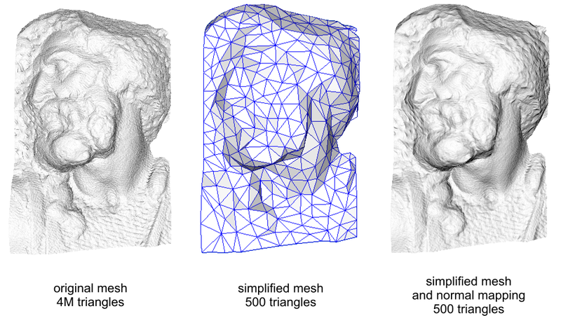
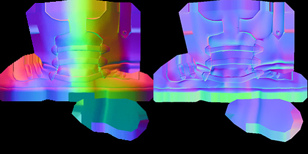
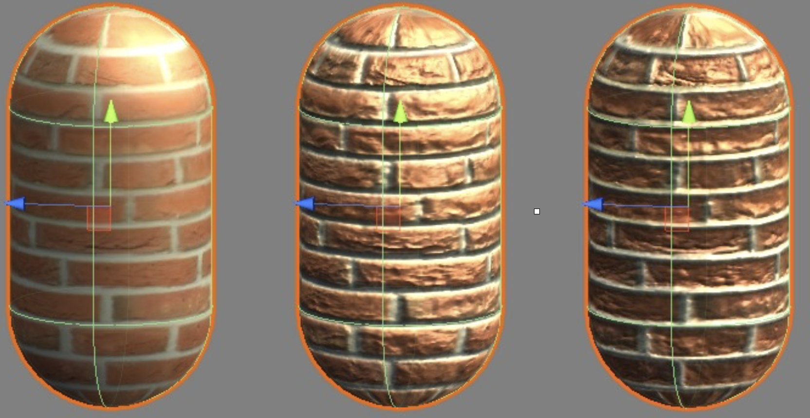

**法线贴图（Normal mapping）**是一种模拟凹凸处光照效果的技术，是**凹凸贴图**的一种实现。法线贴图可以在不增加模型面数的前提下，为模型添加更多细节。



[^图片来源]: https://zh.wikipedia.org/wiki/法线贴图


法线纹理一般有：**模型空间法线纹理**，**切线空间法线纹理** 。



[^图片来源]: https://docs.cryengine.com/display/SDKDOC4/Tangent+Space+Normal+Mapping

左图为模型空间法线纹理，右图为切线空间纹理。可以看到模型空间的法线纹理颜色是比较随机的，这是因为所有法线均基于同一个坐标空间（模型空间），每个点的法线方向相对于模型空间是各异的。

切线空间法线均呈淡蓝色，这是因为所存储的法线均是各自点所在的**切线空间**中的法线方向。按照模型顶点的位置坐标随纹理坐标（u, v）的变化即是**切线空间**。使用切线空间法线纹理还有以下优点：

1. 自由度高，切线空间法线纹理是相对法线信息，所以把纹理应用到一个完全不同的网格上，也可以得到一个合理的结果。
2. 可通过移动UV坐标来实现凹凸移动的效果，这种效果在水和火山熔岩中会用到。
3. 可以重用，一个立方体的六个面均可以使用同一张纹理。
4. 可压缩，切线空间法线的z轴总是正方向，因此可以仅存储x,y轴方向，推导得到z轴方向。

关于切线空间的计算可参考：[切线空间(Tangent Space) 的计算与应用](http://windsmoon.com/2017/11/28/切线空间-Tangent-Space-的计算与应用/)

#### 实现

在片元着色器中得到切线空间下的法线值，然后再与切线空间写的视角方向，光照方向进行计算，最终得到光照结果。




我们可以使用Unity内置的**TANGENT_SPACE_POTATION**来直接得到转换矩阵**rotation**。

##### Normal_TangentSpace.shader

```c#
Shader "Dev/Normal_TangentSpace"
{
   Properties
   {
       _Color ("Color Tint", Color) = (1, 1, 1, 1)
       _Specular ("Specular", Color) = (1, 1, 1, 1)
       _Gloss ("Gloss", Range(5.0, 256.0)) =  20
       _MainTex("Texture", 2D) = "white" {}
       _BumpMap ("Normal Map", 2D) = "bump" {}
       _BumpScale ("Bump Scale", Float) = 1.0
   }

   SubShader
   {
       Tags { "RenderType"="Opaque" "Queue"="Geometry" "LightMode"="BasicLightMode" }

       Pass
       {
           CGPROGRAM
           #pragma vertex vert
           #pragma fragment frag
           
           #include "UnityCG.cginc"
           #include "Lighting.cginc"

           struct a2v
           {
               float4 vertex : POSITION;
               float4 texcoord :  TEXCOORD0;
               float3 normal : NORMAL;
               float4 tangent : TANGENT;
           };

           struct v2f
           {
               float4 pos : SV_POSITION;
               // xy 存储 _MainTex纹理坐标 zw 存储 _BumpMap纹理坐标
               float4 uv : TEXCOORD0;
               float3 lightDir : TEXCOORD1;
               float3 viewDir : TEXCOORD2;
           };

           fixed4 _Color;
           fixed4 _Specular;
           float _Gloss;

           sampler2D _MainTex;
           float4 _MainTex_ST;

           sampler2D _BumpMap;
           float4 _BumpMap_ST;

           float _BumpScale;

           v2f vert(a2v v)
           {
               v2f o;
               o.pos = UnityObjectToClipPos(v.vertex);
               o.uv.xy = TRANSFORM_TEX(v.texcoord, _MainTex);
               o.uv.zw = TRANSFORM_TEX(v.texcoord, _BumpMap);

               TANGENT_SPACE_ROTATION;
               o.lightDir = mul(rotation, ObjSpaceLightDir(v.vertex)).xyz;
               o.viewDir = mul(rotation, ObjSpaceViewDir(v.vertex)).xyz;
               return o;
           }

           fixed4 frag(v2f i) : SV_TARGET
           {
               fixed3 tangentLightDir = normalize(i.lightDir);
               fixed3 tangentViewDir = normalize(i.viewDir);

               fixed4 packedNormal = tex2D(_BumpMap, i.uv.zw);
               fixed3 tangentNormal;
               tangentNormal = UnpackNormal(packedNormal);
			   tangentNormal.xy *= _BumpScale;
			   tangentNormal.z = sqrt(1.0 - saturate(dot(tangentNormal.xy, tangentNormal.xy)));

               fixed3 albedo =  tex2D(_MainTex, i.uv.xy).rgb * _Color.rgb;

               fixed3 ambient = unity_AmbientSky * albedo;
               //Diffuse
               fixed3 diffuse = _LightColor0.rgb * albedo * (dot(tangentNormal, tangentLightDir) * 0.5 + 0.5);

               //Specular
               fixed3 hDir = normalize(tangentLightDir + tangentViewDir);
               fixed3 specular = _LightColor0.rgb * _Specular.rgb * pow(saturate(dot(tangentNormal, hDir)), _Gloss);

              
               return fixed4(ambient + diffuse + specular, 1.0);
           }

           ENDCG
       }
   }

}
```

