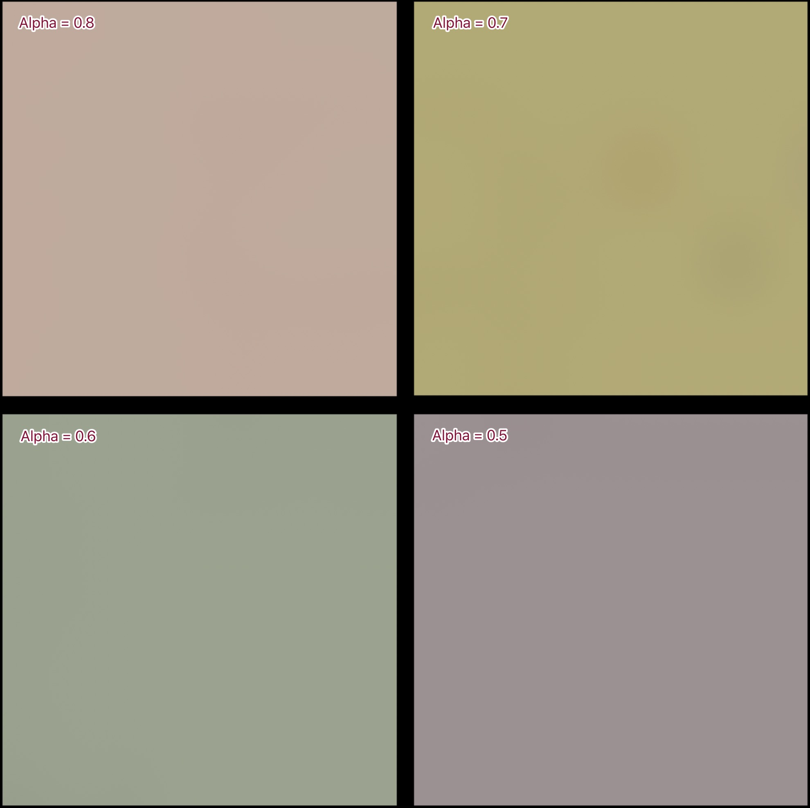
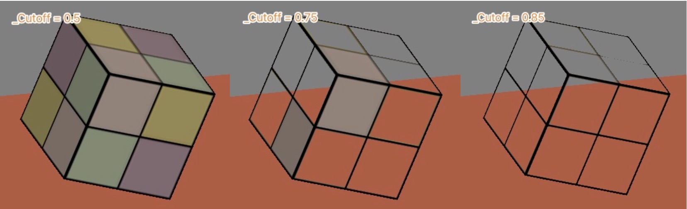

实时渲染中，透明材质的渲染一直是一个非常难处理的问题。在实际的开发中，我们会经常提醒美术的同学要尽量避免使用透明材质。透明材质的渲染会带来一系列的问题，渲染结果的正确性，实时渲染的性能等。Unity中有两种方式来实现透明效果：

* 透明度测试 Alpha Test
* 透明度混合 Alpha Blending

#### 透明度测试

透明测试**Alpha Test**是一种简单粗暴的处理透明的方法，包含透明材质的物体和包含不透明材质的物体不需要预先排序后再进行渲染。只是在渲染包含透明材质的物体时，对比片元的透明度，如果小于预设值则直接丢弃该片元。也就是要么有固定值的透明，要么不透明。

```c#
// 使用内置函数 clip 来做透明度测试
clip(v_color.a - _Cutoff);
//等同于
if((v_color.a - _Cutoff) < 0.0)
{
    discard;
}
```

这里使用《Unity Shader 入门精要》中第八章里资源：



把这张材质用到立方体上，然后使用不同的Alpha值(_Cutoff)来进行测试：



**_Cutoff = 0.85**时，就全部透明了。

**AlphaTest.shader**

```c#
// Upgrade NOTE: replaced 'mul(UNITY_MATRIX_MVP,*)' with 'UnityObjectToClipPos(*)'

Shader "Dev/AlphaTest"
{
    Properties{
        _Diffuse ("Diffuse", Color) = (1, 1, 1, 1)
        _MainTex ("Texture", 2D) = "white" {}
        _Cutoff ("Alpha Cutoff", Range(0, 1)) = 0.5
    }

    SubShader{

        Tags { "RenderType"="Transparent" "Queue"="AlphaTest" "LightMode"="BasicLightMode" }
        Pass{

            CGPROGRAM
            #pragma vertex vert
            #pragma fragment frag

            #include "Lighting.cginc"
            #include "UnityCG.cginc"

            fixed4 _Diffuse;
            sampler2D _MainTex;
            float4 _MainTex_ST;
            fixed _Cutoff;

            struct a2v{
                float4 vertex : POSITION;
                float2 uv : TEXCOORD0;
                float3 normal : NORMAL;
            };

            struct v2f{
                float4 pos : SV_POSITION;
                float2 uv : TEXCOORD0;
                float3 worldNormal : TEXCOORD1;
            };

            v2f vert(a2v v){
                v2f o;
                o.pos = UnityObjectToClipPos(v.vertex);
                o.uv = TRANSFORM_TEX(v.uv, _MainTex);

                o.worldNormal = normalize(mul(v.normal,  (float3x3)unity_WorldToObject));
                return o;
            };

            fixed4 frag(v2f i):SV_TARGET{
                fixed3 worldLight = normalize(_WorldSpaceLightPos0.xyz);
                fixed3 diffuse = _LightColor0.rgb * _Diffuse.rgb * saturate(dot(i.worldNormal, worldLight));
                fixed3 color = unity_AmbientSky + diffuse;

                fixed4 v_color = tex2D(_MainTex, i.uv);
                clip (v_color.a - _Cutoff);
                fixed4 f_color = fixed4(color, 1.0);
                return v_color * f_color;
            };

            ENDCG

        }        
    }
}
```

#### 透明度混合

通过**Alpha Blending**技术可以实现真正的透明。不透明物体的绘制结束后当前缓冲区已经被颜色填充，那么对于透明物体可以通过透明度和当前缓冲区的颜色进行混合，从而使物体有透明效果。Unity中的透明度混合可以通过设置混合模式来执行混合：

```c#
Blend SrcAlpha OneMinusSrcAlpha 
```

**Alpha Blending** 按照以下流程进行渲染：

1. 绘制所有不透明物体
2. 关闭深度写入，但保留深度检测
3. 将透明物体根据相机距离进行排序
4. 开启透明度混合模式，从后往前绘制透明物体

关闭深度写入是为了保证所有透明物体都将被绘制，如果不关闭深度写入，当一个透明物体更接近相机时，原来的不透明物体所对应的像素就会被覆盖，从而导致错误的渲染效果。保留深度检测是为了保证当透明物体被不透明物体遮挡是，不应该绘制透明物体。

**Alpha Blending**存在两个问题：

1. 场景级别的排序开销很大
2. 只能处理简单场景，并且要求所有透明物体都是可分割，可排序。简单的透明球体无法正常渲染，球体的前后半球是未经排序的，当球体可分割为前后半球时，可以得到正确的排序。

**Alpha Blending**优化：

1. 可做三角形级别排序，但仍然无法解决三角形之间的交叉时导致的渲染错误问题


**AlphaBlending.shader**

```c#
Shader "Dev/AlphaBlending"
{
    Properties
    {
        _Diffuse ("Diffuse", Color) = (1, 1, 1, 1)
        _MainTex ("Texture", 2D) = "white" {}
        _AlphaScale ("AlphaScale", Range(0, 1)) = 1
    }

    SubShader
    {
        Tags { "RenderType" = "Transparent" "Queue"="Transparent" "LightMode" = "BasicLightMode" }

        ZWrite Off
        Blend SrcAlpha OneMinusSrcAlpha 
        Pass
        {
            CGPROGRAM
            #pragma vertex vert 
            #pragma fragment frag 

            #include "Lighting.cginc"
            #include "UnityCG.cginc"

            fixed4 _Diffuse;
            sampler2D _MainTex;
            float4 _MainTex_ST;
            fixed _AlphaScale;

            struct a2v
            {
                float4 vertex : POSITION;
                float2 uv : TEXCOORD0;
                float3 normal : NORMAL;
            };

            struct v2f
            {
                float4 pos : SV_POSITION;
                float2 uv : TEXCOORD0;
                float3 worldNormal :TEXCOORD1;
            };

            v2f vert(a2v v)
            {
                v2f o;
                o.pos = UnityObjectToClipPos(v.vertex);
                o.uv = TRANSFORM_TEX(v.uv, _MainTex);

                o.worldNormal = normalize(mul(v.normal, (float3x3)unity_WorldToObject));
                return o;
            };

            fixed4 frag(v2f i):SV_TARGET
            {
                fixed3 worldLight = normalize(_WorldSpaceLightPos0.xyz);
                fixed3 diffuse = _LightColor0.rgb * _Diffuse.rgb * saturate(dot(i.worldNormal, worldLight));
                fixed3 color = unity_AmbientSky + diffuse;

                fixed4 v_color = tex2D(_MainTex, i.uv);
                v_color.a = v_color.a * _AlphaScale;
                fixed4 f_color = fixed4(color, 1.0);
                return v_color * f_color;
            };
            ENDCG
        }
    }
}
```

