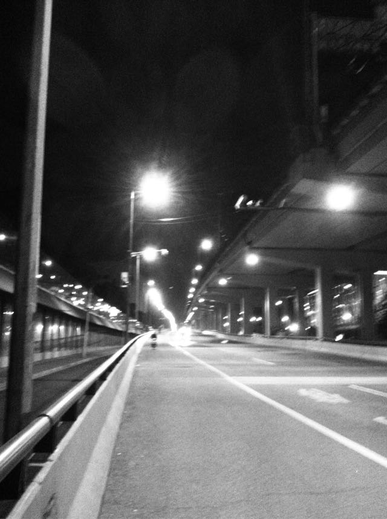
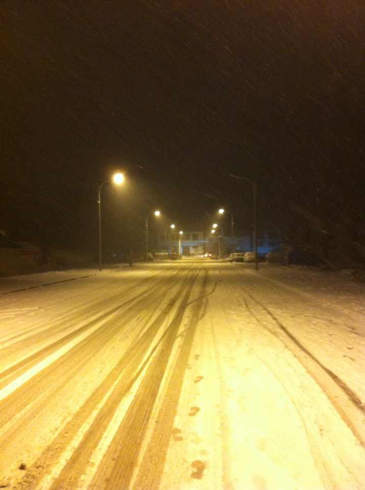

这好像是2012年的某个夜。整理照片时偶然翻到，盯着照片几秒后，感觉很心塞。是回忆起什么了？可明明那段时间的记忆已经非常的模糊。大概独自走在这样的夜，总会让我这样伪文青强说愁。不过算算自己的年纪，好像根本不需要强说愁，已经有很多烦心事了。  

遇到一真的文青，说到了“生气”这个话题。我说自己很少很少会感到生气。文青说我太冷漠，谁都不关心，不在乎别人。只有这样才可以做到不生气。听起来好像是这样的因果关系。我真的去思考了一下，觉得自己不太生气并不是因为我冷漠或者不在乎。反而是因为自己不需要来自他人的在乎。比如我爸，有一次他去坐公车，站在门口问那师傅到不到汽车站。问了两次，师傅也没有回答他。他就很生气，招手栏了辆的士走了。这换作我，肯定不会觉得生气。顶多会觉得师傅这么大年纪了怎么还不太懂礼貌，不要跟他一般见识。不过，我爸生气我很能理解。如果换作他年轻的时候，那师傅肯定被他揍趴下了（我爸他老人家练武术出身，狠的要命。特别是我调皮揍我的时候。不是亲生的一般）。  

生气是一种需要宣泄的情绪。既然需要宣泄，大多都不能理智。人生气的时候由于肾上腺的作用，还极具攻击性。所以，还是少生气为妙。

这是去年春节的某一个晚上。下了很大的雪，老家有好几年没有下过这么大的雪。看这张照片感到安逸。

出生，生活，工作都在这座大都市的人，可能不太能体会到故乡对于一个人的意义。如果不是奋斗在这座城市，也可能根本不会知道自己留恋故乡。以往，每年固定回老家两次。今年十一却没能回去，接下来的日子总是觉得今年少做了一件事。这是一种不踏实的感觉，很不安。

我好像一直都很忙！但为什么要这么忙？一直都没想的明白。