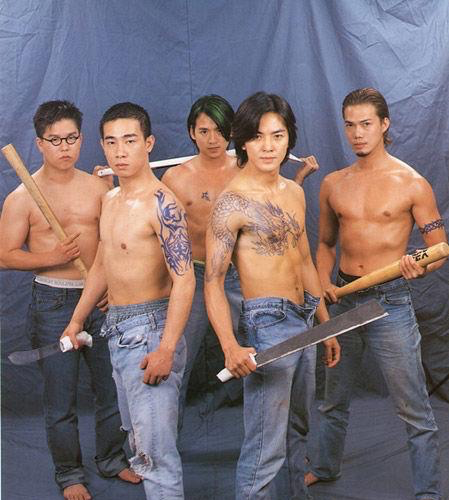

我们都有很多朋友。我大致把自己的朋友分成以下几类：

##### 发小

这群朋友就是一起穿着开裆裤，到处闯祸的人。小时候彼此感情很好。大了以后，大多各自漂在不同的城市，联系越来越少，慢慢的也就淡了。

##### 同窗好友

这里的同窗好友自然不能包括大学时的朋友，因为大学时压根不存在同窗苦读这事。

战斗友谊永远是最坚固的，一起吃苦的日子才是最珍贵的。高一时和朋友住在他爸的厂子里，他爸给我们安排了一间非常不错的宿舍。那时我们晚自习要上到9:40。下了晚自习，肚子已经很饿了，正是长身体的时候，饿肚子太残忍了。好再我们每天回到厂子里，都能在厂子的食堂里找到吃的。有次我们还找到了酒，我们就顺了一瓶啤酒。然后蹲在门口，你一口我一口的喝光了。

后来高二的时候，和基友租住在民居里。北方的冬天天亮的很晚，但我们早上7点多就要早读。每天我们俩就摸黑去吃早饭。包子油条，稀饭…但我们至今都不知道卖早点的夫妻长什么样子(在路边卖早点，而且没有路灯，真的就是摸黑吃)。

还有很多朋友，至今关系都很好。

##### 同床好友

上面说战斗友谊永远是最坚固的，那么同床好友的友谊也是建立在战斗中的。当然，这里的同床只是用来比喻上下铺，同宿舍的大学好友。这群人大概是唯一一群当面骂你傻B，你还咧嘴笑且一点都不生气的人。有句话是这样的：再牛逼的岁月都比不上和你们一起傻逼的日子。

这群猪朋狗友要说起来，大概要说很久了。嘲笑你，作弄你，关心你，帮助你…但都是真爱啊。不过我的三观也是被这群人刷新的，而且给我造成的心理阴影的面积是非常大的(没错，就是说的那群毕业前夜聚在一起修练二指禅的人)。

##### 同壕好友

说职场如战场，那么职场战友必定也是战斗友谊的一种。我是非常幸运的，在工作的这些年遇到了很多良师益友。职场并非只有尔虞我诈，真诚待人还是能交到朋友的。这些朋友，将会一直是良师益友。

##### 圈外好友

我仔细想了下，不属于上述四种类型的朋友好像一只手已经可以数清了。老郑，如果我说我们是”忘年交”你不会介意的对吧。

##### 越来越难交到朋友了

好像真的很难交到朋友，生活变的规律而单调。并且作为宅男，最大的爱好是不出门。再者越来越觉得自己冷漠，不想接受帮助也不愿主动帮助别人。都老大不小了，在没有互利的情况下自然很难交到朋友。