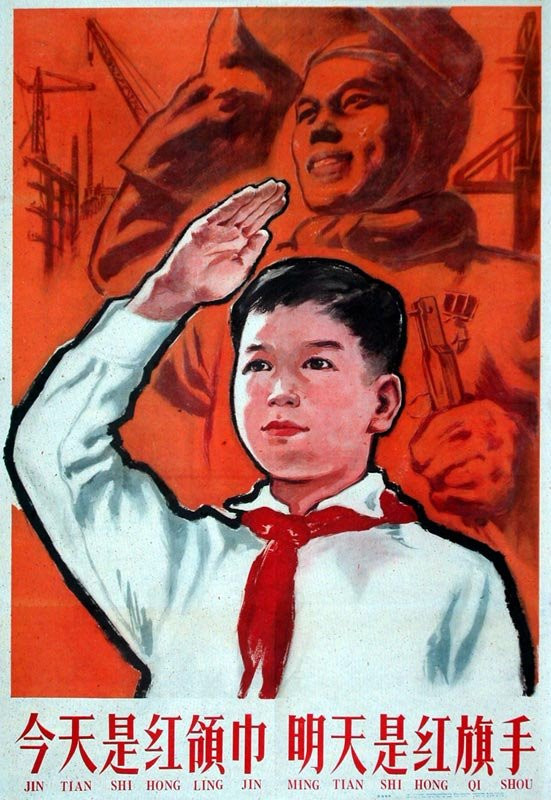

今天阳光明媚，起了个大早，背上书包愉快的走在上学的路上。忽然，有位老奶奶摔倒在我面前！我毫不犹豫立刻去扶这位白发苍苍的老奶奶。我使出吃奶的力气拉了两次都没能扶起她来。然后老奶奶说：小朋友你干嘛推倒我啊，我这腿好像摔断了呢？我擦，这是要碰瓷啊，一下子我这暴脾气就上来了。狠狠的在老奶奶腿上踩了两脚，大摇大摆的朝学校走去。

好了，以上是鸡肉，下面是汤。由于肉质不好，熬出来的汤可能会导致不适，请酌情饮用。

### 第一碗：正能量

我对**正能量**最深刻的体会就是：当别人比我惨的时候，我就会感到满满的正能量。上大学那会穷的在宿舍吃泡面度日觉得苦，可有人在等着喝我碗里的汤，我觉得正能量满满；我买股票亏了1万块，朋友说他亏了40万，我瞬间满血复活。。。

什么？说我心理阴暗？我都给你熬鸡汤了，你还说我阴暗？

### 第二碗：去你大爷的道德绑架

> 道德绑架
> 
> 道德绑架的实质是以道德为砝码，要挟个人或者众人不得不做某些事情，结果一般是做了的也少有自豪感，不做的则会在一段时间内感到忐忑不安

来讲个案例：

人物介绍：我买的硬卧的中铺，然后旁边一家人买的是4个连号的中铺，然后我的车厢里两个下铺一个是年轻男子，一个是中年妇女。那一家人分别是一对小夫妻和一对老夫妻，以及一个小孩子，小孩也就4岁多点。

上车后我把东西放到我的床上，然后那4个人就上来了，其中那个女的买的中铺就是我对面，然后剩下的3个人就是旁边的车厢的中铺。

那个女的上车后把东西和小孩都放到了下铺，然后那个年轻男子上来了，看着那个女子丝毫没有让位置的意思，就跟那个女的说，他的票是这个位置的。

那个女的看了一眼男子说：你跟我换一下吧，我带个小孩不方便。

男的说：我也是好不容易买到的下铺，我也睡不了中铺。

然后那个女的就说：那算了吧！

但是还是没有让座的意思，还跟她的小孩说，你坐好啊。。。

然后登登登，这个女的妈就从旁边车厢过来了。

她说：你跟我们换一下吧，我们带着孩子不方便。

男子重复了第一次说的话。

那个大妈这时态度就不太好了，不高兴的说：那你说我们怎么办，我们的孩子这么小，怎么睡中铺，完一掉下来了，谁负责。

男子很为难的说：我也是提前好几天，排了很久的队才买到的，就是为了买下铺，我真的睡不惯中铺。

大妈这时不耐烦了：你这年轻人怎么这样，就是从中铺换到下铺而已，又不是拿上铺跟你换，我们的孩子这么小，吃饭，上厕所，中铺都不方便，你不换，你让我们怎么办？

然后大妈的老公也过来了，就说，你跟我们换一下吧，然后小孩的母亲也说话了：你就帮帮忙，跟我们换一下吧！

大妈不依不饶的说：你换一下怎么了，年轻人怎么就睡不了中铺了。

最后小伙子终于顶不住了，跟她们换了。

然后大妈立马变了一副嘴脸：这就对了，年轻人本来就该这样嘛！

然后就是小孩母亲和小孩姥爷跟男子说，谢谢！

一个有道德的人，就不应该提出这样的要求。反正我是一个没什么道德底线的人，这种事情我是不会妥协的。除非我觉得孩子可爱，不忍心她睡中铺。

### 第三碗：被利用是好事

被利用没什么不好，只要不是做违法乱纪的事。如果觉得被利用了不必生气，被利用价值也是个人价值的体现呢。

### 第四碗：关于你嘴里的无力感

小B: 哎，女朋友又跟人家跑了

小A：为什么是又？

小B：我就不能交过几个女朋友吗？

小A：那这个为啥跟人家跑了？

小B：那男就是有钱！

小A：哦？你确定人家只是有钱？不是人又帅，又体贴，又懂得怜香惜玉。。。

小B:  哎，我有一种被抛弃后，无法摆脱的无力感。

很多情景下你会有无力感，这种无力感不只是对外在的不满，其实更多的是对自己无能的控诉。

### 第五碗：人与人之间的信任去哪里了？

没错，都被狗吃了。

建立信任是如何的漫长啊，而毁掉信任就是一瞬间的事情啊。这不就像一条狗跑过来，一口把丢在地上的良心吃掉吗？

### 第六碗：脸还要不要？

这个问题我来回答不太合适，因为我是一个不要脸的人啊。而且我还经常吹牛逼，然后被打脸。。。算了，这碗不要喝了。

### 第七碗：遇事不公

公平从来就没有存在过，你要么有能力让自己站在上风，要么说服自己接受。见人就说自己遇事不公最傻B。而且不要以为自己可以做到公平，那也是不存在的。你看我们都在骂特权，可当我们享受到特权时，有谁说这太不公平了，我要放弃这特权的？要真这么做了，还是会被骂傻B。

### 第八碗：武松打虎

提这个干吗？是这样的，武松那个年代物资比较匮乏，网络也不够发达。没有鸡汤这样的玩意。他们那时的鸡汤其实就是酒啦，武松连喝18碗后成就了**打虎英雄**。所以，兄弟姐妹们喝了这最后一碗鸡汤吧。